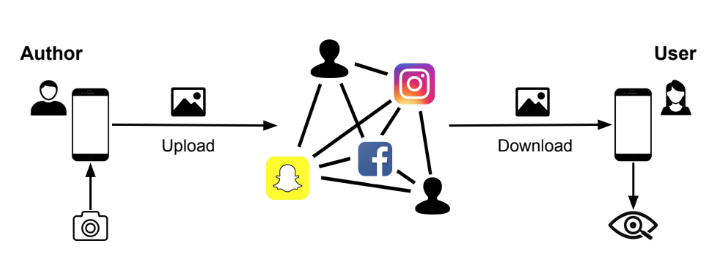
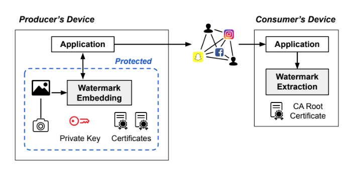
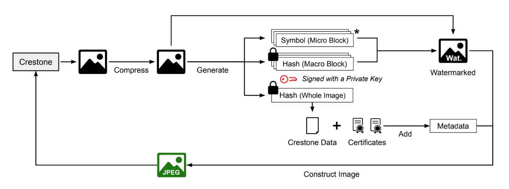
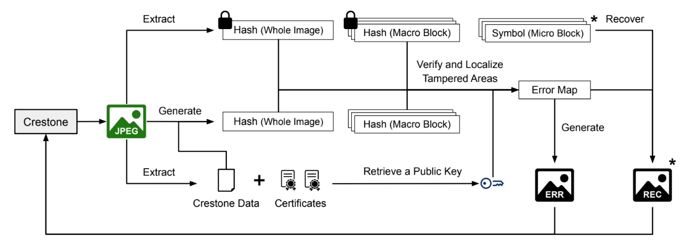
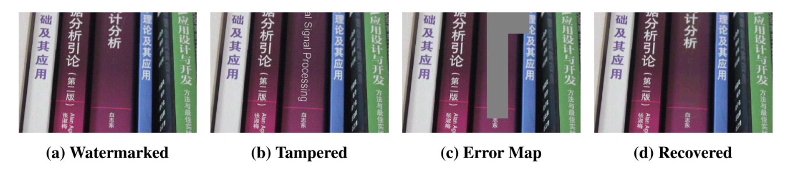
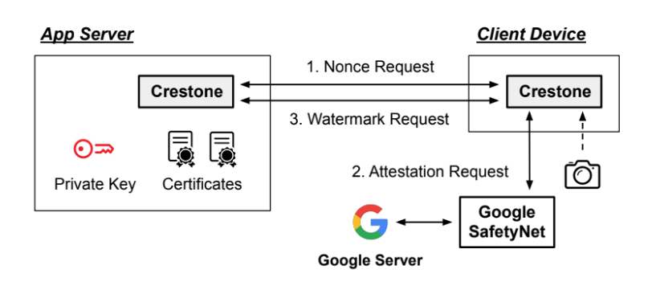
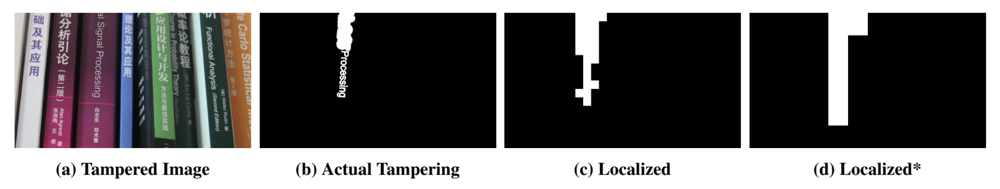

 Images travel through cameras, apps, social platforms, and cloud storage before anyone views them. Along that path they are compressed, resized, and—too often—tampered with. Classical digital signatures break under routine JPEG transforms, and a malicious actor can always re-sign a forged image. Crestone is an end-to-end system that protects **image integrity from creation to consumption** by embedding **signed hashes into raw pixels as an invisible watermark**, then verifying integrity (and optionally recovering tampered regions) on the consumer device.

Crestone combines that JPEG-tolerant watermark with end-device protections (including TEE / attestation paths) so an attacker who compromises an app or OS cannot quietly watermark a fake photo as authentic. Our evaluation preserves about **30&nbsp;dB PSNR** and **0.8 SSIM** for watermarked image quality, with fast tamper localization (~0.2&nbsp;s) and background embedding / recovery on device and cloud-scale workloads.

Here are our contributions:
- An end-to-end design for image integrity across producer device → sharing services → consumer device.
- A JPEG-tolerant invisible watermark of signed hashes (whole-image and block-level) with optional **recovery** symbols.
- Device-side protection of the capture-to-watermark path (certificates, private key, embedding software), including a SafetyNet-based attestation flow in our prototype.
- Evaluation of quality, localization/recovery accuracy, latency, and adoption cost against real sharing services.

All other details—DCT block design, metadata/certificate chain, TCB size, and security analysis—are in the paper.

---
### The End-to-End Sharing Problem

The figure is the threat setting Crestone targets: an **Author** captures a photo, it is **Uploaded** through apps and cloud services, later **Downloaded**, and viewed by a **User**. Between upload and download, platforms recompress JPEGs and an adversary in the middle can splice, retouch, or copy-move regions. Integrity therefore has to survive **lossy transforms** that discard exact bit equality—and still bind authenticity to the producer, not whoever last touched the file.

 

---
### End-to-End Design

**Left (producer’s device):** a protected path from capture into **Watermark Embedding**, using an app **Private Key** and **Certificates** under a CA chain so a compromised app cannot watermark a forged photo as authentic. **Right (consumer’s device):** **Watermark Extraction** verifies the received JPEG with a **CA Root Certificate**—without calling back to the original producer. The watermark is designed to tolerate common JPEG quality factors (we target quality 80 while keeping usable visual quality).

 

---
### Watermark Embedding and Extraction

Embedding starts from a normal image: compress, attach Crestone metadata and certificates, then write signed evidence into the pixel domain—**whole-image** and **macro-block** hashes. In **recovery mode** (starred components in the figure) Crestone also embeds recoverable **symbols** per micro-block. The output is a **watermarked JPEG** that still looks like an ordinary photo.

Extraction reverses that path: pull Crestone data and certificates from metadata, regenerate hashes from the received pixels, verify signatures with the public key from the certificate chain, and emit an **error map (ERR)** of blocks that no longer match. In recovery mode it can also **recover (REC)** those regions from the embedded symbols before display.

**(a) Watermarked** is the authentic shared image. **(b) Tampered** replaces text on one book spine. **(c) Error map** marks the blocks Crestone flags as inconsistent with the watermark. **(d) Recovered** restores those blocks from recovery symbols so the consumer sees content closer to (a) instead of the forgery in (b).

 

---
### Protecting the Producer Path

Watermarking alone is not enough if a compromised app can watermark an already-forged image. Crestone therefore hardens the producer side: private keys and certificates stay protected, and embedding can be gated on device attestation.

In the prototype flow: **(1)** the client asks the app server for a **nonce**, **(2)** it requests **Google SafetyNet** attestation (device ↔ Google), and **(3)** only then issues a **watermark request** into Crestone with certificates and the private key. Related TrustZone display work (e.g., [Rushmore]({{ site.baseurl }}/rushmore)) can further bind what the consumer *sees*; Crestone’s focus here is the integrity of the shared JPEG itself.

 

---
### Localization and Recovery

Read this figure left to right:

- **(a) Tampered image** — the photo after attack.
- **(b) Actual tampering** — ground-truth mask of modified pixels (white = changed).
- **(c) Localized** — Crestone’s tamper map in **no-recovery** mode (finer blocks, more signature bits per block; block size 64×64 in our setup).
- **(d) Localized\*** — the same check in **recovery** mode. The paper’s `*` means recovery is enabled: blocks are larger (152×152) because each block also carries recoverable symbols, so the flagged region is coarser than (c) even when it still covers the attack.

So (c) and (d) are not “two random masks”—they are the same localization pipeline under the two watermark modes. Recovery mode trades some localization granularity for the ability to restore pixels; no-recovery mode localizes more finely but cannot reconstruct content from symbols.

We evaluate on a colored FHD-scale dataset with known forgeries across common resolutions, and measure latency on phone, laptop, and server-class machines. Embedding a large image is on the order of tens of seconds in the background; localization stays interactive (~0.2&nbsp;s), while full recovery is slower and also runs in the background in the end-to-end design.

Adoption-wise, services that preserve our metadata field (e.g., Google Photos and OneDrive in our experiments) work without change; apps that strip metadata need only retain that field—or could move toward designs that embed more in-pixels if metadata is unavailable.

 

---
### Summary

Crestone closes the gap between “signed at capture” and “believed at view” for the JPEG sharing world: invisible, compression-tolerant watermarks carry signed integrity evidence through the middle, while producer-side protection keeps the watermark meaningful. It does not solve every transform or every RGB round-trip edge case, but it is a concrete step toward end-to-end image integrity on mobile and social pipelines.
