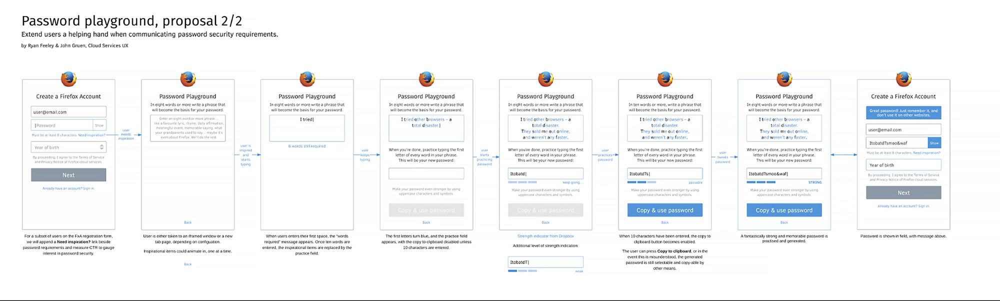
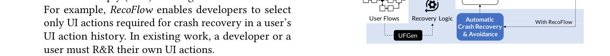
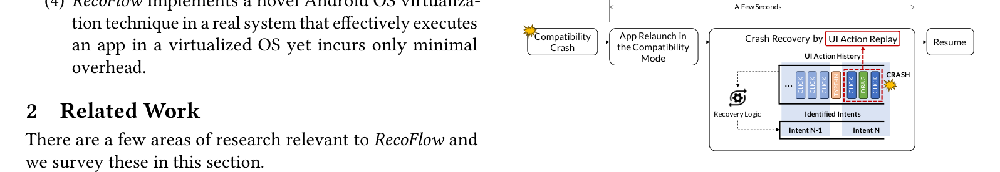
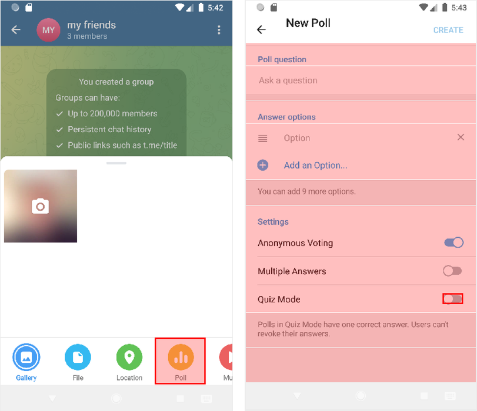
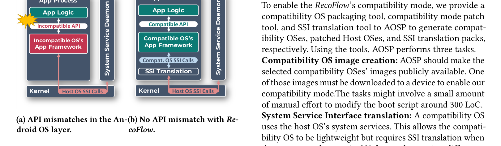

 Android fragmentation—API churn plus vendor OS customization—means the same app can crash on some devices and versions while running fine on others. Those **compatibility crashes** are hard to eliminate in testing: there are too many OS and device combinations to cover before release, and fixes often lag for months once an issue appears in the wild.

RecoFlow is our answer for the gap between “we cannot test everything” and “users should not lose their place when a crash hits.” Developers express the **user flows** they already design for UI (graphs of stages and UI actions for an intent). At runtime RecoFlow matches live UI actions to those flows. On a crash it (1) relaunches the app in a **compatibility mode** backed by Android OS micro-virtualization, and (2) **replays** the UI actions for the interrupted intent so the user can resume instead of starting over.

Here are our contributions:
- An API and visual tool (**UFGen**) so developers program recovery from design-time user flows—not from opaque app-state checkpoints.
- Selective, developer-guided record-and-replay of UI actions that belong to a disrupted intent.
- The first **compatibility-mode** app execution framework for Android via lightweight app-framework virtualization and SSI translation.
- Evaluation with commodity apps, developer studies, and measured overhead (~2.7% delay from SSI translation; ~38.7&nbsp;MB extra memory for the compatibility Zygote in our setup).

All other details—stage matching with VPath, UFGen, virtualization design, and full evaluation—are in the paper.

- <a href="https://arxiv.org/abs/2406.01339" target="_blank">arXiv Paper</a>,
<a href="https://arxiv.org/pdf/2406.01339" target="_blank">PDF</a>,
<a href="https://dl.acm.org/doi/10.1145/3639478.3639748" target="_blank">ACM DL</a>

---
### From User Flows to Recovery Logic

App teams already draw user flows when designing features (screens, UI targets, and the order of actions for an intent). RecoFlow reuses that artifact for crash recovery: a user flow becomes a directed graph of **stages**, each a set of UI actions (element + action type) identified with **VPath** (an XPath-style selector). Transitions fire when a matching action occurs; escaping the stage clears tracking for that intent.

During development, **UFGen** mirrors the app under test and lets developers click or drag-select UI elements to generate Java stage and user-flow code. That recovery logic is shipped with the app. When a crash is reported, RecoFlow can keep users productive while developers still debug and ship a permanent fix—rather than forcing a pure “crash → wait for update” loop.

 

---
### Crash Recovery by UI Action Replay

On a compatibility crash, RecoFlow does not try to restore potentially corrupted in-memory app state. It relaunches in compatibility mode, then replays the UI actions tied to the **current intent**—the subset of history that matches the programmed user flow—so the feature can continue. Replay is under developer control: a VPath must match exactly one UI element, or recovery aborts rather than clicking the wrong control.

The figure above shows the UFGen-style idea on real screens: highlight the UI elements that belong to a stage (for example, starting a poll vs. composing poll fields), generate filters, and connect stages into a user flow. Optional `prepareReplay()` hooks can prepend navigation (e.g., reopen the right chat room) before recorded actions run.

 

---
### Compatibility Mode via OS Micro-Virtualization

Replaying into the same broken OS/API surface would often crash again. RecoFlow’s **compatibility mode** boots a designated compatibility Android OS’s **app framework** (via an injected Zygote) on the user device and runs the app against compatible APIs. Host OS system services are still used, with **SSI (System Service Interface) translation** bridging RPC-style mismatches between guest framework and host.

Compared with full VM or container approaches, this micro-virtualization targets the objectives needed for on-device recovery: correct API behavior for the app, continued use of host services, and modest overhead. In our French Calendar crash case study, end-to-end recovery completed in a few seconds; SSI translation accounted for a small fraction of launch and recovery latency.

 

---
### Summary

RecoFlow treats compatibility crashes as something apps can **recover from by design**: reuse user flows for intent-aware UI replay, and avoid immediate recurrence with a lightweight compatibility OS execution environment. It complements testing and crash reporting—it does not replace fixing the root cause—but it closes the long window when fragmented Android devices would otherwise leave users stuck.
