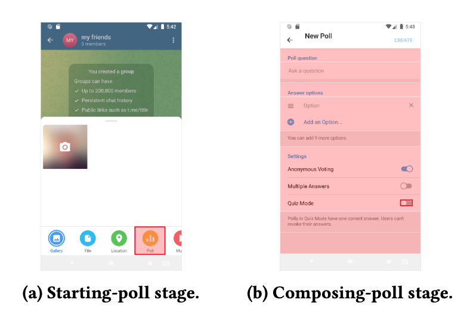

 Android fragmentation—API churn plus vendor OS customization—means the same app can crash on some devices and versions while running fine on others. Those **compatibility crashes** are hard to eliminate in testing: there are too many OS and device combinations to cover before release, and fixes often lag for months once an issue appears in the wild.

RecoFlow is our answer for the gap between “we cannot test everything” and “users should not lose their place when a crash hits.” Developers express the **user flows** they already design for UI (graphs of stages and UI actions for an intent). At runtime RecoFlow matches live UI actions to those flows. On a crash it (1) relaunches the app in a **compatibility mode** backed by Android OS micro-virtualization, and (2) **replays** the UI actions of the interrupted intent so the user can resume instead of starting over.

Here are our contributions:
- An API and visual tool (**UFGen**) so developers program recovery from design-time user flows—not from opaque app-state checkpoints.
- Selective, developer-guided record-and-replay of UI actions that belong to a disrupted intent.
- The first **compatibility-mode** app execution framework for Android via lightweight app-framework virtualization and SSI translation.
- Evaluation with commodity apps, developer studies, and measured overhead (~2.7% delay from SSI translation; ~38.7&nbsp;MB extra memory for the compatibility Zygote in our setup).

All other details—stage matching with VPath, UFGen, virtualization design, and full evaluation—are in the paper.

- <a href="https://arxiv.org/abs/2406.01339" target="_blank">arXiv Paper</a>,
<a href="https://arxiv.org/pdf/2406.01339" target="_blank">PDF</a>,
<a href="https://dl.acm.org/doi/10.1145/3639478.3639748" target="_blank">ACM DL</a>

---
### From User Flows to Recovery Logic

App teams already draw user flows when designing features. RecoFlow reuses that artifact for crash recovery: a flow becomes a directed graph of **stages**, each a set of UI actions (element + action type) identified with **VPath**. Transitions fire when a matching action occurs; leaving the stage clears tracking for that intent.

During **Design**, those user flows feed **UFGen**, which generates **recovery logic** wired into **Implementation**. After **Release**, a crash without RecoFlow goes back through debugging and testing. With RecoFlow, the same crash path can take **Automatic Crash Recovery & Avoidance** while developers still investigate a lasting fix.

UFGen mirrors the app under test so developers can click or drag-select the UI elements that belong to each stage—for example, the **Poll** entry point versus the fields on a **New Poll** screen—then emit Java filters and connect stages into a user flow.

 

---
### Crash Recovery by UI Action Replay

On a compatibility crash, RecoFlow does not restore potentially corrupted in-memory app state. Within a few seconds it relaunches the app in compatibility mode, uses the programmed recovery logic to map UI action history onto **intents**, and **replays** the actions for the intent disrupted by the crash so the session can **resume**. Replay stays under developer control: a VPath must match exactly one UI element, or recovery aborts rather than clicking the wrong control. Optional `prepareReplay()` hooks can prepend navigation (for example, reopen the right chat room) before recorded actions run.

 

---
### Compatibility Mode via OS Micro-Virtualization

Replaying into the same broken OS/API surface would often crash again. RecoFlow’s **compatibility mode** runs the app against a compatible Android **app framework** (via an injected Zygote) while still using host OS system services. **SSI (System Service Interface) translation** bridges RPC-style mismatches between the guest framework and the host kernel.

(a) shows an incompatible API and framework against the host—where a compatibility crash surfaces. (b) shows RecoFlow’s stack: compatible API and framework, plus **Compat. OS SSI Calls** and **SSI Translation** down to host SSI calls. Compared with full VMs or containers, this micro-virtualization keeps overhead modest; in our French Calendar case study, SSI translation was only a small share of launch and recovery latency.

 

---
### Summary

RecoFlow treats compatibility crashes as something apps can **recover from by design**: reuse user flows for intent-aware UI replay, and avoid immediate recurrence with a lightweight compatibility OS execution environment. It complements testing and crash reporting—it does not replace fixing the root cause—but it closes the long window when fragmented Android devices would otherwise leave users stuck.
