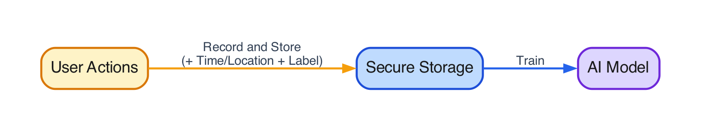
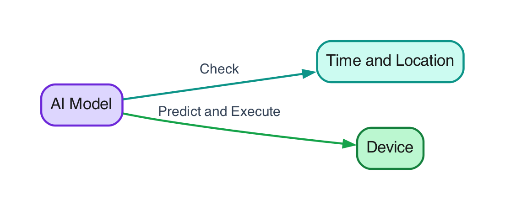

 Most personalization systems answer the wrong question. They ask what *users like*—averaged over a population—or they ask an on-device LLM to reason about a screen in natural language. The product question I cared about was narrower and harder: can a mobile app learn *this user’s* habits **on the device**, then automate only when it is confident enough—without shipping behavior logs to the cloud, and without treating a general language model as a behavior model?

That is the idea behind this work.

> **Note** - built and patented internally (U.S. Patent App. 19/540,086). This page covers only the public, high-level shape—problem, approach, and tradeoffs—not proprietary APIs, metrics, product names, or source.

Here is what the approach stands on:
- **Per-user models**, not a shared “average user,” so distinct morning routines stay distinct.
- **On-device learning from UI sequences**, so behavior evidence never has to leave the phone for personalization.
- **Thin app integration** via wrapper controls that emit light events into a local library.
- **Confidence-gated actions**, so the model proposes and product policy decides what is allowed to fire.

---
### The problem

**Hyper-personalization** means each person gets a model of *their* behavior. In the morning, one user opens school mail, another skims newsletters, another checks social—same app surface, different sequences. A shared model collapses those into a single “read emails” trend. Useful to nobody’s real morning.

<em>User behavior patterns in the morning</em>

Two popular answers miss this job for opposite reasons.

**Cloud personalization** centralizes every device through a service. That buys scale and shared features, but it needs connectivity, costs money at user scale, and moves sensitive *behavior*—not just content—off the device.

**On-device general LLMs** keep inference local and shine at language tasks: summarize this, draft that, translate those. They are the wrong tool for “what does *this* person usually tap next on *this* screen?” You can prompt around the edges; you still do not own a compact, always-on sequence model of one user’s UI habits.

<em>Cloud personalization (top) and on-device general LLMs (bottom)</em>

The gap in between is the interesting one: **local learning from ordered UI events**, small enough to stay resident on a phone, private by architecture rather than by policy document.

 

---
### The approach

The host app should not have to become an ML platform. It needs a thin way to say “the user did this” and a controlled way to say “you may do that.”

**Recording.** Thin **wrapper UIs** sit over ordinary controls (rows, columns, buttons, text, …) and emit light behavior events. Those events enter an on-device library: a **label assigner** turns them into training examples, an **action registry** holds product-defined **registered actions**, and **local storage** keeps the sequence history on device.

<em>Behavior event recording through wrapper UIs</em>

**Training.** User actions are recorded with simple context—time, and optionally location—plus a label, written into secure on-device storage, then used to train or update a **per-user** model. The loop is local end to end.

<em>Training flow</em>

**Inference.** At prediction time the model checks the same kind of context, scores a next behavior from the recent sequence, and—only if policy allows—drives an action on the device.

<em>Inference flow</em>

The important product move is the gate between prediction and execution. Easy-to-undo suggestions can fire at lower confidence. Hard-to-undo actions—delete, send, pay—need much higher confidence, or no automation at all. The model proposes; **registered actions and thresholds** decide. That separation is what makes hyper-personalization feel helpful instead of reckless.

Cold start and drift are first-class, not afterthoughts: until enough local sequence exists, the host can fall back to heuristics; as habits change, the on-device model is meant to retrain or fine-tune on a cadence rather than freeze a first week forever.

 

---
### Sequence model, not language model

This is a **behavior / sequence** model. It maps a short window of UI events to a next label (or a ranking over items). It does not read message bodies, write replies, or answer questions in prose. Those are LLM jobs.

A compact shared encoder turns recent events into a user vector; small task heads specialize—next action, content affinity, and similar. Exact sizes depend on schema and device. The public claim is the **order of magnitude**: always-on phone inference for one person’s habits, not a multi-gigabyte general model doing language in the background and hoping habit falls out.

That specialization is the point. Cloud analytics still matter for fleet-wide questions. On-device LLMs still matter for language. Hyper-personalization of *in-app behavior* is often a sequence problem with a privacy constraint—and that is a different machine.

 

---
### Takeaway

If you only remember one thing: **personalization of UX habits is not the same problem as personalization of content or language.** A tiny on-device sequence model, fed by thin UI wrappers and fenced by confidence-gated actions, is a coherent way to chase the former while keeping behavior data local.

It complements cloud personalization and on-device LLMs; it does not replace them. Formal claims live in the patent filing.
