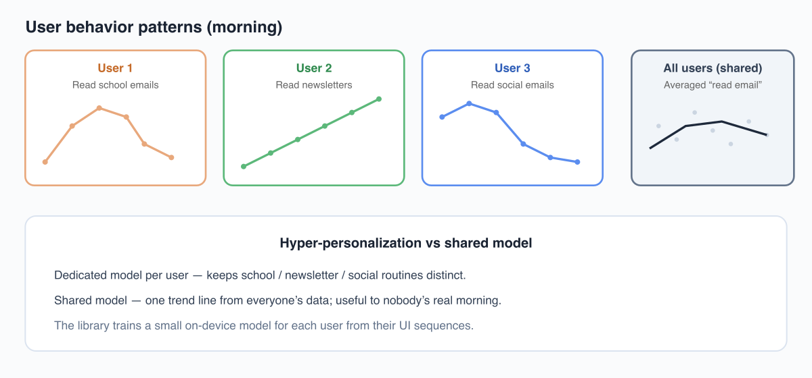
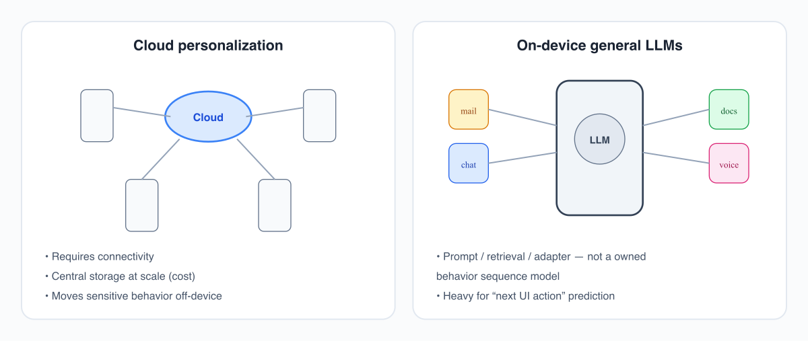
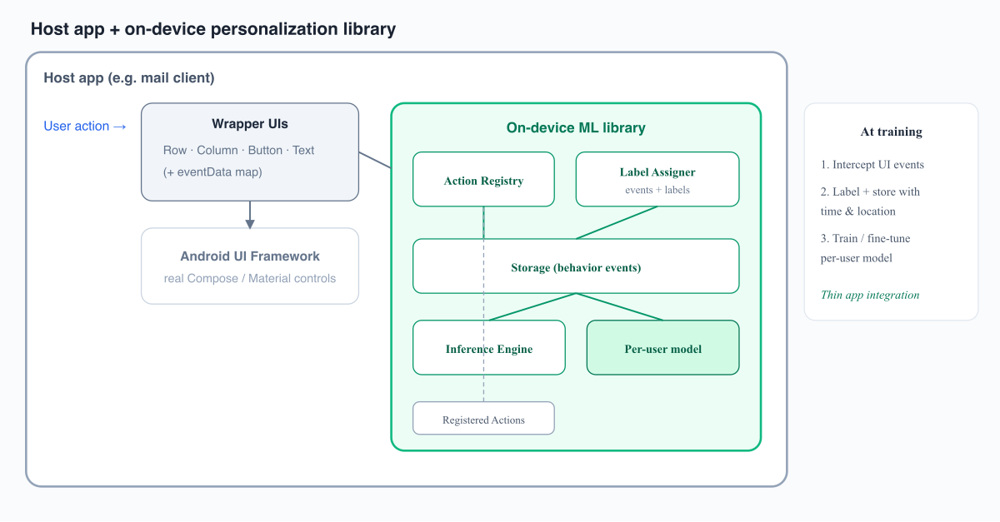
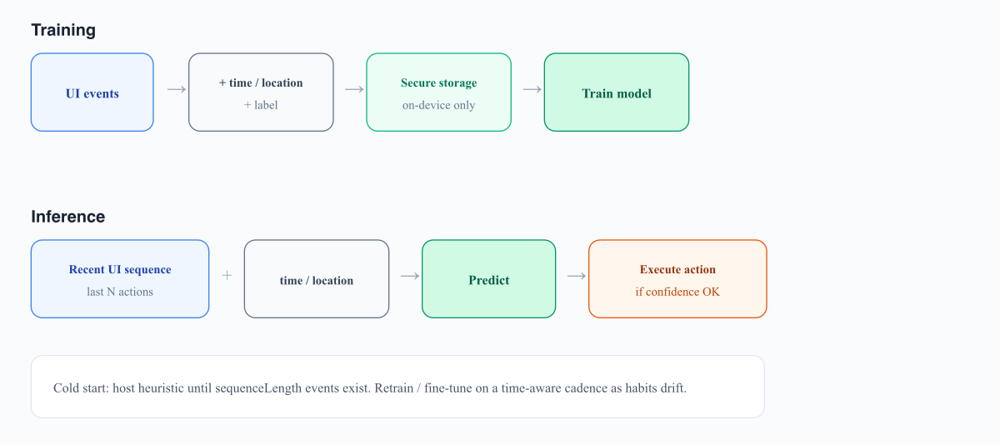
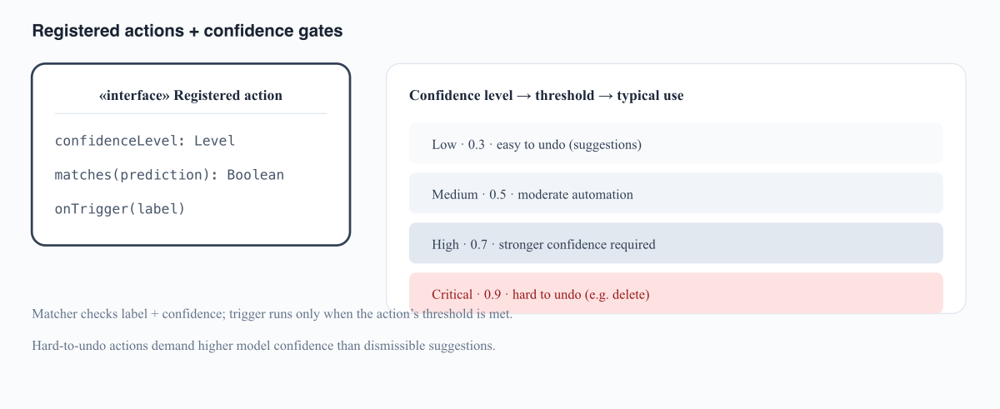
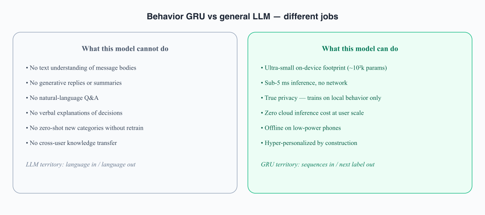
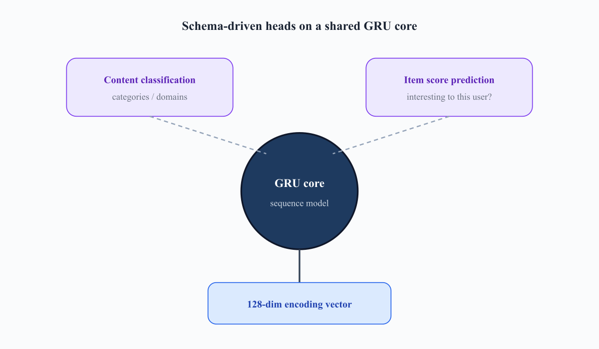

 I worked on a research prototype aimed at a simple product question: can a mobile app learn *this user’s* habits **on the device**, then automate only when it is confident enough—without uploading behavior logs, and without treating a general on-device LLM as a behavior model?

This page stays **high level**: the problem, the approach, and the tradeoffs. It is not a library dump, API reference, or confidential implementation write-up. A related public patent application covers the broader individualized-model direction (U.S. Patent App. 19/540,086).

---
### The problem

**Hyper-personalization** means each person gets a model of *their* behavior. A shared model averages everyone together—so “reads school mail,” “reads newsletters,” and “reads social” collapse into one trend that matches nobody’s morning.

Two common alternatives fall short for this job:

- **Cloud personalization** — needs connectivity, costs at scale, and moves sensitive behavior off-device.
- **On-device general LLMs** — strong for language tasks via prompts; heavy and indirect for “what does this user usually do next on this screen?”

We wanted the gap in between: **local learning from UI sequences**, small enough for a phone, private by architecture.

 

---
### The approach (conceptually)

At a high level, the host app emits light **behavior events** from UI (via thin wrappers around normal controls). An on-device component **labels and stores** those events locally, **trains a per-user model**, and at inference time **predicts** a next behavior—then consults product-defined **registered actions** before anything runs.

**Train** on-device from recent interactions plus simple context (for example time). **Predict** from the latest sequence. **Act** only through an explicit product gate.

That gate matters: easy-to-undo suggestions can fire at lower confidence; hard-to-undo actions need much higher confidence. The model proposes; product policy decides.

 

---
### What kind of model

This is a **sequence / behavior** model, not a language model. It does not read message bodies or write replies. It specializes in ordered UI habits for one user, stays small, and runs offline.

A compact encoder (for example a GRU) turns a short window of recent events into a user vector; small **task heads** handle things like next-action prediction or ranking which items look interesting to *this* person. Exact sizes depend on schema and device—the public point is the **order of magnitude**: always-on phone inference, not a multi-GB LLM.

 

---
### Takeaway

Hyper-personalization for in-app UX is often a **sequence problem**. A tiny on-device model plus **confidence-gated actions** is a coherent way to approach it while keeping behavior data local. It complements cloud analytics and on-device LLMs; it does not replace them.

I am not republishing proprietary names, internal APIs, confidential metrics, or employer source. Those stay behind IP agreements; the patent filing is the place for formal claims.
