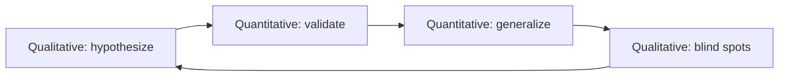

## Why the split matters before you collect data

The fastest way to waste a user study is to pick the wrong kind of evidence first. I learned that building [Mimic]({{ site.baseurl }}/mimic): we could replay thousands of UI event sequences across Android versions and count how often a layout diverged — but the number alone did not explain *why* a vendor skin broke a gesture or which developer assumption caused the mismatch. Quantitative runs told us **how often**; qualitative sessions with engineers told us **what to instrument next**.

Qualitative and quantitative methods are not rivals. They answer different questions at different stages of a systems project. Treat them as a pipeline — hypothesize, validate, generalize, revisit the human element — rather than a checkbox on a grant form.

*Figure 1. Qualitative methods explore reasons and motivations; quantitative methods produce structured, measurable data.*

## Qualitative: reasons before ratios

**Qualitative research** gathers non-numerical evidence — interviews, think-aloud protocols, open-ended survey text, observation notes — to understand *why* people behave a certain way or *what* problem they think they have.

It is exploratory by design. You are not proving a hypothesis yet; you are surfacing language, mental models, and blind spots that a spreadsheet will never show.

Concrete examples from the mobile systems work I was doing around this paper year:

- **Formulating hypotheses.** Before we automated UI replay in Mimic, we watched developers manually reproduce compatibility failures. Their descriptions ("the list jumps after rotation on Samsung") became test oracles we later encoded — not the other way around.
- **[Gesto]({{ site.baseurl }}/gesto) gesture elicitation.** Asking users to perform a task in their own words reveals gesture vocabularies that lab-chosen swipe patterns miss. Qualitative data here is the raw material for a taxonomy, not a p-value.
- **Oracle design interviews.** When a replay farm flagged a "failure," engineers often disagreed on whether the UI was wrong or the oracle was brittle. Short debriefs after failed runs told us which assertions to rewrite before we burned another night of device time.

Qualitative work is messy to compare across runs. That is a feature at the start of a project and a limitation when you need a ship/no-ship gate.

## Quantitative: structure, scale, and statistical leverage

**Quantitative research** turns observations into numbers you can aggregate: crash rates, replay pass/fail counts, task completion time, A/B conversion deltas. It is more structured — fixed instruments, defined samples, explicit thresholds.

It excels when the question is already sharp: "Does build X crash more than build Y on API 28?" or "Did stable list keys cut failed replays on vendor Y?" Numbers let you compare cohorts, run regressions, and set release criteria.

The trap is treating a metric as the whole story. A 2% crash drop on a staged rollout is quantitative success until qualitative feedback explains that the remaining crashes cluster on one locale-specific input method — a slice too thin for the aggregate to expose.

## A four-step loop for systems papers

Neither method lives in isolation. A practical research arc — one I used on compatibility-testing papers — looks like this:

| Stage | Method | Question it answers |
|-------|--------|---------------------|
| 1. Hypothesize | Qualitative | What problem or opportunity do people actually name? |
| 2. Validate | Quantitative | Does the data support or reject the hypothesis at scale? |
| 3. Generalize | Quantitative | What is the broad answer across devices, locales, or builds? |
| 4. Human element | Qualitative | What did we miss in our own framing? |

Walk the table in order: discovery interviews yield a falsifiable claim ("rotation on vendor X breaks list scroll offset"); replay farms validate it; API × OEM matrices generalize; post-study debriefs close the loop when the oracle was wrong ("we only tested portrait"). Mimic-style replay fits stages 2–3; engineer readouts belong at stages 1 and 4.

*Figure 2. Research loop — qualitative opens and closes; quantitative scales the middle.*

## Choosing method by decision, not habit

| You need… | Lean toward… | Example |
|-----------|--------------|---------|
| Problem discovery | Qualitative | Think-aloud on a failing vendor skin |
| Release gate | Quantitative | Crash rate / replay pass rate vs baseline |
| Coverage claim | Quantitative | Device × API matrix with defined oracles |
| Oracle design | Qualitative | What "correct UI" means to a human reviewer |

Rule of thumb: if you cannot yet state what you would count, stay qualitative one round longer. If stakeholders ask "how many users/devices," you owe quantitative evidence.

## References

- [Mimic — UI compatibility testing (ICSE '19)]({{ site.baseurl }}/mimic)
- [Gesto — gesture elicitation (EICS / PACM-HCI '19)]({{ site.baseurl }}/gesto)
- Creswell & Creswell, *Research Design: Qualitative, Quantitative, and Mixed Methods Approaches* — standard framing for mixed-method studies
- [Mixed methods research — NIH Office of Behavioral and Social Sciences Research](https://obssr.od.nih.gov/research-resources/mixed-methods-research)
