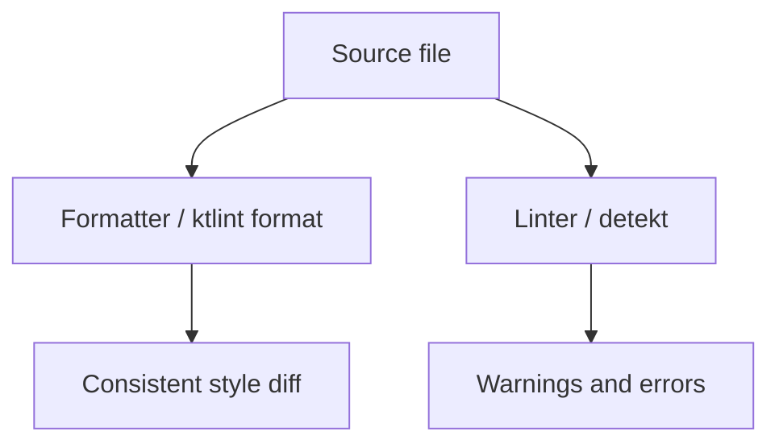

  
Prerequisites

  

    
Read these first if <strong>ASTs</strong>, <strong>CI checks</strong>, or <strong>format-on-save vs lint-on-CI</strong> are new.

    <ul>
      <li><a href="https://prettier.io/docs/en/comparison.html">Prettier — comparison with linters</a> — style machines vs correctness rules</li>
      <li><a href="https://eslint.org/docs/latest/use/core-concepts/">ESLint core concepts</a> — lint as configurable static analysis over an AST</li>
      <li><a href="https://kotlinlang.org/docs/coding-conventions.html">Kotlin coding conventions</a> — what a formatter is allowed to rewrite vs what a reviewer still owns</li>
    </ul>
  

## The symptom is the diff, not the bug

Reviewing a Kotlin change last month, half the lines were indentation and import order. The logic was fine; the author had run a different IDE formatter than the rest of the team. Another PR failed CI on a complexity warning in legacy code nobody touched — except the linter had never been enforced on that module before. Same toolchain family, opposite outcomes: one tool cleaned noise, the other blocked a release over style-adjacent rules.

That confusion shows up in every language shop. People say "run the linter" when they mean "run Prettier," or ship a formatter config and still wonder why review time did not drop. The fix is not another Slack thread about tabs vs spaces — it is knowing **which job each tool is built for** and where they overlap.

## Related reading

- **Docs:** [Prettier — Comparison with linters](https://prettier.io/docs/en/comparison.html); [Kotlin coding conventions](https://kotlinlang.org/docs/coding-conventions.html)
- **Articles surveyed:** [Formatter vs Linter (Awesome Code)](https://medium.com/awesomecode/formatter-vs-linter-what-is-the-difference-42b898a276ae) — high-level roles; [Linter vs Formatter (nono.ma)](https://nono.ma/linter-vs-formatter) — AST and speed

## Formatters: mechanical style, fast and deterministic

A **formatter** enforces presentation rules: indentation, line breaks, spacing around operators, max line length, quote style. It does not care whether your function is too complex — only whether the braces match the team guide.

Characteristics that matter in production:

- **Opinionated output** — given the same AST, you get the same text (Prettier, `gofmt`, Kotlin's formatter in IntelliJ)
- **Speed** — formatters rewrite text with limited analysis; they are built to run on save and in pre-commit hooks
- **Diff shrinking** — when everyone runs the same formatter, PRs show logic changes, not 400 lines of "I hit Reformat Code"

Companies adopt formatters because shared style is cheaper than debating it in review. That only works with a **written convention** (official language style guide + repo config) so new hires know what "correct" looks like before their first push.

> **Rule of thumb** - read the official style guide when learning a language; the formatter encodes a subset of it, not a substitute for understanding why names and structure matter.

## Linters: semantics, practices, and foot-guns

A **linter** walks source with deeper analysis — often an **abstract syntax tree (AST)** — and flags things that compile but smell wrong: unused variables, suspicious casts, cyclomatic complexity, deprecated APIs, security patterns.

Examples of linter territory:

- "This `@Composable` function reads mutable state without subscription"
- "Empty `catch` block"
- "Class has too many responsibilities" (complexity thresholds)

Linters are slower than formatters because they model meaning, not just whitespace. They catch errors and risky practices early; they also produce **false positives** if rules are copied from a blog post without tuning.

## Overlap: ktlint, detekt, and "formatting linters"

Some tools blur the line. **ktlint** is often described as a linter, but its sweet spot is Kotlin formatting — it can auto-fix style violations much like a formatter. **detekt** leans analytical: complexity, naming, coroutine misuse, custom rule sets.

On Android/Kotlin teams I have seen:

| Tool | Primary job | Typical hook |
|------|-------------|--------------|
| ktlint | Kotlin formatting + light style rules | pre-commit / CI format check |
| detekt | Complexity, smells, custom rules | CI gate on main |
| IntelliJ formatter | Local Reformat Code | IDE settings synced to `.editorconfig` |

Formatters (and formatting-first tools) win **speed** for the formatting job. Running detekt to argue about trailing commas is the wrong tool; running nothing but ktlint and expecting architecture enforcement is the other miss.

*Figure 1. Formatters normalize presentation; linters report semantic and practice issues. CI often runs both, with different failure thresholds.*

## What to enforce where (without a setup guide)

This post deliberately skips Gradle plugin wiring — that changes every year and belongs in project docs. At a policy level:

1. **Formatter (or ktlint format) on every commit** — zero debate in review about spacing
2. **Linter in CI with an allowlist for legacy** — new code meets the bar; old modules burn down gradually
3. **Shared conventions doc** — links to [Kotlin coding conventions](https://kotlinlang.org/docs/coding-conventions.html), Android Kotlin style, and *your* exceptions
4. **Do not ask linters to format** — use the formatter pass first so lint output is readable

When learning a language, official style guides teach idioms formatters cannot explain — when to prefer `val`, how to name test fixtures, how modules should depend on each other. The formatter makes the file pretty; the guide makes you a consistent teammate.

## Wrap-up

Noisy diffs usually mean missing or mismatched **formatters**, not missing linters. Blocked releases over style usually mean a **linter** is doing review work that belongs in docs or a formatter pass. Split the jobs, document conventions, and run the fast mechanical tool before the slow analytical one. Review gets shorter without lowering the bar on correctness.

## References

- [Prettier — Comparison with linters](https://prettier.io/docs/en/comparison.html) — scope and speed
- [Formatter vs Linter (Awesome Code)](https://medium.com/awesomecode/formatter-vs-linter-what-is-the-difference-42b898a276ae)
- [Linter vs Formatter (nono.ma)](https://nono.ma/linter-vs-formatter)
- [Kotlin coding conventions](https://kotlinlang.org/docs/coding-conventions.html)
- [ktlint](https://ktlint.github.io/) — Kotlin linter with formatting fixes
- [detekt](https://detekt.dev/) — static analysis for Kotlin
