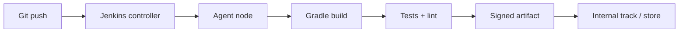

## Shipping broke before the code did

A release candidate built on a laptop "worked fine." The store build did not — different JDK patch, a stale cache, signing config picked from the wrong properties file. Nobody changed application logic that week; the pipeline did. That gap between **works on my machine** and **works for users** is why CI/CD exists. It is not Agile theater or DevOps rebranding; it is repeatable assembly, test, and promotion with audit trails.

I have shipped Android through classic Jenkins jobs and through org-scale platforms including [Screwdriver](https://github.com/screwdriver-cd/screwdriver) at enterprise scale (Verizon Media / Yahoo open-source lineage). The tools differ; the mental model does not. This post clarifies that model, how Jenkins fits, why platforms like Screwdriver exist, and how adjacent tools like Jira and Azure DevOps relate — without conflating project tracking with compilation.

## Related reading

- **Video:** [Jenkins pipeline overview](https://www.youtube.com/watch?v=LFDrDnKPOTg) — jobs, agents, and CI flow
- **Articles surveyed:** [Synopsys — Agile vs CI/CD vs DevOps](https://www.synopsys.com/blogs/software-security/agile-cicd-devops-difference.html); [Geekflare — Jira vs Azure DevOps](https://geekflare.com/dev/jira-vs-azure-devops/)

## Agile, CI/CD, and DevOps — three different layers

Teams mix these labels in one sentence; they solve different problems:

| Term | What it is | What it is not |
|------|------------|----------------|
| **Agile** | Product/process rhythm — sprints, backlog, feedback | Automatic builds |
| **CI/CD** | Automation — integrate, test, build, deploy on every change | A standup format |
| **DevOps** | Culture + ops practices — ownership from commit to production | Only a Jenkins install |

**Continuous Integration (CI)** merges work frequently and verifies each merge with automated build/test. **Continuous Delivery/Deployment (CD)** extends that to releasable artifacts — signed APK/AAB, staged rollouts, infra promotion. Agile decides *what* to build next; CI/CD proves *each increment still runs*; DevOps is the broader collaboration model around running it in production.

None of that replaces code review — it makes review trustworthy by showing green checks on real hardware or emulators, not just LGTM.

## Jenkins: the default mental model

[Jenkins](https://www.jenkins.io/) is the reference many engineers learn first: a controller schedules **jobs**, **agents** (executors) run steps, **pipelines** encode stages as code (`Jenkinsfile`).

Typical Android CI stages:

1. Checkout + cache Gradle dependencies
2. Static analysis (ktlint/detekt)
3. Unit tests (`:test`)
4. Assemble variants (`assembleRelease` / flavors)
5. Instrumentation or smoke tests (optional, slower)
6. Archive AAB/APK + upload to distribution (Play internal track, Firebase App Distribution)

*Figure 1. Simplified Jenkins CI path for Android.*

Jenkins is flexible — plugins for almost everything — but flexibility becomes **maintenance**: agent images drift, Groovy pipelines rot, credential sprawl. Small teams tolerate that; orgs with hundreds of repos often outgrow copy-paste Jenkinsfiles.

For a walkthrough of pipeline concepts, the [Jenkins CI/CD intro video](https://www.youtube.com/watch?v=LFDrDnKPOTg) is a reasonable starting point.

## Why Screwdriver (and similar platforms) exist

[Screwdriver](https://github.com/screwdriver-cd/screwdriver) is an open-source CI/CD platform (origin Verizon Media, widely used in large media/org estates). It targets **many teams, many pipelines, one control plane**: pipeline definitions in repo, containerized builds, event-driven triggers (PR, tag, cron), artifact and log aggregation.

You choose Screwdriver (or Buildkite, GitHub Actions at org tier, etc.) when:

- Jenkins plugin glue becomes its own product
- You need standardized secrets, audit, and ephemeral build containers
- PR throughput requires horizontal scale without hand-tuning agents

I am not claiming one tool wins everywhere — I am saying **org-scale CI** optimizes for consistency and operability over "install Jenkins on a VM and figure it out." Screwdriver's [cdCon 2020 talk slides (Verizon Media)](https://static.sched.com/hosted_files/cdcon2020/78/Screwdriver%20preso%20for%20CDCon.pdf) describe that operations angle better than a README skimming session.

Android specifics stay the same inside the container: Gradle wrapper, JDK pin, `local.properties` secrets from vault, emulator farms optional and expensive. On large Android monorepos I have worked in, PR gates usually run unit tests and static analysis; heavier instrumentation suites often move to nightly or release tracks.

> **Rule of thumb** - pick the platform that keeps JDK and SDK versions honest; Android failures from environment skew look like flaky tests.

## Jira vs Azure DevOps — adjacent, not interchangeable with CI

New hires often ask whether to "move CI from Jenkins to Jira." Wrong comparison.

- **Jira** — issues, sprints, workflow (Agile layer)
- **Azure DevOps** — boards *plus* repos, pipelines, artifacts (broader ALM)
- **Jenkins / Screwdriver / GitHub Actions** — execution engines for build/test/deploy

[Geekflare's Jira vs Azure DevOps comparison](https://geekflare.com/dev/jira-vs-azure-devops/) is useful for **planning and ALM**, not for choosing Gradle cache strategy. You can hook Jira ticket keys into CI for traceability (`PROJ-1234` in commit messages) without running compiles inside Jira.

## Practical lessons (enterprise CI, no secret sauce)

What transfers across Jenkins → Screwdriver (or any migration):

1. **Pin toolchains** — JDK, Android SDK, NDK in image or config; document bumps
2. **Gradle remote cache** — pays off on modular Android monorepos
3. **Separate PR vs release pipelines** — fast feedback under 15 minutes for lint+unit; full suite nightly
4. **Signed releases only from CI** — no manual keystore on a laptop
5. **Treat flaky tests as debt** — green that lies erodes trust faster than red

I will not invent internal Yahoo pipeline names or metrics here. Public takeaway: large mail-client Android CI looks boring on purpose — repeatable Gradle, guarded secrets, staged promotion — because exciting pipelines mean someone is firefighting.

## Wrap-up

Agile organizes work; CI/CD proves each change; DevOps is how teams own the path to production. Jenkins teaches the job/stage/agent model; platforms like Screwdriver carry that model at org scale. Jira and Azure DevOps help plan and trace work — they do not replace `./gradlew` in a clean container. If your release broke without a code change, fix the pipeline first.

## References

- [Jenkins](https://www.jenkins.io/)
- [Screwdriver CD](https://github.com/screwdriver-cd/screwdriver) — open-source CI/CD platform
- [Jenkins CI/CD overview (YouTube)](https://www.youtube.com/watch?v=LFDrDnKPOTg)
- [Agile vs CI/CD vs DevOps (Synopsys)](https://www.synopsys.com/blogs/software-security/agile-cicd-devops-difference.html)
- [Jira vs Azure DevOps (Geekflare)](https://geekflare.com/dev/jira-vs-azure-devops/)
- [Screwdriver at Verizon Media — cdCon 2020 slides (PDF)](https://static.sched.com/hosted_files/cdcon2020/78/Screwdriver%20preso%20for%20CDCon.pdf)
