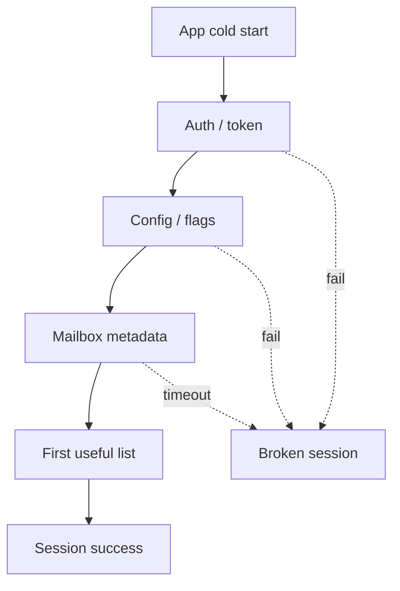

<details class="post-prereq" markdown="0">
  <summary>Prerequisites</summary>
  <div class="post-prereq__body">
    <p class="post-prereq__hint">Read these first if <strong>SLI/SLO, session success, or cold-start critical paths</strong> are new.</p>
    <ul>
      <li><a href="https://sre.google/sre-book/service-level-objectives/">SRE book — SLIs and SLOs</a> — what “up” means as a measured contract</li>
      <li><a href="https://developer.android.com/topic/performance/vitals/launch-time">Android app startup</a> — cold/warm start as user-visible latency</li>
      <li><a href="https://developer.android.com/topic/performance/vitals">Play Vitals overview</a> — how Play scores client health</li>
    </ul>
  </div>
</details>

## Green dashboards, angry sessions

Backend availability sits at a comfortable stretch of nines. On-call is quiet. The status page is green. And yet support tickets and client telemetry say the same thing: people cannot open mail, send a reply, or get past splash. That gap is not a mystery once you treat the **phone session** as the product — not the HTTP handler that returned 200.

For example, in a mail Android client the user-visible path is a chain: process start, auth/token refresh, config, mailbox metadata, then the first useful paint. A dependency that is “mostly up” can still fail the session if it sits on the critical path of cold start. Server SLIs that only count well-formed requests at the edge miss phones that never get that far.

## Related reading

- **Docs:** [SRE Book — Service Level Objectives](https://sre.google/sre-book/service-level-objectives/)
- **Articles surveyed:** [Engineering Reliable Mobile Applications (Google SRE)](https://sre.google/resources/practices-and-processes/engineering-reliable-mobile-applications/); [Product-Focused Reliability for SRE](https://sre.google/resources/practices-and-processes/product-focused-reliability-for-sre/); [How we build good SLOs at Google](https://cloud.google.com/blog/products/gcp/building-good-slos-cre-life-lessons)

## What backend nines actually measure

Classic request SLIs answer: *of the requests that reached us, what fraction succeeded fast enough?* That is necessary. It is not sufficient for a native client.

Problems that leave backend graphs looking healthy:

- DNS / TLS / captive portal failures before the first byte
- Token refresh deadlocks or clock-skew auth loops
- Config or feature-flag fetch timeouts that gate the UI
- Partial outages of a “minor” dependency that the client treats as blocking
- Successful APIs that return empty or stale payloads the UI cannot render as useful mail

Google’s SRE material is explicit: measure as close to the user as you can, and expect client-side collection to catch classes of failure server logs never see. Mobile makes that harder — telemetry is batched, lossy on airplane mode, and contaminated by device and network quality — but avoiding client SLIs does not make those failures fictional.



*Figure 1. Session success is an AND of cold-start dependencies, not an OR of green services.*

## Cold-start dependencies are product surface

On a mail client, “API up” often means many APIs. The wrong instinct after a green status page is to blame Compose, Room, or “Android flakiness.” The right instinct is to ask which dependency was on the **blocking** path for first useful frame.

| Dependency class | If it flakes… | Better product posture |
|------------------|---------------|------------------------|
| Auth / identity | Splash forever or login loop | Short timeout, cached session, clear retry |
| Remote config | Feature set unknown | Last-known-good config, degrade features |
| Mailbox bootstrap | Empty shell UI | Show cached list; sync in background |
| Avatar / enrichment CDN | Ugly, not unusable | Non-blocking; placeholders |

> **Rule of thumb** - if a call can turn a healthy backend into a stuck splash, it belongs on a session SLI, not only on a service dashboard.

Qualitatively: when cold-start critical paths balloon under partial dependency failure, users experience “the app is down” even while edge success rates stay high. That is the product truth — for example, in a mail app with a green API dashboard and a stuck splash.

## Redefine SLIs when the client is the product

A practical mobile-first SLI set for a mail client looks more like journey success than request yield:

1. **Cold-start session success** — process start → first interactive mailbox (or intentional offline shell) within a budget
2. **Critical write success** — send / save draft acknowledged (local + server path as designed)
3. **Sync freshness** — inbox reflects server state within a latency budget the product owns
4. **Degraded-but-usable rate** — fraction of sessions that still show cached mail when a non-critical dep is down

Backend availability remains a dependency SLI. Product reliability is the AND of those journeys. Annotating RPCs with “which user step is this?” — the product-SRE idea of client-side annotation — helps join phone telemetry to server logs without pretending a 200 at the load balancer equals a successful open.

```kotlin
// why: count journeys, not lone HTTP codes
data class SessionSli(
    val coldStartOk: Boolean,   // first useful paint or offline shell
    val authPath: String,       // cached | refreshed | failed
    val blockingDepFailures: List<String>,
)
```

## Tradeoffs

Client SLIs are messier than server counters: sampling bias, OS kills, users who background mid-start. Still better than optimizing the wrong graph. Teams that only burn error budget on edge 5xx will “fix” availability while phones stay broken — and the Android team will keep getting tickets for a distributed systems problem.

Operationally, split dashboards help: dependency health for paging the right service owner, session journeys for deciding whether the *product* is up. When those disagree, believe the session chart first and use dependency charts to find which link in Figure 1 snapped.

## Wrap-up

Backend nines measure the door you already walked through. Phones fail earlier: cold-start deps, auth, config, bootstrap. When the client *is* the product, redefine success as session and journey SLIs, keep non-critical work off the blocking path, and stop treating green API dashboards as proof users can read mail.

## References

- [SRE Workbook — Implementing SLOs](https://sre.google/workbook/implementing-slos/)
- [Engineering Reliable Mobile Applications](https://sre.google/resources/practices-and-processes/engineering-reliable-mobile-applications/)
- [Product-Focused Reliability for SRE](https://sre.google/resources/practices-and-processes/product-focused-reliability-for-sre/)
- [How we build good SLOs at Google](https://cloud.google.com/blog/products/gcp/building-good-slos-cre-life-lessons)
