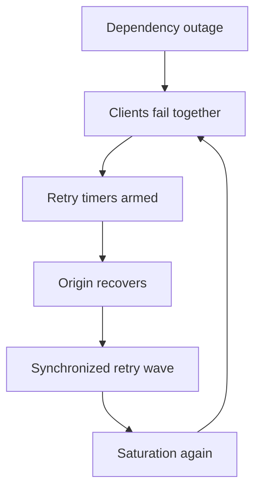

## The outage ended. The traffic did not.

Origin recovers. Deploy is rolled forward. Error budgets look ready to heal. Then RPS spikes past the incident peak, tail latency returns, and on-call wonders whether the attack is back. It is not an attacker. It is **every phone** that queued a retry when the world was on fire — now firing in phase.

Mail clients (and every other always-on mobile app) are distributed load generators with imperfect clocks. A well-meant `repeatOnFailure` without jitter and caps turns recovery into a self-inflicted DDoS. This post is about that metastable failure mode and the client-side brakes that keep retries from owning the incident.

## Related reading

- **Articles surveyed:** [Retry storm as self-inflicted DDoS (Rack2Cloud)](https://www.rack2cloud.com/retry-storm-self-inflicted-ddos/); [Backoff and jitter for mobile networks](https://dcdhameliya.com/blog/designing-retry-and-backoff-strategies-for-mobile-networks); [Retry storms — backoff, jitter, budgets (Webalert)](https://web-alert.io/blog/retry-storms-exponential-backoff-jitter-explained); [Mobile API retry storm mitigation (Appxiom)](https://www.appxiom.com/blogs/how-to-detect-and-mitigate-mobile-api-retry-storms-that-bring-down-backend-services/)

## How phones synchronize by accident

During the outage, failures cluster in wall-clock time: push storms, users foregrounding the app, shared timeouts. Each client schedules retry at `now + backoff`. Without randomness, exponential backoff alone produces **waves** — T+1s, T+2s, T+4s — that all hit the recovering service together. The third wave is often worse than the original fault because the service has just started accepting work again.



*Figure 1. Recovery without jitter feeds the next outage.*

Mobile makes amplification worse: process death loses in-memory “we already tried,” WorkManager and push reopen work, and old app versions with aggressive policies stay in the wild for a long tail after you ship a fix. At mail-client scale you do not need every user to hammer send — inbox sync, auth refresh, and badge fetch alone are enough to rebuild the outage if they share one naive retry loop.

## Jitter, budgets, and idempotency

| Control | What it does | Failure if missing |
|---------|--------------|--------------------|
| Exponential backoff | Reduces per-client rate | Still synchronized waves |
| **Full jitter** | Spreads retries across the window | Lockstep herds |
| Max attempts / max delay | Bounds patience | Infinite background heat |
| Retry budget | Caps retries as a fraction of traffic | Global amplification |
| Idempotency keys | Safe replay of sends/mutations | Duplicate mail / side effects |
| Circuit breaker | Fail fast when dep is down | Retries become the outage |

AWS’s “full jitter” guidance — delay in `[0, min(cap, base * 2^attempt)]` — is the pattern to steal. Equal jitter is better than nothing; full jitter decorrelates harder.

```kotlin
// why: decorrelate recovering clients; cap patience
fun fullJitterDelay(attempt: Int, baseMs: Long = 500L, capMs: Long = 60_000L): Long {
    val exp = (baseMs * (1L shl attempt.coerceAtMost(16))).coerceAtMost(capMs)
    return Random.nextLong(0L, exp + 1L)
}
```

Idempotency is non-negotiable for mail send and draft upload. Retries without keys turn a storm into duplicate messages — a correctness incident riding on the availability one.

## Client circuit breakers

Retries handle **transient** blips. Circuit breakers handle **sustained** failure: open the circuit for an endpoint class (auth, sync, send), fail fast to cached UX, and probe with a single half-open attempt on a **jittered** cool-down so breakers do not all flip together. Per-endpoint breakers beat one global switch — a broken avatar CDN should not freeze inbox sync.

On Android, put this in the shared API layer (OkHttp interceptor / repository policy), not ad hoc in each screen. Classify before retry: 401/403 are not “try harder”; 429 should honor `Retry-After`; 500/502/503/timeouts are the usual retry set.

> **Rule of thumb** - if the breaker is open, the retry loop must exit, not dig a deeper queue.

## What to watch after an incident

Qualitative signals that the herd is you: retry rate as a share of RPS climbing while origin errors fall; identical request fingerprints from huge device fanout; half-open stampedes when a breaker timer aligns. Compare **attempt** counts to **unique user or device** counts — if attempts race ahead while unique actors stay flat, recovery traffic is synthetic.

Chaos-test “dependency down for N minutes, then up” in a pre-prod cohort before the next real SEV teaches the same lesson with customers. Include the mobile binary in that drill; mesh-only retry policy will not catch WorkManager coalescing every failed sync into the same wake-up minute.

Ship retry policy as a versioned, remote-configurable default when you can — so the next bad client build is not a forever tax — but never rely on config alone for idempotency and jitter; those belong in the binary.

## Wrap-up

When the outage ends and phones retry wrong, your clients become the DDoS. Exponential backoff without jitter synchronizes waves; missing idempotency duplicates work; missing circuit breakers keep digging. Treat retry policy as production architecture — shared, budgeted, jittered, breakered — so recovery can stick.

## References

- [Retry storm — self-inflicted DDoS (Rack2Cloud)](https://www.rack2cloud.com/retry-storm-self-inflicted-ddos/)
- [Designing retry and backoff for mobile networks](https://dcdhameliya.com/blog/designing-retry-and-backoff-strategies-for-mobile-networks)
- [Retry storms — backoff, jitter, budgets (Webalert)](https://web-alert.io/blog/retry-storms-exponential-backoff-jitter-explained)
- [Mobile API retry storm detection and mitigation](https://www.appxiom.com/blogs/how-to-detect-and-mitigate-mobile-api-retry-storms-that-bring-down-backend-services/)
- [AWS Architecture Blog — exponential backoff and jitter](https://aws.amazon.com/blogs/architecture/exponential-backoff-and-jitter/)
