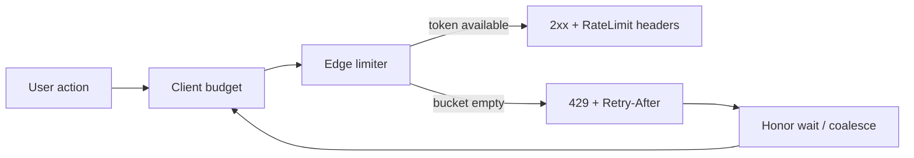

<details class="post-prereq" markdown="0">
  <summary>Prerequisites</summary>
  <div class="post-prereq__body">
    <p class="post-prereq__hint">Read these first if <strong>HTTP 429, Retry-After, or token-bucket limiting</strong> are new.</p>
    <ul>
      <li><a href="https://developer.mozilla.org/en-US/docs/Web/HTTP/Status/429">HTTP 429 Too Many Requests</a> — the status clients must handle</li>
      <li><a href="https://developer.mozilla.org/en-US/docs/Web/HTTP/Headers/Retry-After">Retry-After header</a> — when to try again</li>
      <li><a href="https://en.wikipedia.org/wiki/Token_bucket">Token bucket (rate limiting)</a> — common server-side limiter mental model</li>
      <li><a href="https://datatracker.ietf.org/doc/html/draft-ietf-httpapi-ratelimit-headers">Rate limit headers (IETF draft overview)</a> — communicating budgets to clients</li>
    </ul>
  </div>
</details>

## The spinner that lied

A user taps Send on a mail compose screen. The button greys out. A circular progress indicator spins for twelve seconds. Then a toast: "Something went wrong." Support gets a ticket. Backend logs show a clean `429 Too Many Requests` with `Retry-After: 8`. The client treated capacity protection like a random outage, burned the user's attention, and taught them nothing about when to try again.

Rate limits are not a backend-only concern. On a production Android client, a 429 is a **contract**: the server is healthy enough to answer, and it is telling you how to wait. If the UX ignores that contract, you gaslight the user — the app looks broken while the platform is doing its job.

## Token buckets, not fixed windows, for phones

Mobile traffic is bursty. A user returns from airplane mode; the app wakes sync, prefetch, and analytics in the same second. A **fixed window** ("100 requests per minute") treats that foreground burst like abuse and blocks the next legitimate tap. A **token bucket** fits the pattern better: tokens refill at a steady rate, unused capacity accumulates up to a cap, and short bursts spend the savings.



*Figure 1. Client and edge share one story: spend tokens, or wait with a clock.*

Identity matters. Do not key mobile limits on IP — carrier NAT and hotel Wi‑Fi put thousands of phones behind one address. Prefer authenticated user (or device) IDs, with separate buckets for interactive vs bulk paths when login/SMS abuse is in play.

> **Rule of thumb** - size the burst for "app just foregrounded," not for a steady scrape. Then enforce the sustained rate so runaway clients still get stopped.

## Retry-After is the UX signal

A bare 429 with an empty body is how you create spinner hell. The useful response carries:

- `Retry-After` — seconds (or an HTTP-date) until a retry is welcome
- Remaining-budget headers on **success** responses too (`RateLimit-Remaining` / vendor equivalents), so the client can throttle *before* the wall
- A machine-readable code plus a short human message ("Too many send attempts — try again in a moment")

On Android, parse that once in the HTTP layer and surface a typed failure to the UI, not a generic `IOException`:

```kotlin
sealed class ApiFailure {
    data class RateLimited(val retryAfterMs: Long, val message: String?) : ApiFailure()
    data class Transient(val cause: Throwable) : ApiFailure()
    data class Fatal(val code: Int, val body: String?) : ApiFailure()
}

fun Response.toFailure(): ApiFailure {
    if (code == 429) {
        val seconds = header("Retry-After")?.toLongOrNull() ?: 30L
        return ApiFailure.RateLimited(
            retryAfterMs = seconds * 1_000,
            message = peekBody(1_024).string().takeIf { it.isNotBlank() },
        )
    }
    // ... map 5xx vs 4xx
}
```

Honor `Retry-After` before inventing your own schedule. If the header is missing, use exponential backoff **with jitter** so a fleet of clients does not retry in lockstep. Cap attempts; after that, stop and explain — endless silent retries are still gaslighting.

## Degrade the product, not the honesty

When the bucket is empty, the UI should change shape — not freeze on a spinner.

| Mode | When | What the user sees |
|------|------|--------------------|
| **Queue** | Non-urgent sync / prefetch | Work waits; chrome stays usable |
| **Coalesce** | Duplicate refreshes | One in-flight request absorbs the rest |
| **Explain** | User-initiated send / login | Clear copy + countdown or disabled CTA |
| **Prioritize** | Mixed load | Keep auth and critical writes; defer analytics |

Coalescing matters as much as backoff. If three screens each fire `GET /inbox` on resume, merge them. Client-side token buckets that sit *under* the documented server limit reduce how often you hit 429 at all — reserve a slice of budget for retries so a recovery attempt is not what pushes you over.

For abuse-sensitive flows (SMS OTP, password reset), fail closed with an explicit wait. Do not hide the limit behind "network error." Users accept "wait 30 seconds"; they do not accept a spinning button that eventually shrugs.

## Wrap-up

The portable lesson is boring on purpose: typed 429 handling, shared request coalescing, and honest copy beat another loading indicator. Token buckets absorb mobile bursts; `Retry-After` tells the client when a retry is welcome; queue / coalesce / explain keep the product usable without pretending the network failed. If your rate limit only shows up as a spinner, you have a UX bug — not just an ops control.

## References

- [RFC 9110 — 429 Too Many Requests](https://www.rfc-editor.org/rfc/rfc9110.html#name-429-too-many-requests)
- [Designing Rate Limiting for Mobile APIs](https://dcdhameliya.com/blog/designing-rate-limiting-for-mobile-apis)
- [Rate Limiting Strategies That Don't Kill Your UX](https://raghavkattel.com.np/blog/rate-limiting-strategies-that-dont-kill-your-ux)
- [Consuming Rate-Limited APIs (Webalert)](https://web-alert.io/blog/consuming-rate-limited-apis-handling-429s-guide)
