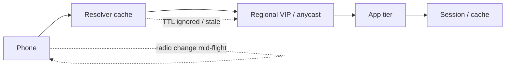

## The phone moved; the control plane did not

A traveler opens your app over airport Wi‑Fi in SFO, then boards a flight and lands on LTE in another metro. DNS once pointed them at `us-west`. Mid-session they are physically closer to `eu-central`, but the process still holds a pooled connection to an IP that is now a bad bet — or worse, a sticky session cookie that insists the old region owns their cart and auth state. Latency climbs. Failover on the backend looks healthy in the dashboard. The user sees timeouts and a mysterious logout.

Multi-region architecture slides are tidy: latency-based DNS, health checks, active-active reads. Mobile clients are not tidy. They cache resolvers aggressively, keep sockets open across radio changes, and move through the world faster than TTL math assumes. This post is about that mismatch — what breaks when the phone moves and the control plane assumes a laptop that sat still.

## Related reading

- **Docs:** [AWS — cross-region DNS load balancing and failover](https://docs.aws.amazon.com/whitepapers/latest/real-time-communication-on-aws/cross-region-dns-based-load-balancing-and-failover.html)
- **Articles surveyed:** [Multi-Region Deployment (Codelit)](https://codelit.io/blog/multi-region-deployment-architecture) — routing and session options; [Multi-Region Failover (CloudRoute)](https://cloudroute.net/insights/reliability/multi-region-failover/) — TTL and untested failover

## Latency is not only "pick the nearest region"

Serving from a nearby region cuts RTT. That helps — until the path is: phone → bad radio → CDN edge → region that is "nearest" by yesterday's DNS answer → a dependency that still calls home to the primary DC. End-to-end user latency is the sum of **DNS age**, **connection reuse**, **TLS**, **app-layer retries**, and **cross-region chatter** you forgot about (session store, feature flags, analytics).

For mail-scale Android clients, the symptom often looks like "sync is flaky on travel days," not "Route 53 misconfigured." Measure from the device when you can; backend p50 will not show the 2 seconds spent on a dead pooled IP.

*Figure 1. The phone's path includes caches the control plane does not own.*

## DNS failover is slower than the slide

Latency-based or failover DNS (Route 53, Cloudflare, and peers) is the usual entry point: health checks remove a sick region; new answers go to a healthy one. Caveats that matter on phones:

- **TTL is a hint.** Carrier and OS resolvers often cache longer than you configured. Expect tens of seconds to minutes of sticky wrong answers during an incident — not instant cutover.
- **Clients that ignore TTL and pin IPs** will retry the corpse. Web browsers are better at this than many custom OkHttp stacks you wrote in 2019 and never revisited.
- **Anycast / Global Accelerator-style fronts** can move traffic without waiting for every resolver to forget an A record — still not a substitute for client reconnect logic.

> **Rule of thumb** - design for "DNS will lie for a while." The app must detect bad endpoints and open a fresh connection that re-resolves, not hammer the same IP with linear retries.

## Sticky sessions that lie

Sticky sessions (cookie or IP affinity to one region or one node) feel simple until failover. If auth or cart state lives in memory in `us-east-1` and traffic shifts to `eu-west-1`, the user is not "failed over" — they are logged out or mid-transaction broken. Support tickets will not say "sticky session"; they will say the app is broken.

Prefer patterns that survive a region shift:

| Approach | Upside | Tradeoff |
|----------|--------|----------|
| Stateless tokens (JWT-style) | No regional session memory | Revocation needs a blocklist or short TTL |
| Externalized session (global table / replicated cache) | Survives shift | Replication lag; cost; conflict rules |
| Regional sticky + accept logout on failover | Simple | Bad UX on the exact day you need HA |

Cache invalidation across DCs is the sibling problem: a write in region A and a read in region B during lag looks like a client bug ("I deleted that mail; it came back"). Treat replication lag as a first-class product state — show "syncing" — rather than pretending strong consistency you do not have.

## What the client must do

Server multi-region without a ready client is incomplete. Practical Android-side habits:

1. **Honor DNS TTL on the HTTP stack** — bound connection lifetime; force re-resolve on systematic failures
2. **Skip known-bad IPs** for a cooldown instead of reconnecting forever to the same address
3. **Backoff with jitter** on regional blips; distinguish "no radio" from "TCP to this host fails"
4. **Keep critical writes idempotent** so a retry after failover does not double-send
5. **Do not assume the region that answered login owns the next hour of traffic** if the user is moving

Test failover with a real client journey (cold start, resume, mid-compose send), not only synthetic HTTP from a VPC. Unrehearsed DR is how you discover the secondary region cannot reach a vendor API or a secrets store.

## Wrap-up

Multi-region buys latency and survival only if DNS age, sticky state, and mobile connection reuse are part of the design. Phones move mid-flight — literally and figuratively. Build clients that re-resolve and recover, and keep session state somewhere a region shift cannot orphan.

## References

- [AWS whitepaper — Cross-region DNS load balancing and failover](https://docs.aws.amazon.com/whitepapers/latest/real-time-communication-on-aws/cross-region-dns-based-load-balancing-and-failover.html)
- [Multi-Region Deployment Architecture (Codelit)](https://codelit.io/blog/multi-region-deployment-architecture)
- [Multi-Region Failover guide (CloudRoute)](https://cloudroute.net/insights/reliability/multi-region-failover/)
- [AWS Global Accelerator](https://aws.amazon.com/global-accelerator/) — anycast front ends when DNS TTL is too slow
