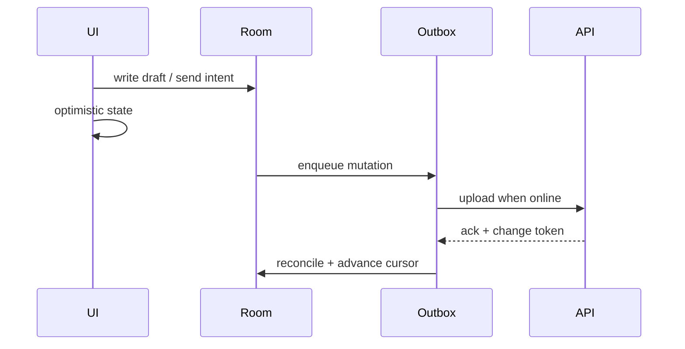

## The draft that vanished between phones

You edit a reply on the train. Radio drops. The UI still shows the text — good. Later you open the same account on a tablet and the draft is an older version, or gone, or duplicated after sync. Nobody “lost” a database row in the dramatic sense. The system chose **availability** while partitioned, then paid the bill when devices reconverged.

Mail is the textbook offline-first product: subway tunnels, flaky hotel Wi‑Fi, background sync killed by the OS. CAP is not a whiteboard slogan here — it is what the compose screen does when the network lies. This post ties offline-first consistency to the sync machinery that makes mail feel correct: read-your-writes, multi-device drafts, incremental sync, push vs poll, and latency budgets.

## Related reading

- **Articles surveyed:** [Offline vs real-time sync and conflicts (Adalo)](https://www.adalo.com/posts/offline-vs-real-time-sync-managing-data-conflicts/); [Flutter offline-first sync strategies (Samioda)](https://samioda.com/en/blog/flutter-offline-first-sync-conflict-resolution); [PACELC / sync taxonomy (Aalto thesis excerpt)](https://aaltodoc.aalto.fi/server/api/core/bitstreams/d485ca46-ef01-41bc-ae4c-d468afb209a8/content)

## CAP as UX, not just theory

During a partition, a mail client that still lets you compose has already chosen **A** over strong **C**. That is the right product call for drafts and local reads. The mistake is pretending the later merge is free.

| User action | While offline / lagging | Consistency risk |
|-------------|-------------------------|------------------|
| Read inbox | Show Room / disk cache | Stale unread badges |
| Edit draft | Local write + outbox | Multi-device last-write fights |
| Send | Optimistic “Sending…” | Duplicate send if not idempotent |
| Star / archive | Queue mutation | Order vs server rules |

PACELC sharpens the everyday case: even without a hard partition, you are still choosing latency vs consistency on every sync. Instant local UI is PA/EL-shaped. Waiting on the server for every keystroke is PC/EC — and feels broken on cellular.

> **Rule of thumb** - label every write path with the promise you owe the user: local-only, read-your-writes on this device, or cross-device eventually consistent.

## Read-your-writes on one device

After send or archive, the next list refresh must not resurrect the old state. On a single phone that means: mutate local store first, show optimistic UI, and do not let a stale pull overwrite a newer local version. Server acknowledgment updates the sync token; until then, local causality wins for that session.



*Figure 1. Local write, durable outbox, then incremental pull — not “refresh and hope.”*

## Multi-device drafts are the hard case

Two devices editing the same draft is where “eventually consistent” becomes a support ticket. Strategies that show up in production mail-shaped systems:

1. **Last-write-wins with server timestamps** — simple; can surprise users who typed more on the “losing” device
2. **Draft revision / etag** — second device must merge or fork (“keep both”) when versions diverge
3. **Single active editor lease** — rare on mobile; fights the offline-first goal

At mail scale, inventing a novel CRDT usually matters less than **honest UI**: pending sync affordances, conflict surfaces when needed, and never silently dropping the longer draft. Cross-device read-your-writes is a different promise than same-device; product copy and sync order should admit that.

## Incremental sync, push, and poll

Full mailbox refetch does not scale on cellular and destroys battery. Incremental sync with an opaque **change token** (not a client wall clock) avoids skew and lets the server page deltas. Push is usually a **shoulder tap** — FCM says “something changed,” the client pulls — because silent payloads are limited and unreliable under Doze. Polling remains the safety net when push is delayed or permission-denied.

| Mechanism | Strength | Weakness |
|-----------|----------|----------|
| Incremental pull | Bandwidth, deterministic cursor | Needs solid server changefeed |
| Push tap → pull | Low latency when it works | OS delivery not guaranteed |
| Foreground poll / pull-to-refresh | User-controlled freshness | Easy to over-poll |
| Background WorkManager | Catch-up when idle | Deferred, not interactive |

Latency budgets belong to product, not folklore: interactive send ack on-device should feel immediate (local); server visibility to other devices can sit in a longer band; badge correctness can tolerate more lag than “did my send leave this phone?” Mixing those budgets produces either sluggish compose or false “lost mail” reports.

On Android, durable outbox + WorkManager covers process death; the UI still has to render **pending** vs **acked** so users do not double-tap send into duplicate risk. Idempotency keys on the mutation close that loop when the network lies about whether the first attempt landed.

```kotlin
// why: token > wall clock; survive process death
data class SyncCursor(val changeToken: String)
data class OutboxItem(
    val idempotencyKey: String,
    val mutation: Mutation,
    val localVersion: Long,
)
```

## Wrap-up

Offline-first mail is a consistency product: CAP during partitions, PACELC on every sync, read-your-writes on-device, explicit multi-device draft rules, incremental tokens, and push-as-tap with poll as backup. If the UI implies strong cross-device consistency you did not build, users will file bugs against Android — and they will be right about the experience, even when the servers are “fine.”

## References

- [Offline vs real-time sync (Adalo)](https://www.adalo.com/posts/offline-vs-real-time-sync-managing-data-conflicts/)
- [Flutter offline-first sync (Samioda)](https://samioda.com/en/blog/flutter-offline-first-sync-conflict-resolution)
- [Limits of generalized sync / PACELC framing (Aalto)](https://aaltodoc.aalto.fi/server/api/core/bitstreams/d485ca46-ef01-41bc-ae4c-d468afb209a8/content)
- [WorkManager — guide](https://developer.android.com/develop/background-work/background-tasks/persistent/getting-started)
