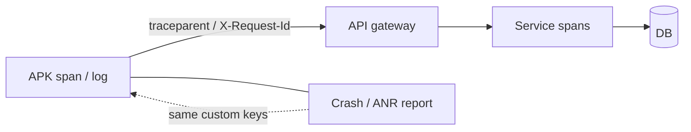

<details class="post-prereq" markdown="0">
  <summary>Prerequisites</summary>
  <div class="post-prereq__body">
    <p class="post-prereq__hint">Read these first if <strong>OpenTelemetry, trace context, correlation IDs, or ANR signals</strong> are new.</p>
    <ul>
      <li><a href="https://opentelemetry.io/docs/concepts/signals/">OpenTelemetry concepts</a> — traces, metrics, logs as signals</li>
      <li><a href="https://www.w3.org/TR/trace-context/">W3C Trace Context</a> — how `traceparent` ties client → server spans</li>
      <li><a href="https://developer.android.com/topic/performance/vitals/anr">ANRs</a> — client freezes as a vital</li>
      <li><a href="https://firebase.google.com/docs/crashlytics">Firebase Crashlytics</a> — crash/ANR reporting pipeline many apps use</li>
    </ul>
  </div>
</details>

## Users say it's broken; three dashboards disagree

Play Console shows a mild crash uptick. Backend latency is flat. Product analytics says "send success" is fine. Support pastes a screenshot of a spinner that never ends. Nobody is lying — they are looking at **different signals that do not share an ID**. The APK, the API gateway, and the store each tell a partial story. Without a correlation key that survives the hop from phone to backend, you triage by vibe.

This post is about stitching that story: correlation IDs from client to server, and why crashes, logs, and metrics answer different questions. For the **client ANR / Crashlytics layer** specifically — watchdog snapshots, Play Vitals vs Crashlytics timing — see [ANR Stack Traces Lie by Omission]({{ site.baseurl }}/android-crashlytics-anr). Here the focus is the **system boundary**, not ANR forensics.

## Related reading

- **Internal:** [ANR Stack Traces Lie by Omission]({{ site.baseurl }}/android-crashlytics-anr) — client ANR/crash reporting constraints
- **Docs:** [OpenTelemetry — client-side apps](https://opentelemetry.io/docs/platforms/client-apps/); [OpenTelemetry Android](https://opentelemetry.io/docs/platforms/client-apps/android/)
- **Articles surveyed:** [Android mobile observability with OTel](https://docs.base14.io/blog/android-mobile-observability-opentelemetry/) — W3C propagation end-to-end; [W3C Trace Context](https://www.w3.org/TR/trace-context/) — the header contract

## Correlation is the join key

A useful incident join looks like this:

1. User action (or support ticket time) → client session / screen
2. Outgoing HTTP carries a **trace or request ID**
3. Gateway and services continue the same ID in logs and spans
4. You can jump from "send hung" to the exact backend handler without guessing timestamps

OpenTelemetry's usual vehicle is [W3C Trace Context](https://www.w3.org/TR/trace-context/) (`traceparent` / `tracestate`). OkHttp instrumentation can inject those headers; backends that speak OTel continue the trace. Even if a legacy service only logs the header, you can still grep one ID across Nginx and app logs.

```kotlin
// why: one ID the UI, HTTP client, and support tooling can all show
val requestId = UUID.randomUUID().toString()
Firebase.crashlytics.setCustomKey("request_id", requestId)

val request = originalRequest.newBuilder()
    .header("X-Request-Id", requestId)
    // prefer W3C traceparent when the stack supports it
    .build()
```

Propagate on **user-meaningful** calls (sync, send, login), not on every analytics ping. Sample aggressively on high-volume paths; battery and egress are real constraints on mobile ([OTel client guidance](https://opentelemetry.io/docs/platforms/client-apps/)).



*Figure 1. One ID ties store crash reports, client RUM, and backend traces.*

> **Rule of thumb** - if support cannot paste one ID and get both the mobile breadcrumb and the server log line, you do not have distributed telemetry yet — you have adjacent dashboards.

## Crashes ≠ logs ≠ metrics

Teams collapse these into "observability" and then argue past each other:

| Signal | Answers | Lies when… |
|--------|---------|------------|
| **Crashes / ANRs** | Process died or UI watchdog fired | Snapshot timing misses the root cause ([ANR post]({{ site.baseurl }}/android-crashlytics-anr)) |
| **Action / event logs** | What the user (or client) attempted | You never logged the state you needed; PII rules stripped the join key |
| **Metrics** | Rate, latency, saturation over time | Averages hide the cohort; success counters ignore "hung UI" |

A flat backend p95 with rising client "send failed" often means the failure is **before** or **after** the timed handler: DNS, TLS, parse, main-thread work, or a 429 the metrics classified as client error. Correlated traces expose the gap; store crash charts alone cannot.

Conversely, a crash-free session rate can look healthy while a feature is unusable — the process never died; the button no-op'd. Metrics on business success ("message sent") catch that class; crash dashboards will not.

## What to put on the wire (and what not to)

**Do:** stable `request_id` / W3C context; coarse screen name; build/version; non-PII feature flags that explain the path.

**Don't:** raw email bodies, auth tokens, or unbounded breadcrumbs that become a second database. Redact at the source. Offline buffer and batch export so airplane mode does not drop the only evidence of a failed send.

Ownership matters as much as tooling. Decide who pages on **client crash-free**, **API availability**, and **business success** separately — then require the shared ID so those on-calls can meet in one trace. Datadog-style RUM+APM products help when configured; they do not invent correlation if the APK never sends a header.

## Wrap-up

[Crashlytics / ANR work]({{ site.baseurl }}/android-crashlytics-anr) teaches you to distrust a single main-thread snapshot and to design custom keys for session context. This post assumes that layer and asks the next question: **can you walk from that key into backend time?** If the answer is only "we have Play Vitals" and "we have Grafana," you will keep holding three-way meetings about whose chart is right.

Ship one join key from APK to backend, and treat crashes, logs, and metrics as different questions — not competing sources of truth. Store dashboards explain process death; correlated traces explain "users say it's broken" when the process lived. Wire the header before you buy another chart.

## References

- [ANR Stack Traces Lie by Omission (this site)]({{ site.baseurl }}/android-crashlytics-anr)
- [OpenTelemetry — Client-side apps](https://opentelemetry.io/docs/platforms/client-apps/)
- [OpenTelemetry — Android](https://opentelemetry.io/docs/platforms/client-apps/android/)
- [Android mobile observability with OpenTelemetry (base14)](https://docs.base14.io/blog/android-mobile-observability-opentelemetry/)
