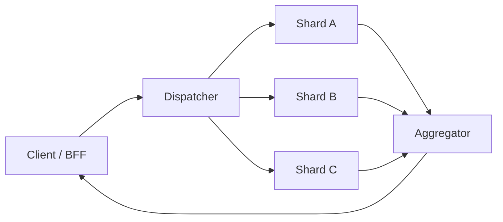

## You already ship these — under different names

Interview decks love pattern bingo. Production teams ship the same shapes with boring product names: edge gateways, Room caches, fan-out sync, attachment pipelines, nightly aggregations, workflow runners. Ricky Ho’s 2010 tour of [scalable system design patterns](https://horicky.blogspot.com/2010/10/scalable-system-design-patterns.html) still maps cleanly onto mobile clients and the backends they talk to — if you skip the résumé rename and ask where each pattern already lives.

This is an opinionated tour of six patterns that earn their keep. Each vignette is a **mail-shaped example** (client behavior, or how systems like mail typically wire the server). No BSP, no blackboard — I do not have a sharp phone-side example for those.

## Load balancer — any replica can take the next open

A dispatcher sits in front of identical workers. Statelessness is the real requirement: if session affinity is mandatory, you have not finished the pattern.

**Vignette:** Cold-open inbox hits whichever healthy API instance has capacity. Sticky sessions that “fix” flaky clients usually hide a server that still holds soft state — push that state into a shared cache or token, or Android retries become a DDoS on one bad pod. From the client: do not invent your own sticky affinity; treat every instance as interchangeable and keep retries idempotent.

## Result cache — do not pay twice for the same answer

Before expensive work, look up a prior result. Invalidation is the tax; TTL alone is not a strategy when avatars and thread metadata change mid-scroll.

**Vignette:** Thread metadata in an API/CDN cache, plus Room on device. Stampede on app open is the failure mode: many clients miss together after a purge or deploy. Cache-aside with jittered TTL and write-through for “I just sent” paths keeps open-inbox from turning into a thundering herd — you feel it as latency cliffs after a bad invalidation.

## Scatter-gather — fan out, then merge

Unlike a load balancer (pick one identical worker), scatter-gather sends work to **many** workers that may hold different shards or offer different facets, then aggregates.

*Figure 1. Scatter-gather: parallel workers, one merged response (timeouts drop stragglers).*

**Vignette:** Global search across mailbox shards, or a BFF that fans out to mail + calendar + contacts for a unified typeahead. Timeouts matter more than completeness: a 200 ms straggler should not hold the whole suggestion list. Drop late shards; show partial results with a clear “still loading” affordance — that is a client UX contract as much as a server one.

## Pipe and filter — stages with narrow contracts

Data flows through sequential stages. Each filter owns one transformation; pipes carry the bytes.

**Vignette:** Attachment path: upload → virus scan → thumbnail/transcode → CDN publish. The product mistake is making send wait on the whole pipe. Ack the user when the message is durable; let filters finish asynchronously unless trust requires inline completion. On Android compose, that means separate UI states for “message exists” vs “preview ready.”

## Map-reduce — batch when I/O dominates

Map emits key/value pairs; reduce aggregates by key. Best when disk or scan cost dwarfs coordination — classic Hadoop territory, but the shape shows up in smaller jobs too.

**Vignette:** Nightly “top senders / large attachments” analytics over anonymized mail telemetry, or a one-shot reindex of a corrupted search partition. Do not pretend interactive open-message is map-reduce. If a user is waiting on a spinner, you wanted scatter-gather or a cache, not a batch job.

## Orchestrator — dumb workers, smart schedule

A central scheduler runs a dependency graph: unlock ready tasks, retry failures, keep workflow state. Workers stay dumb on purpose.

**Vignette:** Send pipelines as a DAG — persist draft → upload attachments → commit send → fan out push/index. Orchestration on the server (or a workflow engine) beats a phone that chains five fragile network calls and loses power mid-flight. The client’s job is optimistic UI and idempotent retries; the orchestrator owns “what runs next when step three fails.”

| Pattern | Steal when… | Prefer something else when… |
|---------|-------------|-----------------------------|
| Load balancer | Workers are interchangeable | Soft state still lives on one box |
| Result cache | Reads repeat, writes are rare enough to invalidate | Every read is unique |
| Scatter-gather | Parallel facets / shards beat one deep call | You need one authoritative writer |
| Pipe-filter | Stages have different SLAs / owners | You need a single transactional step |
| Map-reduce | Offline / batch I/O | Interactive latency budgets |
| Orchestrator | Multi-step workflows with retries | One request / one service is enough |

Name the shape so you can argue about tradeoffs — not so you can label a slide. In a large Android mail client, most of these show up as gateway routing you depend on, Room/CDN caches you populate, fan-out search you wait for, attachment pipelines you partially render, batch reindex you never see, and send workflows you retry against. If a pattern does not map to a failure you have felt (stampede, straggler, send waiting on CDN), leave it off the whiteboard.

## References

- [Ricky Ho — Scalable System Design Patterns (2010)](https://horicky.blogspot.com/2010/10/scalable-system-design-patterns.html)
- [AWS Prescriptive Guidance — Scatter-gather](https://docs.aws.amazon.com/prescriptive-guidance/latest/cloud-design-patterns/scatter-gather.html)
- [Will Larson — Introduction to architecting systems for scale](https://lethain.com/introduction-to-architecting-systems-for-scale/)
- [donnemartin/system-design-primer](https://github.com/donnemartin/system-design-primer)
