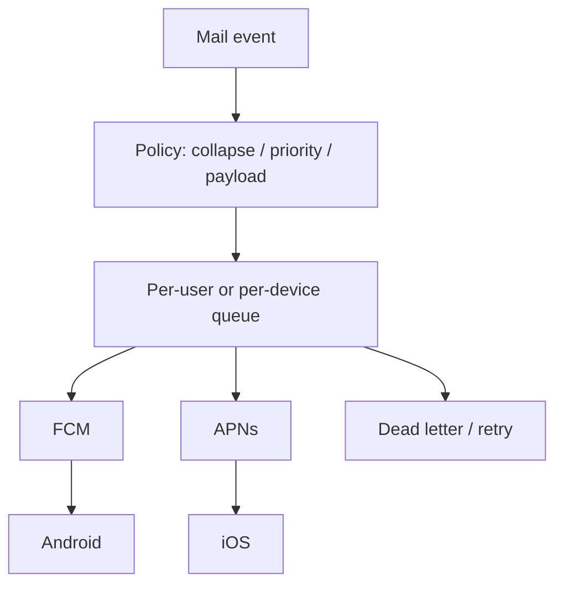

  
Prerequisites

  

    
Read these first if <strong>FCM, collapse keys, Doze, or data vs notification messages</strong> are new.

    <ul>
      <li><a href="https://firebase.google.com/docs/cloud-messaging/android/client">FCM on Android</a> — how push reaches a device</li>
      <li><a href="https://firebase.google.com/docs/cloud-messaging/concept-options">About FCM messages</a> — notification vs data payloads; priority</li>
      <li><a href="https://firebase.google.com/docs/cloud-messaging/concept-options#collapsible_and_non-collapsible_messages">Collapse keys</a> — coalescing queued pushes</li>
      <li><a href="https://developer.android.com/training/monitoring-device-state/doze-standby">Optimize for Doze</a> — how idle modes delay delivery</li>
    </ul>
  

## “Just send a push”

New mail arrives. Someone wires `FirebaseMessaging.send(...)` from the ingest service and ships. It works in dogfood. In production you discover silent failures: Doze delays, collapse keys eating updates, tokens rotting, dual providers, and a backlog that looks healthy until one region’s fan-out stalls. Push delivery is not a library call. It is a **distributed system** with queues, prioritization, provider contracts, and failure domains.

Mail clients feel this acutely: bursty traffic when a campaign or outage clears, and users who treat a missing badge as product breakage. This post sketches the parts you must design explicitly — collapse, priority, payload type, and failover — from the **client contract** and the industry patterns behind FCM/APNs, not as a claim that I owned the push pipeline.

## Collapse keys are capacity, not cosmetics

On Android, a [collapse key](https://firebase.google.com/docs/cloud-messaging/customize-messages/collapsible-message-types) tells FCM that newer messages with the same key can replace older pending ones when the device is offline. That is good for “unread count changed” and bad for “every chat line must arrive.” FCM also limits how many distinct collapse keys it will store per registration token (documented as four). Exceed that and you lose determinism about which pending messages survive.

| Intent | Collapse strategy |
|--------|-------------------|
| Latest inbox sync hint | One key per mailbox / account |
| Distinct threads that must not overwrite | Separate keys — budget carefully |
| Every event must land | Non-collapsible data messages (and accept backlog cost) |

Server-side aggregation (digest within a window) and provider-side collapse are different levers. Use both: reduce volume before the provider, then let collapse clean the device tray when the user was offline.

## Priority is a battery contract

FCM’s [normal vs high priority](https://firebase.google.com/docs/cloud-messaging/customize-messages/setting-message-priority) is not a vanity knob. High priority may wake a sleeping device; normal may wait through Doze. Google’s own guidance uses new-email sync as a **normal** priority example — visible later can be acceptable; waking the radio for every folder poll is not.

Abuse high priority for silent sync and you risk deprioritization. Underuse it for time-critical, user-visible alerts and users blame “flaky push.” Map product urgency to priority deliberately; do not default everything to high.

TTL belongs in the same conversation. A sync hint that expires after an hour may be correct; a security or billing alert that silently expires is not. Collapse, priority, and TTL are one policy triple — set them together when you classify an event type, not as afterthoughts in the FCM JSON.

## Data vs notification messages

Two payload shapes, different lifecycles:

- **Notification messages** — system tray can display them; often collapsible; convenient, less app control when backgrounded
- **Data messages** — app code handles display and sync; more control, more responsibility for channels, grouping, and foreground/background paths

Mail apps often need a hybrid: a light wake/sync signal (data) plus a user-visible banner when appropriate. The wrong choice shows up as “push arrived but UI stale” or “banner without local state.” Design the client handler before you pick the payload type — including notification channels, grouping keys, and what happens when the app is killed versus foregrounded. Those branches are easy to forget in a dogfood build that always has the process warm.

*Figure 1. Provider call is the last hop; policy and queues sit in front.*

## Failover and token reality

Tokens expire. Users reinstall. Devices change. Providers rate-limit. A production push path needs:

1. **Durable enqueue** before calling the provider (retry without re-deriving the event)
2. **Idempotent delivery keys** so retries do not spam
3. **Token invalidation** handling on provider errors
4. **Multi-provider** awareness (FCM vs APNs) with shared policy, not copy-paste forks
5. **Observability** for drop reasons (inactive token, too many pending, TTL expiry) — not only “HTTP 200 from send API”

Failover is more than “retry FCM.” When a region’s worker pool stalls, you need backpressure that does not create a second stampede; when APNs and FCM disagree on token validity, you need a single device registry as source of truth. Topic fan-out and per-device sends have different failure modes — design both or pick one deliberately.

From the Android client: register and refresh tokens carefully, treat invalidation as expected, and never assume a high-priority data message will arrive before the user opens the app. The honest production bar is: you can explain, for a missed push, whether collapse, priority, TTL, token rot, or queue lag caused it.

Calling FCM is one hop. The system is collapse policy, priority ethics, payload semantics, queues, retries, and token lifecycle. Treat push like any other fan-out pipeline: design failure modes first, then wire the SDK. If your design doc stops at `send()`, it is not finished.

## References

- [FCM — collapsible and non-collapsible messages](https://firebase.google.com/docs/cloud-messaging/customize-messages/collapsible-message-types)
- [FCM — set the priority of a message](https://firebase.google.com/docs/cloud-messaging/customize-messages/setting-message-priority)
- [Design a notification system (Sujeet Jaiswal)](https://sujeet.pro/articles/design-notification-system)
- [Set and manage Android message priority (FCM)](https://firebase.google.com/docs/cloud-messaging/android-message-priority)
