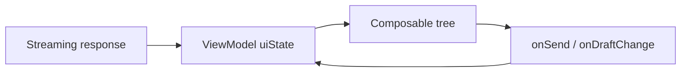

## Chat UI fails where screenshots look fine

Wire a chat-like assistant into Compose and the backend can be fine while the UI still falls apart: a long question opens the keyboard and history vanishes behind the IME, scroll jumps, a streaming token arrives mid-animation and the last bubble flickers. Design review misses all of that — Figma does not simulate `WindowInsets` or partial text updates at dozens of tokens per second.

This is a **pattern post**, not a claim that Yahoo Mail shipped an in-app assistant. The lessons come from high-churn Compose surfaces I *have* shipped (message list, compose, attachment smart view): stable list keys, observable state, Material theming, and inset-aware layout. Assistant UX just amplifies those constraints — reverse-ordered lists, incremental text, and keyboard-driven layout shifts. Treat the panel like a single `TextField` on a `Column` and you will fight the framework.

For the declarative mental model — state driving UI, recomposition, migration from Views — see [Imperative vs Declarative Android UI]({{ site.baseurl }}/imperative-vs-declarative-android-ui). This post assumes that contract and focuses on **assistant-specific Compose patterns**.

## Chat layout: LazyColumn, not Column

Assistant conversations are unbounded lists. A `Column` with `verticalScroll` allocates every row and recomposes all of them when one message grows during streaming. Use `LazyColumn` with stable keys:

```kotlin
@Composable
fun AssistantChat(
    messages: List<ChatMessage>,
    modifier: Modifier = Modifier,
) {
    LazyColumn(
        modifier = modifier.fillMaxSize(),
        reverseLayout = true, // newest near input; scroll "sticks" to bottom
        contentPadding = PaddingValues(horizontal = 16.dp, vertical = 8.dp),
        verticalArrangement = Arrangement.spacedBy(8.dp),
    ) {
        items(messages, key = { it.id }) { message ->
            MessageBubble(message)
        }
    }
}
```

> **Rule of thumb** - assign real IDs to messages before they hit the list; placeholder IDs that change when streaming completes will remount the bubble and reset selection.

`reverseLayout = true` pairs naturally with an input bar pinned below the list: new tokens append at the "bottom" of the data model while the lazy list grows upward visually. Unstable keys were a top source of scroll jank on Mail list surfaces; assistant UIs amplify that because row content mutates in place.

## Theming: one Material 3 tree for assistant and app chrome

Assistants often ship as a bottom sheet, inline panel, or full-screen overlay. If you fork a separate color scheme, the feature reads as a WebView bolt-on. Wrap the assistant subtree in the same `MaterialTheme` as the host screen, or extend it with explicit role colors for user vs assistant bubbles:

```kotlin
@Composable
fun MessageBubble(message: ChatMessage) {
    val bubbleColor = if (message.isUser) {
        MaterialTheme.colorScheme.primaryContainer
    } else {
        MaterialTheme.colorScheme.surfaceVariant
    }
    Surface(
        color = bubbleColor,
        shape = MaterialTheme.shapes.medium,
        modifier = Modifier.widthIn(max = 320.dp),
    ) {
        Text(
            text = message.text,
            style = MaterialTheme.typography.bodyMedium,
            modifier = Modifier.padding(12.dp),
        )
    }
}
```

Typography and shape tokens keep assistant copy aligned with the rest of the app without hard-coded `sp` values scattered through bubble composables.

## State: one source of truth, streaming as partial updates

Assistant UI state is more than a string in a `TextField`. At minimum you need: conversation history, draft input, send/in-flight flags, and error/retry. Keep that in a ViewModel (or equivalent) and expose immutable UI state:

```kotlin
data class AssistantUiState(
    val messages: List<ChatMessage> = emptyList(),
    val draft: String = "",
    val isStreaming: Boolean = false,
)

class AssistantViewModel : ViewModel() {
    private val _uiState = MutableStateFlow(AssistantUiState())
    val uiState: StateFlow<AssistantUiState> = _uiState.asStateFlow()

    fun onToken(messageId: String, append: String) {
        _uiState.update { state ->
            state.copy(
                messages = state.messages.map { msg ->
                    if (msg.id == messageId) msg.copy(text = msg.text + append) else msg
                },
            )
        }
    }
}
```

Collect with `collectAsStateWithLifecycle()` in the composable. **Do not** append tokens inside `@Composable` bodies or hold message text in `remember` without syncing to the ViewModel — that recreates the dual-writer bugs declarative UI is supposed to eliminate.

For streaming, update the **same message row** by ID rather than replacing the whole list each token. That keeps LazyColumn item identity stable and limits recomposition to the active bubble (plus skippable siblings when inputs are stable).



*Figure 1. Unidirectional flow: network pushes tokens into ViewModel state; UI describes bubbles from that state.*

## Keyboard and IME: insets, not magic padding

The assistant input bar must stay above the keyboard without obscuring the last messages. Compose 1.2+ `Modifier.imePadding()` (and related window inset modifiers) adjust layout when the IME opens. Combine with `navigationBarsPadding()` on edge-to-edge screens:

```kotlin
Column(modifier.fillMaxSize().imePadding()) {
    AssistantChat(
        messages = uiState.messages,
        modifier = Modifier.weight(1f),
    )
    AssistantInputBar(
        draft = uiState.draft,
        enabled = !uiState.isStreaming,
        onDraftChange = viewModel::onDraftChange,
        onSend = viewModel::onSend,
    )
}
```

If the host is a bottom sheet, also check `BottomSheetScaffold` / Material 3 sheet peek height — the sheet and IME can compete for vertical space. Test on gesture-nav devices; inset math differs from three-button navigation.

Focus matters for accessibility: when the user sends a message, move focus back to the input with `FocusRequester` only when product requires it — forced refocus on every token update annoys screen-reader users.

## Streaming UX tradeoffs

| Approach | Upside | Tradeoff |
|----------|--------|----------|
| Update same row by ID | Stable LazyColumn identity; minimal scroll jump | Need incremental text model |
| Replace list each token | Simple immutable snapshots | Recomposition and scroll cost |
| Typing indicator row | Clear "working" state | Extra list item to key and remove |
| Disable send while streaming | Prevents duplicate requests | Must handle cancel/timeouts |

Markdown rendering in assistant bubbles adds another layer — defer full parsing until streaming completes, or use a lightweight plain-text phase first. Rich text + recomposition is expensive on low-end devices.

## Wrap-up

Assistant UI in Compose is still Compose: observable state, lazy lists with stable keys, Material theming, and explicit inset handling. The failure modes are familiar from other high-churn surfaces — stale UI when state is not observable, jank when keys change, layout breaks when the keyboard opens — but streaming and reverse chat layout make them show up faster. Model quality gets the headlines; the surface determines whether the feature feels native or bolted on.

If you are migrating from a WebView or legacy chat shell, treat it as a state redesign, not a pixel port. Wire unidirectional flow first, then polish bubbles and animations.

## References

- [Jetpack Compose lists](https://developer.android.com/jetpack/compose/lists) — `LazyColumn`, keys, reverse layout
- [Material 3 theming in Compose](https://developer.android.com/jetpack/compose/designsystems/material3)
- [State in Compose](https://developer.android.com/develop/ui/compose/state) — ViewModel + `StateFlow`
- [Support keyboard inset animations](https://developer.android.com/develop/ui/views/layout/sw-keyboard) — IME and window insets (applies to Compose inset modifiers)
