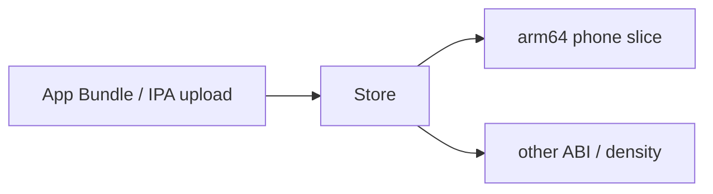

  
Prerequisites

  

    
Read these first if <strong>ABI</strong>, <strong>App Bundles</strong>, or <strong>dynamic libraries</strong> are new.

    <ul>
      <li><a href="https://developer.android.com/guide/app-bundle">Android App Bundles</a> — Play generates device-optimized APKs</li>
      <li><a href="https://developer.android.com/topic/performance/reduce-apk-size">Reduce your app size</a> — why splits matter</li>
      <li><a href="https://developer.apple.com/documentation/xcode/reducing-your-app-s-size">Apple — Reducing your app’s size</a> — thinning / slicing overview</li>
      <li><a href="https://developer.android.com/ndk/guides/concepts">NDK concepts</a> — native code on Android</li>
    </ul>
  

## “Works on my phone. Dead on the emulator.”

Native method missing. Or an install that is “huge” on one chart and “fine” on another. Or a WebView behavior change with **no new version of your app**. Teams mash those into one sentence — “Android has shared libraries; Apple makes you download everything” — and then debug the wrong layer for a week.

Three packaging stories get collapsed into that myth. They share install size as a concern. They are not the same mechanism, and they fail differently.

## Story 1: your `.so` is not a system shared library

NDK code can be shared (`.so`) or static. Your app’s `.so` files almost always live **inside your package**. Another APK does not reuse them. iOS embeds **dynamic frameworks** the same way for code you ship.

What *is* shared across apps is the **OS / vendor stack** (and on Android, often Play services / WebView updated outside your Play upload). If your mental model is “shared library = one download for all apps,” you are describing system/vendor components — not the `.so` you compiled into the APK.

**Failure mode:** crash or `UnsatisfiedLinkError` on an ABI you did not ship. Works on the arm64 phone in your pocket; dies on an x86_64 emulator or an older ABI device. That is a packaging bug in *your* native delivery, not proof that “shared libraries are broken.”

## Story 2: the store already thinned — you measured the wrong blob

**Android (Play + AAB):** upload a bundle; Play serves a base plus **configuration splits** (ABI, density, language) and optional on-demand feature/asset modules. Users should not download every ABI you built.

**iOS:** **app thinning / slicing** delivers a device-appropriate variant; On-Demand Resources defer large assets. Same goal, different vocabulary.

*Figure 1. Upload fat; device downloads a slice. Both stores do a version of this.*

**Failure mode:** arguing install size from a **universal APK**, an unoptimized local build, or “download everything” folklore. You “prove” Apple is leaner or Android is bloated by comparing incomparable artifacts. Fix: name whether you mean Play’s served size, a universal debug APK, or App Store thinned size — then compare like with like.

## Story 3: the shared stack moved without your release

WebView, Play services, or a system framework changed behavior. Your versionCode did not. Users file “your app broke”; bisecting your git history finds nothing.

**Failure mode:** treating every regression as a regression in *your* binary. Sometimes the shared stack outside the APK moved. Sometimes an **on-demand module** never finished downloading and feature code is simply missing until Play Core completes.

## Which story is it?

The three stories share one symptom vocabulary, so start by naming which layer the evidence points at:

| Symptom | Which story to open first |
|---------|---------------------------|
| Missing native method / ABI-specific crash | Your `.so` / ABI splits |
| Size debate that does not match user devices | Store splits / thinning vs the artifact you measured |
| Behavior change, empty git diff in the app | System / vendor stack (or on-demand not installed) |

> **Rule of thumb** - when size or “missing native method” shows up, name which story you mean: per-app `.so`, system stack, or store split — then debug that one.

Android and Apple both dynamic-link and both thin delivery. The myth is useful as a wrong guess; the useful work is separating the three stories before you change the wrong build.gradle flag.

## References

- [App bundle format / configuration APKs](https://developer.android.com/guide/app-bundle/app-bundle-format)
- [Types of mobile apps (this site)]({{ site.baseurl }}/types-of-mobile-apps)
- [Android ABIs](https://developer.android.com/ndk/guides/abis) — why `.so` files multiply per CPU and splits exist
- [Play Feature Delivery](https://developer.android.com/guide/playcore/feature-delivery) — on-demand modules vs shipping every native lib up front
