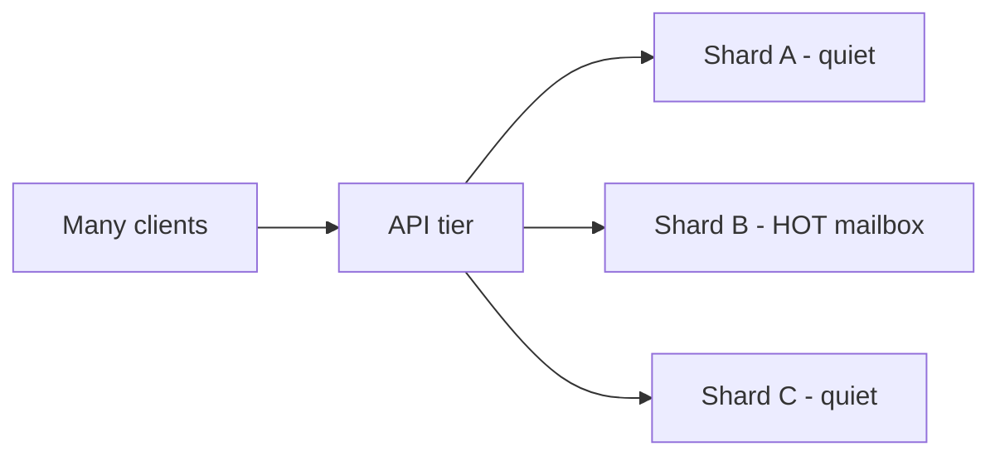

  
Prerequisites

  

    
Read these first if <strong>sharding, hot keys, cache-aside, or thundering herds</strong> are new.

    <ul>
      <li><a href="https://learn.microsoft.com/en-us/azure/architecture/patterns/sharding">Sharding</a> — partitioning data by key</li>
      <li><a href="https://learn.microsoft.com/en-us/azure/architecture/patterns/cache-aside">Cache-Aside</a> — first shield for hot reads</li>
      <li><a href="https://en.wikipedia.org/wiki/Thundering_herd_problem">Thundering herd / stampede</a> — many clients missing cache together</li>
      <li><a href="https://redis.io/docs/latest/develop/reference/keyspecs/">Hot keys (Redis glossary-style)</a> — why one key can melt a shard</li>
    </ul>
  

## One inbox, everyone refreshing

Sharding by mailbox id looks fair on a whiteboard: hash the key, spread load, sleep well. Then a celebrity account, a shared support inbox, or a viral thread lands on one shard. Reads concentrate. Tail latency climbs for every *other* mailbox that happens to share that partition. The cluster is “balanced” by key count and on fire by request rate.

Mail products make this visceral. A shared team inbox or a high-profile account is a **hot key**. Clients amplify it: pull-to-refresh, aggressive sync, preview fetches, and badge polls all hammer the same logical mailbox. I write this from the **client amplification** angle — what Android mail apps do that pours gasoline — plus the cache-aside and hot-key tactics systems like mail typically use. Not as a claim that I ran the shard fleet.

## Sharding does not split one key

Consistent hashing spreads *keys* across nodes. It does not split traffic for a single key. If `mailbox:celebrity` receives orders of magnitude more reads than the median mailbox, the owning shard absorbs that QPS — NICs, CPU, and lock contention — while sibling shards idle.

*Figure 1. Even key placement; uneven request heat.*

Symptoms look like “random” slowness for unrelated users on the same shard, not a clean error for the famous account only. That collateral damage is why hot partitions are operationally scary.

## Clients amplify the hotspot

Server heat is often a product of client behavior:

- Foreground sync on open + background sync + push-triggered sync stacked
- Message list, thread, and attachment metadata requested as separate chatty calls
- Retry storms when the hot shard slows (timeouts → more retries → more heat)

On Android mail clients, the usual client-side mitigations are partly product discipline: coalesce refreshes, backoff when the server signals load, and avoid turning every UI recomposition into a network round trip. Shared inboxes make this worse: many human operators open the same mailbox across devices, each running its own sync cadence. The client cannot fix a melting shard alone — but it can stop pouring gasoline.

Writes matter too. A hot support inbox does not only get read; operators mark read, assign, and reply. Write amplification on the same shard key stacks with the read hotspot. Cache-aside helps reads; it does not remove the need for careful write batching and conflict rules on shared mailboxes.

## Cache-aside as the first shield

[Cache-aside](https://learn.microsoft.com/en-us/azure/architecture/patterns/cache-aside) (look-aside) is the default read path systems use: check cache → on miss load store → populate cache → return. On write, update the store then **invalidate** the cache entry so the next read repopulates.

For hot mailboxes this matters because most traffic is read-heavy (list headers, unread counts, recent threads). A shared cache layer absorbs repeated identical reads that would otherwise all hit the shard.

Caveats that show up in production:

| Risk | Mitigation |
|------|------------|
| Stampede on TTL expiry | Single-flight / request coalescing; TTL jitter |
| Stale after write | Invalidate (or version) on mutate; accept brief inconsistency budgets |
| Hot key still melts *cache* shard | Process-local L1 with short TTL; replicate or split the hot key |

Cache-aside alone does not solve an extreme celebrity key. It buys headroom and turns many DB reads into cache hits. Extreme keys need L1, replication, or key splitting on top.

## Hot-key playbook (mail-shaped)

What large mail backends typically plan for — useful context when you are designing the client:

1. **Detect** — per-key or sampled QPS; alert on shard imbalance, not only cluster averages
2. **Absorb** — cache-aside + short-TTL L1 in the API process for the hottest ids
3. **Coalesce** — one in-flight reload per key per process (single-flight)
4. **Spread** — if still hot, N physical copies / random read suffix; accept write amplification
5. **Throttle clients** — rate limits and sync backoff for abusive refresh patterns

Detection without a playbook is just a prettier pager. Synthetic load tests that assume uniform mailbox popularity will never find this bug. From the app side: treat sync aggressiveness as part of the capacity model — coalesce, backoff, and stop retry storms when the server is already hot.

A hot mailbox is the celebrity problem with folders. Sharding spreads keys; it does not dilute one key’s traffic. Cache-aside is the first shield; L1, coalescing, and key splitting handle extremes; clients must stop amplifying heat. If your dashboards only show average QPS per shard, you will learn about hot keys from an incident instead of a graph.

## References

- [Caching guidance (Azure)](https://learn.microsoft.com/en-us/azure/architecture/best-practices/caching)
- [Hot key and cache stampede (System Design Sandbox)](https://www.systemdesignsandbox.com/learn/hot-key-cache-stampede)
- [Distributed cache design (Sujeet Jaiswal)](https://sujeet.pro/articles/distributed-cache-design)
