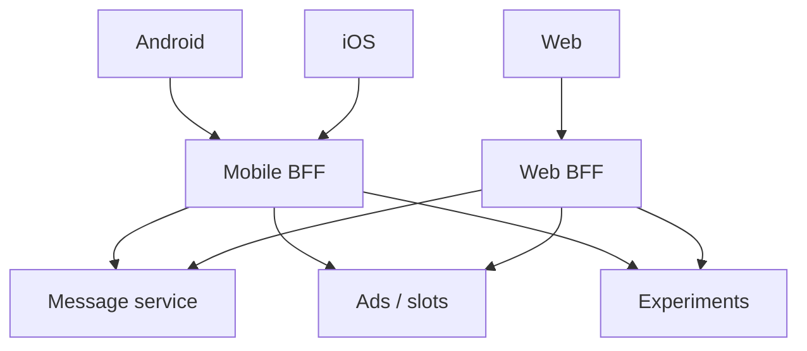

  
Prerequisites

  

    
Read these first if <strong>BFF or API aggregation / fan-out</strong> are new.

    <ul>
      <li><a href="https://learn.microsoft.com/en-us/azure/architecture/patterns/backends-for-frontends">Backends for Frontends</a> — why Android/iOS/web each get a tailored edge</li>
      <li><a href="https://learn.microsoft.com/en-us/azure/architecture/patterns/gateway-aggregation">Gateway Aggregation</a> — one client call, many backend calls</li>
      <li><a href="https://learn.microsoft.com/en-us/azure/architecture/patterns/gateway-routing">API Gateway pattern</a> — edge routing vs aggregation</li>
    </ul>
  

## Copy-paste composition

Android builds a message-list model: headers, unread badges, ad slots, onboarding nudges, attachment previews. iOS builds the same composition from the same microservices. Web does it again with slightly different pagination. Three teams reinvent the same fan-out, the same null handling, and the same “which field is authoritative?” bugs — then disagree on edge cases in production.

That duplication is how [Backends for Frontends (BFF)](https://samnewman.io/patterns/architectural/bff/) earns its keep. In large mail clients the pain is not theoretical: list surfaces are aggregations, not single-resource GETs. This post is about when a BFF helps, what it costs, and how versioning plus feature flags keep three clients from sharing one brittle contract forever.

## The problem BFF actually solves

A general-purpose API optimizes for **resources**. Clients optimize for **screens**. When every client fans out to message, user, ads, and experiment services, you pay:

- Multiple cellular round trips (see [Fat vs Chatty APIs on Cellular]({{ site.baseurl }}/fat-vs-chatty-apis-cellular))
- Divergent aggregation bugs across platforms
- Release coupling: backend field changes break three parsers differently

A BFF sits at the edge, owned with the experience, and returns a payload shaped for that UI — often one call per screen or major section. For mail, think “mailbox home”: enough headers to paint the first screenful, slot descriptors for ads or nudges, and experiment assignments — not three clients each inventing the join order and the empty-state rules.

*Figure 1. One experience may share a BFF; divergent experiences get their own.*

Newman’s useful heuristic: **one experience, one BFF**. If Android and iOS are truly the same product surface and one team owns both, a shared mobile BFF can work. When needs diverge (tablet layouts, foldables, radically different offline rules), split before the shared BFF becomes a negotiation forum.

## Tradeoffs you should budget for

| Benefit | Cost |
|---------|------|
| Fewer client round trips; tailored payloads | Another deployable service per experience |
| Aggregation bugs fixed once (per BFF) | Logic can drift across BFFs — totals disagree |
| UI team ships API changes with the app | Downstream contract changes multiply across BFFs |
| Perimeter concerns (auth shaping, rate limits) colocated | Risk of stuffing business rules into the edge |

Ownership is the make-or-break rule. If a central platform team owns every BFF, you rebuilt the bottleneck the pattern was meant to remove. If client teams own their BFF, they can version with their release train.

Shared libraries of mappers help when two BFFs need the same downstream DTO mapping — but extract carefully. A “common aggregation SDK” owned by nobody becomes the fourth place bugs hide. Prefer thin shared clients to domain services; keep screen composition local to the BFF that ships with that UI.

## Versioning and flags without chaos

Three clients never upgrade in lockstep. Practical controls:

1. **Additive fields first** — clients ignore unknown keys; remove only after telemetry says old app versions are gone
2. **Explicit API versions** on breaking shapes (`/v2/mailbox/home`), not silent reinterpretation
3. **Feature flags** for experimental slots (ads, nudges, onboarding) so server composition can change without forcing an app store wait for every experiment
4. **Contract tests** between BFF and clients for the home/list payload — the highest-churn aggregation

In Android mail clients, slot-style composition (list + ads + nudges) is exactly the kind of aggregation that wants a server-owned layout with flags — not three hard-coded client assemblers that drift. Flags also let you dark-launch a new slot on one platform while others stay unchanged, which is hard when aggregation lives only in app binaries with staggered store rollouts.

> **Rule of thumb** - put experience-specific shaping in the BFF; keep durable domain rules in downstream services so BFFs do not become three divergent sources of truth.

## Wrap-up

When Android, iOS, and web each invent the same aggregation, you are already paying for a BFF — just in client code and bug variance. Introduce an experience-owned edge that fans out once, version additively, and gate experiments with flags. Split BFFs when experiences diverge; share them only while the product truly is one experience. The pattern fails when ownership is wrong or when domain logic hides at the edge.

## References

- [Sam Newman — Backends for Frontends](https://samnewman.io/patterns/architectural/bff/)
- [Backend for Frontend (HLD Handbook)](https://hld.handbook.academy/curriculum/architecture-patterns/backend-for-frontend/)
- [Backends for Frontends (arc42 Quality Model)](https://quality.arc42.org/approaches/backends-for-frontends)
