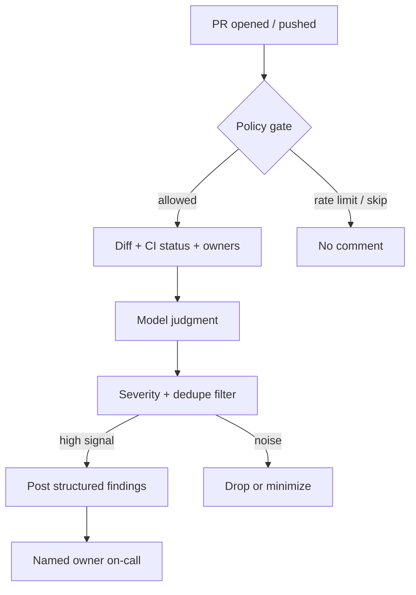

## Public wrongness has a different cost

You open a PR. Before a human looks, a CI agent posts twelve comments: three are useful, four restate the lint job, five are confidently wrong about a module boundary that exists only in the bot's training cut-off. The author spends twenty minutes arguing with a username that has no Slack handle. Reviewers skim past the noise and miss the one real finding. Or worse — they treat the bot as authoritative and ship a "fix" that breaks the build.

A chat session with a coding agent fails privately. You close the tab. An **event-driven** agent fails in public: on the PR timeline, in email digests, in the review queue. The interesting problem is not whether bots can review code. It is **ownership, idempotency, and noisy-neighbor limits** when automation speaks where humans decide.

This is the same reliability mindset as [CI/CD for Android]({{ site.baseurl }}/cicd-jenkins-to-screwdriver): pipelines exist so "works on my machine" stops being the ship bar. Bot comments are another pipeline surface — they need the same operational discipline.

## Chat agent vs CI / event agent

| Dimension | Chat session | CI / event agent |
|-----------|--------------|------------------|
| Audience | You | Authors, reviewers, managers |
| Failure mode | Private thrash | Public noise / wrong authority |
| Trigger | Human prompt | `pull_request`, cron, label, `/review` |
| Retry | You re-run | Webhooks fire again on every push |
| Kill switch | Close chat | Needs a real off switch in CI |

Chat is a tool you drive. Event agents are **services**. Treat them like flaky instrumented tests: useful when bounded, toxic when unbounded.

*Figure 1. Event agents should own workflow in code; the model owns judgment — then a filter decides what reaches humans.*

## Ownership when the bot is wrong

"The bot said so" is not an owner. Someone must be accountable for:

1. **Policy** — what the bot is allowed to comment on (security, API surface, test gaps) vs what it must never invent (product intent, confidential metrics)
2. **False positives** — a path to silence or fix the rule when the bot is systematically wrong
3. **Escalation** — who humans `@` when the bot creates review theater without a real, documented merge gate

Name a human or a rotation in the workflow README. Prefer bots that post as a team identity with a documented maintainer, not a personal token from whoever wired the Action last quarter. When I have seen review bots survive on large Android trees, the teams that kept them had a kill switch in the same PR template as the JDK pin — not a tribal "ask #ai-help."

> **Rule of thumb** - if nobody can turn the bot off in under five minutes, it is not automation; it is a roommate with commit access.

## Idempotency or you get spam

Every `synchronize` on a PR re-triggers the job. Without idempotency you get:

- Duplicate threads on the same line
- "Still an issue" comments after the author already fixed it
- Bot-on-bot loops when another bot replies and retriggers review

Practical controls that actually work:

- **Dedupe key** — hash of `(file, line range, rule id)` and update or resolve the existing thread instead of posting a new one
- **Trigger discipline** — review on explicit `/review` or on first open + label; not on every typo push
- **Ignore bots** — skip when `sender.type == Bot` so agents do not review each other into infinity
- **Resolve policy** — stale findings auto-minimize when the hunk disappears; human threads stay for humans

Tools in this space increasingly separate **orchestration** (fetch PR state, classify noise, decide whether to act) from **model judgment**. That split is right: code should own retries and rate limits; the model should not decide "post twelve comments because the prompt said be thorough."

## Noisy neighbor is a product bug

A bot that comments on every style nit is competing with human attention — the scarcest review resource. Cap severity. Prefer one structured summary plus a few high-confidence inline notes over a wall of "consider renaming." Suppress known-noisy peers (rate-limit notices, "reviews paused") instead of asking the next agent to "address all comments."

On Android monorepos the failure mode is especially sharp: the bot invents a Gradle module that does not exist, or tells you to edit `build/` outputs. That is a navigability problem as much as a model problem — see the companion notes on making a tree [reachable to tools]({{ site.baseurl }}/monorepo-navigable-to-agents) — but the PR still pays the attention tax either way.

## Wrap-up

Ship event agents only when you can answer: who owns false positives, what is the dedupe key, and what is the rate limit. Chat can be sloppy; PR comments cannot. Treat bot review like CI — a verifier with an off switch — not like a senior engineer who happens to lack a calendar.

## References

- [Building your own PR reviewer with coding agents](https://www.huuhka.net/building-your-own-pr-reviewer-with-coding-agents/) — event-driven control plane; model owns judgment, code owns workflow
- [pr-shepherd](https://github.com/jonathanong/pr-shepherd) — deterministic PR orchestration and bot-noise classification for agentic tools
- [AI agents inside CI/CD](https://dev.to/joshua_dyson/ai-agents-inside-cicd-how-we-automated-pr-triage-and-reduced-review-bottlenecks-c16) — triage assist without autonomous merge authority
