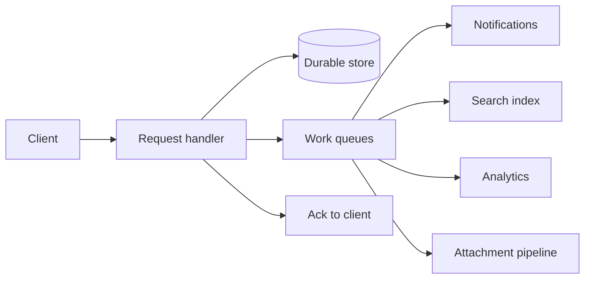

  
Prerequisites

  

    
Read these first if <strong>202 Accepted, idempotency, DLQs, or async pipelines</strong> are new.

    <ul>
      <li><a href="https://developer.mozilla.org/en-US/docs/Web/HTTP/Status/202">HTTP 202 Accepted</a> — accepted for processing, not finished</li>
      <li><a href="https://developer.mozilla.org/en-US/docs/Glossary/Idempotent">Idempotency</a> — safe retries on async work</li>
      <li><a href="https://learn.microsoft.com/en-us/azure/architecture/patterns/pipes-and-filters">Pipes and Filters</a> — staged async processing</li>
      <li><a href="https://learn.microsoft.com/en-us/azure/architecture/patterns/competing-consumers">Competing Consumers / queues</a> — workers draining a queue</li>
    </ul>
  

## The send button lied

You tap **Send** on a mail compose screen. The UI freezes for a few seconds, then shows success — or worse, a timeout with an ambiguous error. The message may already be on the server. The attachment may still be scanning. Search and analytics never got the event. The user learned one lesson: the request path waited for work that did not need to block trust.

From the **client** side, the interesting failures are rarely “the database was down.” They are **latency budgets** on the hot path the phone is waiting on: every extra dependency the API awaits before acknowledging becomes someone else’s p99 and someone else’s support ticket. This post is about what belongs on that synchronous contract, what belongs in a queue behind it, and what must stay inline because trust requires it — framed as patterns mail-shaped products use, not as backend ownership claims.

## Ack fast; finish later

The contract for a write is usually simpler than teams make it:

1. **Validate** enough to reject garbage (auth, size limits, schema).
2. **Persist** the durable fact the user cares about (message accepted, draft saved).
3. **Enqueue** side effects.
4. **Return** success (often `202` or a stable id) before fan-out completes.

*Figure 1. Acknowledge after durable accept; side effects consume queues.*

Notifications, search indexing, and analytics are classic **eventually consistent** consumers. If search lags a few seconds after send, that is annoying. If send itself waits on the indexer, the product feels broken under load. Same for “fire analytics pixel” work: useful for product decisions, toxic when it shares a thread pool with user-visible commits.

Queues also force honesty about failure. At-least-once delivery means consumers must be **idempotent** — indexing the same message twice should not duplicate search hits; notification workers should dedupe by message id. Poison messages belong in a dead-letter queue with an owner, not in an infinite retry loop that starves healthy work. Those operational details are why “just spawn a thread after respond” is a weaker cousin of durable enqueue: the thread dies with the process; the queue survives a deploy.

> **Rule of thumb** - if the user cannot see the outcome on this screen, it almost never belongs on the synchronous request path.

## Attachments: pipe and filter, not one mega-handler

Attachment upload is where teams often put everything back on the request path: virus scan, thumbnail, transcode, CDN publish — all awaited before “upload complete.” That couples user-perceived latency to the slowest security or media step.

A better shape is a **pipe-and-filter** chain driven by the queue:

| Stage | Responsibility | Failure mode |
|-------|----------------|--------------|
| Ingest | Store bytes, assign id, ack upload | Client retries with idempotency key |
| Scan | Malware / policy checks | Quarantine; do not publish |
| Transcode | Previews, format normalization | Retry with backoff; DLQ poison |
| CDN | Publish URLs the UI can open | Partial: message body ok, preview pending |

The client can show “uploading → processing → ready” without holding an HTTP connection open for the whole chain. The message send path should depend on **attachment identity and scan outcome policy**, not on CDN warm-up. In practice that means the compose/send API accepts attachment ids that already cleared ingest (and maybe scan), while preview URLs may still be “pending” in the UI. Partial readiness is a feature; a single all-or-nothing mega-handler is how timeouts become duplicate uploads.

## What must stay inline for trust

Not everything can be async. Trust and correctness force some work onto the request path:

- **Authn / authz** — never “queue and check later” for who can send as whom
- **Quota and abuse gates** that must reject before durable accept
- **Durability of the user’s intent** — the message (or draft) must be stored before you claim success
- **Policy that gates visibility** — e.g. do not return a public CDN URL until scan clears, even if scan is async behind a private holding area

The distinction is not “sync good / async bad.” It is **what the user is allowed to believe after the ack**. If you ack “sent” before durable write, you lie. If you ack “sent” before search indexes, you are honest about eventual consistency. If you ack “attachment ready to open” before scan, you have a security bug dressed as UX.

## Client consequences (mail-shaped)

On Android, a hung send call becomes ANR risk, spinner hell, and duplicate taps. Prefer:

- Optimistic local state after a clear accept response
- Idempotent retries keyed by client-generated send id
- Separate observers for “message exists” vs “preview ready” vs “searchable”

The transferable lesson from large mail clients is boring on purpose: **narrow the synchronous contract**, make side effects recoverable, and teach the UI to live with partial readiness. If send waits on work the user cannot see yet, you are optimizing the wrong latency.

## References

- [Asynchronous Request-Reply (Azure Architecture Center)](https://learn.microsoft.com/en-us/azure/architecture/patterns/asynchronous-request-reply)
- [Asynchronous messaging (arc42 Quality Model)](https://quality.arc42.org/approaches/asynchronous-messaging)
- [Async Request-Reply design pattern (David Mosyan)](https://medium.com/@dmosyan/async-request-reply-design-pattern-9ea13a514187)
