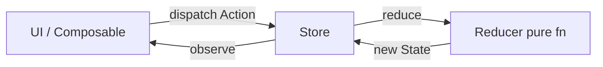

## The bug was order, not syntax

A screen had three buttons that all mutated the same `ViewModel` fields from different coroutines. Race conditions were rare but maddening: tap "refresh" then "filter" quickly and the list showed stale data with the new filter label. Logcat looked fine — no crashes, just **state updates arriving out of order**. The team had MVVM and `StateFlow`, but no single rule for *how* mutations were allowed to happen.

That is the problem Redux-style architecture solves: **one write path** for application state. It is not new to Android — Flux and MVI conversations predated Compose — but Kotlin coroutines and `StateFlow` make the pattern easier to express without boilerplate libraries. The question is when the extra ceremony pays off vs when a thin ViewModel is enough.

For how Android front-end architecture evolved (MVC, MVP, MVVM, MVI, Flux), see [Android FE architecture history]({{ site.baseurl }}/android-fe-architecture-history) — this post focuses on the Redux slice of that map.

## Related reading

- **Internal:** [Android FE architecture history]({{ site.baseurl }}/android-fe-architecture-history) — Flux/MVI in the broader Android story
- **Articles surveyed:** [Flux, Android Architecture Components, and Kotlin](https://medium.com/lewisrhine/flux-android-architecture-components-using-kotlin-a1c933ebf883) — mapping Flux to AAC patterns

## Flux and Redux in one paragraph each

**Flux** (Facebook, 2014) popularized unidirectional data flow for UI: views dispatch **actions**, a **store** holds state, **reducers** compute the next state from `(currentState, action)`, and views re-render from the store. No view writes peer state directly.

**Redux** narrows Flux: one store, pure reducers, actions as plain objects, optional middleware for async (logging, network, throttling). The mental model is predictable — debug by replaying actions — at the cost of more types and indirection.



*Figure 1. Redux loop: UI dispatches actions; reducer returns new state; UI observes store.*

## Mapping Redux to Kotlin Android

You do not need a JavaScript port to use the idea on Android.

| Redux concept | Kotlin/Android analogue |
|---------------|-------------------------|
| Action | sealed class / data class events (`Refresh`, `QueryChanged`) |
| State | immutable `data class AppState` |
| Reducer | `(State, Action) -> State` pure function |
| Store | `StateFlow<AppState>` + single mutator |
| Middleware | coroutine `Flow` operators, `viewModelScope` side effects |
| View | Compose collecting state; callbacks dispatch actions |

Example reducer core:

```kotlin
sealed interface MailAction {
    data object Refresh : MailAction
    data class QueryChanged(val query: String) : MailAction
    data class MessagesLoaded(val items: List<Message>) : MailAction
}

data class MailState(
    val query: String = "",
    val messages: List<Message> = emptyList(),
    val isLoading: Boolean = false,
)

fun mailReducer(state: MailState, action: MailAction): MailState = when (action) {
    is MailAction.Refresh -> state.copy(isLoading = true)
    is MailAction.QueryChanged -> state.copy(query = action.query)
    is MailAction.MessagesLoaded -> state.copy(
        messages = action.items,
        isLoading = false,
    )
}
```

Store wiring in a ViewModel:

```kotlin
class MailStore(initial: MailState = MailState()) {
    private val _state = MutableStateFlow(initial)
    val state: StateFlow<MailState> = _state.asStateFlow()

    fun dispatch(action: MailAction) {
        _state.update { mailReducer(it, action) }
    }
}
```

Network and repository work stay **outside** the reducer — dispatch `MessagesLoaded` when the repo returns, not inside `when (action)` IO. That keeps reducers testable without Robolectric.

Libraries like [ReKotlin](https://github.com/ReKotlin/ReKotlin) or [Orbit MVI](https://github.com/orbit-mvi/orbit-mvi) formalize the store and side-effect channels; many teams stop at `StateFlow` + sealed actions once conventions are clear.

## When Redux-style pays off vs overkill

**Worth it** when:

- Many UI surfaces share overlapping state (wizard flows, assistant + host screen, multi-pane mail)
- Reproducing bugs requires action replay ("what sequence led here?")
- Parallel events genuinely race (filters, pagination, optimistic sends)
- Large teams need enforceable mutation rules

**Overkill** when:

- One screen, one `ViewModel`, two fields — reducer types add noise
- State is mostly local UI (`expanded` flags) — keep in `remember` or saved state handle
- Team will not maintain action naming and middleware discipline

Android's default **MVVM + `StateFlow`** already gives unidirectional *data* flow if you never mutate state outside the ViewModel. Redux adds **explicit actions and pure reducers** — documentation by construction, not magic.

> **Rule of thumb** - if your bug is "wrong text on screen," fix state exposure first; if your bug is "impossible interleaving of events," consider a reducer-shaped store.

MVI (Model-View-Intent) on Android is a close cousin: intents in, immutable state out, often with a single reducer pipeline. The [architecture history post]({{ site.baseurl }}/android-fe-architecture-history) ties Flux/MVI to later Compose state hoisting — same direction, different naming.

## Testing and tradeoffs

Pure reducers unit-test in isolation:

```kotlin
@Test
fun refresh_sets_loading() {
    val next = mailReducer(MailState(), MailAction.Refresh)
    assertTrue(next.isLoading)
}
```

Tradeoffs to accept:

| Benefit | Cost |
|---------|------|
| Predictable mutation path | More types and boilerplate |
| Easy action replay / logging | Learning curve for juniors |
| Shared store across features | Risk of "god state" without modular slices |

Modular Redux uses **state slices** combined in one store — mirror Gradle modules, not one megaclass for the whole app.

## Wrap-up

Redux on Android is not about copying JavaScript tooling — it is about **one door in for state changes** and pure functions in the middle. Kotlin `StateFlow` and sealed actions get most teams close without a framework. Reach for libraries or stricter Redux when races and cross-feature state dominate debugging time, not when a single screen needs cleaner code.

## References

- [Flux, Android Architecture Components, and Kotlin](https://medium.com/lewisrhine/flux-android-architecture-components-using-kotlin-a1c933ebf883)
- [ReKotlin](https://github.com/ReKotlin/ReKotlin) — Redux-like library for Kotlin
- [Orbit MVI](https://github.com/orbit-mvi/orbit-mvi) — MVI / unidirectional state on Android
- [StateFlow and shared flow](https://kotlinlang.org/docs/flow.html#stateflow-and-sharedflow) — Kotlin store primitives
