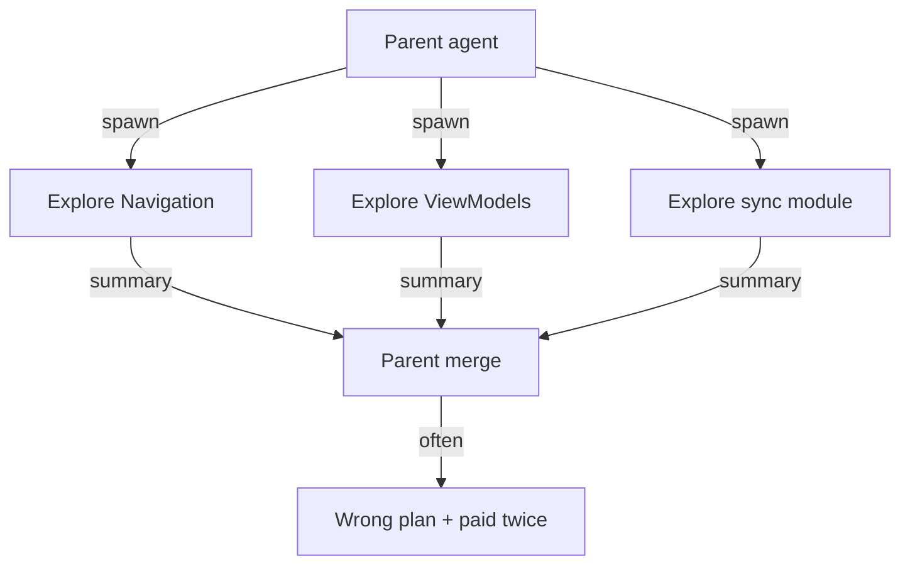

## Parallel looked free until the summaries disagreed

You ask for a focused fix in one Gradle module. The agent spawns three “research” children: one maps Navigation, one greps for `ViewModel`, one “audits” a neighboring sync package because the name sounded related. Ten minutes later you have three confident summaries that contradict each other on where state lives, a parent that merges them into a wrong plan, and a token bill that would have covered a careful single-threaded edit.

I have seen this in personal IDE agent setups on large Android trees. Subagents are sold as speed. On a monorepo they are often a **context-budget tool**, and a cost multiplier when you spawn them for the wrong reasons.

## What actually goes wrong

**Lost parent context.** Children start lean (good) or forked (often bad). Either way they miss the constraint you stated in chat — module boundary, “no generated sources,” “do not touch monetization code.” They explore the wrong tree with high confidence.

**Contradictory merge.** Two greps over overlapping packages return different “sources of truth.” The parent has no ground truth, so it averages slogans instead of opening the file.

**Token tax.** Each spawn pays system prompt, tool schemas, and often a chunk of repo rules. Trivial work (`git status`, one-file read) can cost more in overhead than the command itself. Unbounded fan-out turns a 30k-token edit into hundreds of thousands of exploration tokens.



*Figure 1. Spawn-happy exploration: parallel summaries, serial confusion.*

## When spawning earns its keep

Spawn when **intermediate output is huge and the return value is small** — and the work is truly independent of the live reasoning chain:

- “Find every call site of deprecated `X` under `:feature:` and return a path list.”
- “Summarize why CI job `unit-tests` failed from this log blob.”
- “Map which Gradle module owns this screen; return module + entry files only.”

Keep the parent for decisions that need the trace: editing the same Compose file you just read, iterating on a red unit test, negotiating API shape across two modules you already have open.

> **Rule of thumb** - if you will need the child’s *reasoning history*, stay single-threaded. If you only need a compressed artifact (path list, yes/no, short diagnosis), isolate the exploration.

## When to stay single-threaded on Android trees

Large monorepos punish naive parallelism:

| Stay in one thread when… | Why |
|--------------------------|-----|
| Fix is inside one module / few files | Re-reads and merge tax dominate |
| Modules share types across boundaries | Children invent incompatible stories |
| You already @-mentioned the files | Context is warm; spawn resets it |
| Task is sequential (fail test → edit → retest) | Parallelism is fake; you need the loop |
| Constraint is subtle (feature flags, draft compat) | Children will not inherit nuance |

Prefer a **single agent with tight @-files and a module rule** over three explorers. If you must fan out, cap concurrency (two is often enough), ban nested spawns, and require each child to return structured findings — paths and quotes — not essays.

```text
# Prompt shape that fails less
Explore ONLY :feature:compose. Do not open :feature:sync.
Return: (1) files touching DraftRepository (2) one-line role each.
No architectural recommendations.
```

## A vignette: splitting a migration across explorers

Suppose you are mid–XML → Compose on several related screens that share draft compatibility, lifecycle quirks, and a slot architecture for optional chrome. The tempting parallel split is “one agent per screen.” Children that never saw the parent’s rollout constraints produce three incompatible “just use a new ViewModel” plans.

The cheaper path in my experience: one thread that already has the feature-flag and migration notes in context, plus a skill for the verify checklist — not a committee of explorers. Use subagents at the edges: “list every `WebView` leftover under this module” or “summarize why `:feature:compose:testDebugUnitTest` failed.” Keep the migration decisions single-threaded.

## Cost is a product decision

Cheaper models on mechanical scan subagents can help. They do not fix a bad decomposition. “Refactor the API layer” with unconstrained children is how you buy a 7–15× token multiplier and a PR nobody trusts. Budget the tree the way you budget CI minutes: exploration is billable work. If two summaries already disagree on the owning module, paying for a third opinion is theater — open the Gradle module and end it.

Subagents are isolation for noisy reads, not a substitute for knowing which module owns the bug. On Android trees, default to one thread with sharp rules; spawn only when a disposable explorer returns a small, checkable artifact. If two children already disagree, stop spawning a third — open the file yourself and end the debate.

## References

- [MindStudio — Claude Code sub-agents explained](https://www.mindstudio.ai/blog/claude-code-sub-agents-explained)
- [DEV — When to delegate vs rule or hook](https://dev.to/rulestack/claude-code-subagents-when-to-delegate-and-when-a-rule-or-hook-is-enough-ajn)
- [SourceShift — Subagents as a context-budget primitive](https://blog.sourceshift.io/p/subagents-as-a-context-budget-primitive/)
- [Claude Code Guides — Multi-agent token budgeting](https://claudecodeguides.com/multi-agent-token-budgeting-allocate-subagents/)
