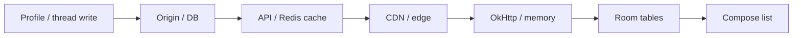

<details class="post-prereq" markdown="0">
  <summary>Prerequisites</summary>
  <div class="post-prereq__body">
    <p class="post-prereq__hint">Read these first if <strong>CDN invalidation, OkHttp/ETag caches, Room InvalidationTracker, or stampedes</strong> are new.</p>
    <ul>
      <li><a href="https://developer.mozilla.org/en-US/docs/Web/HTTP/Caching">HTTP caching</a> — freshness, validators, revalidation</li>
      <li><a href="https://developer.mozilla.org/en-US/docs/Web/HTTP/Headers/ETag">ETag</a> — conditional requests for “did it change?”</li>
      <li><a href="https://square.github.io/okhttp/features/caching/">OkHttp cache</a> — on-device HTTP response cache</li>
      <li><a href="https://developer.android.com/reference/androidx/room/InvalidationTracker">Room — InvalidationTracker</a> — when local DB observers refresh</li>
      <li><a href="https://en.wikipedia.org/wiki/Cache_stampede">Cache stampede</a> — mass miss after expiry</li>
    </ul>
  </div>
</details>

## Same bug, four layers

A user changes their avatar. Support sends a screenshot of the old face on the message list. Backend swears the profile write committed. CDN purge “completed.” The Android ticket still says *UI not updating*. You are not looking at four bugs. You are looking at **one invalidation story** that stops at the first layer that still holds a copy.

From edge CDN through API response cache into on-device Room, each tier optimizes for hit rate and latency. Each also extends the window where thread metadata, avatars, and folder counts can be wrong. This post walks that path as one failure mode — including the stampede that starts when everyone misses at once.

## One story: write lands, copies linger



*Figure 1. A successful write does not atomically clear every copy the UI can read.*

Typical mail-shaped symptoms:

- **Stale avatar** — CDN or disk HTTP cache keyed only by URL without a version bust
- **Wrong thread subject / participants** — API cache or Room row older than the mutation
- **Unread counts flicker** — list from Room, badge from a fresher path (or the reverse)

Debugging only the Compose binding wastes days when the binding is faithfully showing yesterday’s Room row. Treat “UI not updating” as a **layer walk**: did origin change, did API cache miss after write, did the edge still hold bytes, did OkHttp short-circuit the repository, did Room ever see a newer version? Skip a rung and you “fix” Compose while users keep the old face. For example, in a mail app the same walk applies when a thread subject looks stale after a rename.

## Stampede when the cache finally dies

Hard-purging a hot key (or letting a popular TTL expire) can send a herd of clients to origin in the same second. At mail-client scale that herd is not a browser tab refresh — it is millions of phones waking on push or cold start. Soft invalidation / stale-while-revalidate patterns exist so the edge can keep serving briefly while one refresh fills the hole; without them, “we fixed staleness” becomes “we melted origin.”

| Layer | Stale-data failure | Stampede / load failure |
|-------|--------------------|-------------------------|
| CDN | Old avatar bytes | Mass purge → origin spike |
| API cache | Old thread JSON | TTL expiry thundering herd |
| HTTP client cache | Ignores new ETag story | Parallel revalidate storms |
| Room | UI never told to requery | N screens refetch same endpoint |

> **Rule of thumb** - invalidate on write with precise keys or tags; prefer soft purge for hot objects; never teach every client to “clear cache and refetch everything” after a banner.

## Version the thing the UI keys on

Avatar URLs that never change are a classic footgun: CDN and OkHttp happily return immortal bytes. Append a content hash or `v=` from the profile write, or send `Cache-Control` that matches how often identity assets actually change. Thread metadata should carry a **server version** the client stores in Room; a pull that returns an older version must not clobber a newer local row (same causality lesson as sync engines).

```kotlin
// why: URL identity must change when bytes change
data class AvatarRef(val url: String, val version: String) {
    fun cacheKey(): String = "$url?v=$version"
}
```

On device, Room’s [InvalidationTracker](https://developer.android.com/reference/androidx/room/InvalidationTracker) only helps observers who read through Room after the **local** write. A silent OkHttp cache hit that skips your repository update never trips it. Invalidate the client cache layer that absorbed the response, then write Room, then let Flows emit — in that order.

## Coordinating invalidation without theater

What works in practice for client+edge stacks:

1. **Purge or tag-invalidate** the CDN object tied to the write (avatar id, not `/*`)
2. **Delete or version-bump** the API cache entry in the same transaction boundary you can afford
3. **Return the new version** to the writing client so it updates Room without waiting for a global push
4. **Shoulder-tap** other devices to incremental sync — do not broadcast “wipe all caches”

Full-account purge buttons are operationally satisfying and product-wise expensive. Targeted tags (Cloud CDN’s cache tags are one public example of the pattern) keep invalidation proportional to the mutation.

Thread metadata deserves the same discipline as avatars. Subject lines, participant lists, and snippet previews often live in a hot API cache keyed by thread id. A rename or new reply that updates origin without bumping that key leaves Room correct on the writing device (it applied the write response) and wrong on every peer until TTL luck intervenes. Prefer returning the updated thread projection on the mutation response, then fan out a cheap “thread dirty” signal — not a full mailbox wipe.

## Wrap-up

Cache invalidation from CDN to Room is one causal chain. Stale avatars and thread metadata are usually a leftover copy, not a broken list composable. Design writes to bust or version every layer that can serve the old bytes, prefer soft invalidation on hot keys to avoid stampedes, and make the phone’s repository the place where version order is enforced before UI observes Room.

## References

- [Cloud CDN — cache invalidation overview](https://docs.cloud.google.com/cdn/docs/cache-invalidation-overview)
- [CDN cache invalidation (VergeCloud)](https://www.vergecloud.com/blog/cache-invalidation-in-a-cdn/)
- [Redis cache invalidation strategy (Loke.dev)](https://loke.dev/blog/redis-cache-invalidation-strategy-troubleshooting)
