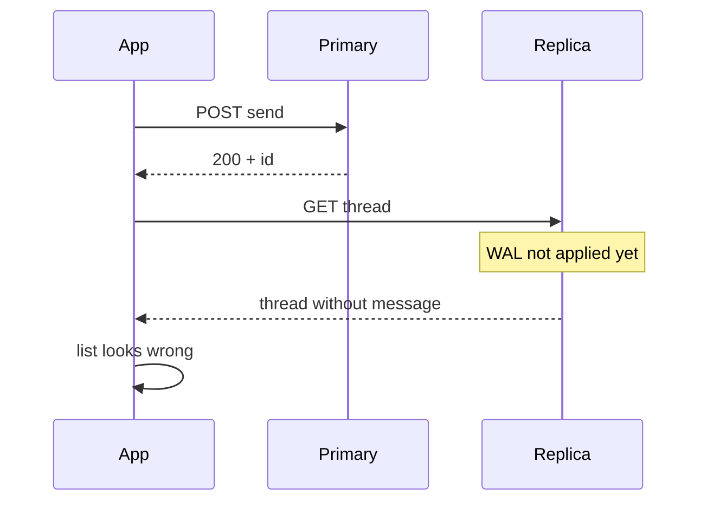

## Send, pull to refresh, message gone

The repro is cursed in the best way: send a message, watch “Sent,” pull to refresh, and the thread looks like the send never happened. Ten seconds later it is there. Logs on the phone show a 200. QA cannot reproduce on a quiet staging stack. The ticket lands on Android anyway — *Compose list lost the item* — because that is the surface the reporter can see.

What actually happened is older than Jetpack: the write hit the **primary**, the refresh read a **replica** that had not applied the commit yet. Replication lag wore an Android costume.

## Related reading

- **Docs:** [Amazon RDS Read Replicas announcement (read-after-write note)](https://aws.amazon.com/blogs/aws/amazon-rds-announcing-read-replicas/)
- **Articles surveyed:** [Read-your-writes: replicas, routing, session tokens](https://matheuspalma.com/blog/read-your-writes-consistency-replicas-routing-tokens); [Aurora write forwarding and read consistency](https://aws.amazon.com/blogs/database/using-write-forwarding-with-amazon-aurora-global-database-for-postgresql/); [Read replica lag — four application bugs (FlowVerify)](https://www.flowverify.co/blog/read-replica-replication-lag-bugs)

## Why it looks like a client bug

| Observation | Android hypothesis | Systems reality |
|-------------|--------------------|-----------------|
| Intermittent | Race in list state | Lag window only sometimes hit |
| “Fixed” by waiting | Lifecycle / recomposition | Replica caught up |
| Staging clean | “Works in debug” | Staging lag ≈ 0 |
| 200 + empty | Parser / mapper bug | Valid stale payload |

No exception, no 5xx, no Compose crash. Optimistic UI may even show the outbound message until a refetch replaces local state with a stale server snapshot — at which point the UI “deletes” something the primary already has. That feels exactly like a client state bug.



*Figure 1. Successful write, then a freshness-blind read.*

## Sticky routing is not enough

Load-balancer stickiness pins a user to an **app instance**, not to “always read the primary after my write.” Two requests on the same phone can still fan out to different data-access paths. What you want is **read-your-writes** in the data layer:

- After a write, mark the session (cookie, header, or server-side flag) for a short freshness window and route those reads to primary
- Or return a **version / LSN-style token** on write; subsequent reads carry `X-Min-Read-…` and wait or redirect until the replica is past that point
- Size the window against **p99 lag under load**, not the peaceful median — batch jobs and failovers stretch the gap

I will not quote internal Yahoo replica metrics. Qualitatively: lag that is fine for global inbox browse is not fine for “I just sent this.” Product paths need different freshness classes.

| Read class | Example | Freshness need |
|------------|---------|----------------|
| Browse | Cold inbox open, search | Replica OK; seconds of lag often fine |
| Read-your-writes | Thread after send / archive | Primary or token-gated until caught up |
| Cross-user causal | Someone else replies in shared thread | Harder; often accept brief lag or push-tap |

Sticky sessions at the HTTP edge do not encode that table. The mail API (or a gateway aware of recent writes) has to.

## Optimistic UI has to survive the stale refetch

On Android, the fix is shared between client and server:

1. **Keep local causality** — do not let a GET that is older than the pending/acked send tombstone the optimistic row
2. **Prefer the write response body** (new message id, thread version) to update Room before any list refetch
3. **Delay or condition refetch** until a freshness token says the read is safe
4. **Instrument** “missing my send” with server freshness metadata when available — so the next ticket is not a week of UI archaeology

```kotlin
// why: stale GET must not clobber a newer local send
fun mergeThread(local: Thread, remote: Thread): Thread {
    if (local.version >= remote.version) return local
    return remote
}
```

## How to stop misrouting the bug

When a report is intermittent, timing-sensitive, and staging-clean, ask for **primary vs replica** before rewriting adapters. Reproduce with artificial lag if you can — inject delay on the read path in a dogfood build and watch optimistic rows disappear after refresh. Add a debug breadcrumb for which freshness class served the read (primary, replica, cache). Teach triage that “Android” is often the messenger for a consistency contract the backend changed when replicas were added.

Compose migrations make the misfile more likely: the list *did* change recently, so it becomes the suspect. Keep a short checklist in the bug template — write status, immediate GET body, whether waiting helps — so mobile and server engineers start from the same hypothesis set.

> **Rule of thumb** - if waiting fixes it and logs are green, suspect replication lag before recomposition.

## Wrap-up

Send-then-refresh missing mail is a classic read-your-writes failure mislabeled as a Compose bug. Sticky app routing will not save you; session-aware primary reads or version tokens will. On the client, optimistic state and versioned merges must outrank a freshness-blind refetch. Fix the consistency contract once, and a whole class of “Android” tickets evaporates.

## References

- [Amazon RDS — announcing Read Replicas](https://aws.amazon.com/blogs/aws/amazon-rds-announcing-read-replicas/)
- [Aurora Global Database write forwarding (PostgreSQL)](https://aws.amazon.com/blogs/database/using-write-forwarding-with-amazon-aurora-global-database-for-postgresql/)
- [Read-your-writes consistency (Matheus Palma)](https://matheuspalma.com/blog/read-your-writes-consistency-replicas-routing-tokens)
- [Read replica lag — four application bugs](https://www.flowverify.co/blog/read-replica-replication-lag-bugs)
