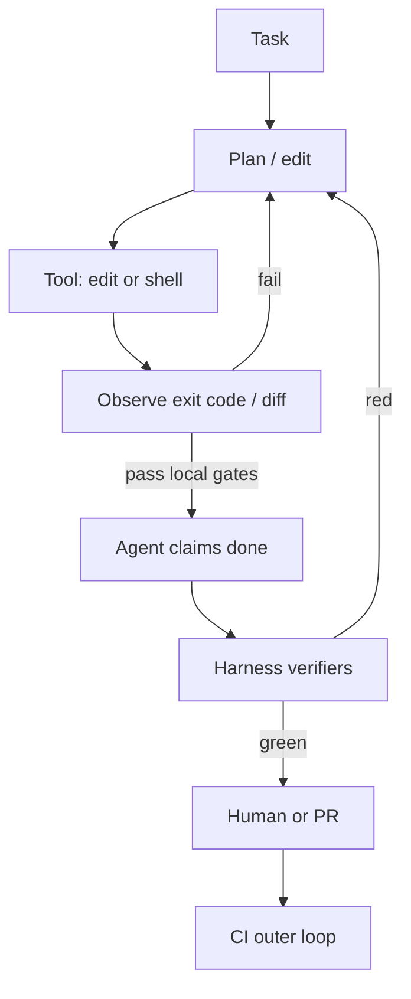

## Green chat, red pipeline

You upgrade the coding model. The agent edits three modules, narrates a confident wrap-up, and marks the task complete. You open the PR. Formatting fails. A unit test you never touched is red. The typechecker catches a nullable the agent invented in a helper. The chat was green; the merge bar is not.

This is not a one-off fluke of a weak model. Stronger models still ship **broken diffs with a done claim** — wrong module, skipped tests, or a "fix" that never left the agent's imagination. The interesting failure is not intelligence on a leaderboard. It is the **runtime around the model**: what tools it may call, what it must observe before stopping, and which checks are allowed to veto "done."

## Related reading

- **Internal:** [Formatters vs Linters]({{ site.baseurl }}/formatter-vs-linter) — mechanical verifiers that shrink and block diffs; [From Jenkins to Screwdriver]({{ site.baseurl }}/cicd-jenkins-to-screwdriver) — CI as the outer proof, not a vibe
- **Docs / context:** [Model Context Protocol](https://modelcontextprotocol.io/) — how tools get into the loop; agent stop hooks in IDE harnesses (verify claims with exit codes, not chat tone)

## Stronger models still need a harness

A coding agent is a loop: assemble context, propose an edit, run a tool, read the result, repeat. The model is one component. The **harness** is everything else — repo rules, allowed commands, context packing, and especially **stop conditions**.

When the stop condition is "the model feels finished," you get silent wrong-success. When the stop condition is "these commands exited 0 on the current tree," you get something closer to engineering.

*Figure 1. Inner loop (fast tools) plus outer loop (CI). "Done" is not a chat tone — it is a gate.*

Teams building agent platforms keep landing on the same conclusion: run deterministic checks on stop (tests, lint, build), feed failures back into the loop, and cap retries so the agent does not thrash forever. IDE harnesses expose the same idea as stop hooks — block completion until a fresh command proves the claim, rather than trusting the model's closing paragraph.

Upgrading the model without tightening that gate is buying eloquence, not reliability.

## Verifiers beat vibes

Map agent claims to **exit codes**, not to prose:

| Claim in the chat | What must run | Trust |
|-------------------|---------------|-------|
| "Formatted" | Project formatter (e.g. ktlint format) | Mechanical |
| "Lint clean" | Same linter CI runs | Mechanical |
| "Tests pass" | Module or focused suite, not a story | Mechanical |
| "Builds" | `./gradlew :app:assembleDebug` (or PR equivalent) | Mechanical |
| "Looks good" | Nothing — ignore | Vibe |

Formatters and linters are the cheapest verifiers you already own. As [Formatters vs Linters]({{ site.baseurl }}/formatter-vs-linter) argues, a formatter is deterministic style; a linter catches foot-guns. Both are perfect agent gates: no debate, no "I think it's fine." Wire them into the agent's stop path the same way CI wires them into merge.

On a large Android monorepo, the practical split matches classic CI design ([Jenkins / Screwdriver lessons]({{ site.baseurl }}/cicd-jenkins-to-screwdriver)):

1. **Inner loop (agent stop):** format + lint + unit tests for touched modules — minutes, not an emulator farm
2. **Outer loop (CI):** the same bar on a clean agent, plus whatever you refuse to fake locally
3. **Never trust a receipt the agent wrote** without re-running — "I ran tests" in markdown is not a green job

> **Rule of thumb** - if CI would fail the PR, the agent is not allowed to say done until the same class of check has a fresh exit code.

## Stop conditions that do not thrash

A verifier that always fails without a repair path creates an infinite loop. Good stop policy:

- **Block once (or a small max)** with the failure text injected back into context
- **Diff-scope** when possible — full-suite on every stop is how agents burn an afternoon
- **Fail closed** when verification is impossible (no test command configured) rather than treating silence as success
- **Separate "done for now"** (human takeover) from "done to merge"

"Just let it cook" fails on real repos because the agent optimizes for chat closure: disable a flaky test, widen a type to `Any`, or edit the wrong module that happened to compile. Stronger models are better at sounding finished while doing those things. The harness is what makes ambition expensive.

## What transfers without vendor lock-in

Whether you use Cursor hooks, Claude Code stop events, or a custom wrapper, the portable checklist is the same:

1. Pin the same toolchain CI uses (JDK, AGP, wrapper) — environment skew looks like "the agent is dumb"
2. Encode one-shot commands in repo docs / skills so the agent does not invent `./gradlew test` variants
3. Treat formatter + linter as mandatory mechanical verifiers
4. Require a green local gate before "done"; let CI remain the outer proof
5. Cap repair loops; escalate to a human with the failing log, not another optimistic summary

I am not claiming a specific internal agent stack at Mail. The lesson from shipping Android through serious CI is older than agents: **green that lies erodes trust faster than red**. Agents accelerate the lying unless you refuse to accept a done claim without a verifier.

## Wrap-up

A stronger model still ships broken diffs when "done" means conversational confidence. Invest in harness, verifiers, and stop conditions — format/lint/test as mechanical gates, CI as the outer loop. Upgrade the model after the gate is honest; not instead of it.

## References

- [Formatters vs Linters (this site)]({{ site.baseurl }}/formatter-vs-linter)
- [From Jenkins to Screwdriver (this site)]({{ site.baseurl }}/cicd-jenkins-to-screwdriver)
- [Model Context Protocol](https://modelcontextprotocol.io/)
