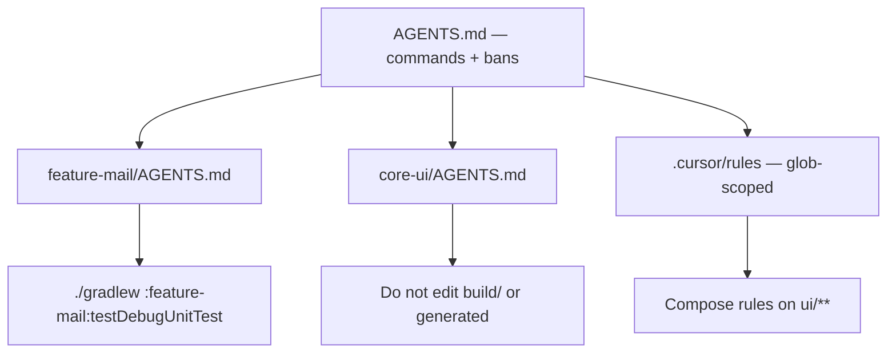

## Agents fail on layout, not IQ

Watch an agent on a large Android tree long enough and a pattern shows up. It invents a `:app:assemble` flavor that does not exist. It "fixes" a crash by editing files under `build/` or `generated/`. It runs the root unit-test task that the team abandoned two years ago because it takes forty minutes and flakes. Then it declares done. The model was not uniquely dumb that day — **the repo was illegible** to tools that only know what you wrote down.

Intelligence without a map wastes tokens. The job is to make the monorepo **reachable**: one-shot commands, explicit forbidden paths, module boundaries in prose short enough to load — not a 10k-token novel nobody maintains.

This pairs with how we think about [CI for Android]({{ site.baseurl }}/cicd-jenkins-to-screwdriver): if humans need a pinned JDK and a real pipeline command, agents need the same, discoverable in one hop.

## What "navigable" means

An agent (or a new hire) should answer these without archaeology:

| Question | Bad answer | Good answer in-repo |
|----------|------------|---------------------|
| How do I unit-test module X? | "Gradle somewhere" | `./gradlew :feature-mail:testDebugUnitTest` |
| What is generated? | Silence | `build/`, `*Generated*`, Room/Schema folders — do not edit |
| Where does feature Y live? | Search the universe | Module map: feature → Gradle path → owners |
| What must never ship from chat? | Vibes | Secrets paths, Play keys, internal metric names |

If those answers live only in Slack lore, every agent session relearns them wrong.



*Figure 1. Thin root instructions; nested playbooks and glob rules for local truth — not one giant always-on essay.*

## One-shot commands beat narrative

Put the commands you actually run in CI near the top of `AGENTS.md` (or equivalent). Prefer copy-paste lines over paragraphs:

```bash
# Module unit tests (PR gate shape)
./gradlew :feature-mail:testDebugUnitTest

# Static analysis the team enforces
./gradlew :feature-mail:detekt

# Do not: ./gradlew test  (root suite — slow, not the PR gate)
```

Agents pattern-match on executable snippets. A sentence that says "run the appropriate module tests" invites improvisation. The same discipline belongs in skills and runbooks for recurring workflows: "add a Compose screen in `:feature-X`" should list files, packages, and the verify command — [Medium Engineering's Android skills writeup](https://medium.engineering/making-ai-write-android-code-our-way-a-practical-guide-to-agent-skills-4e7b085d8e50) makes that case well for team playbooks.

## Generated folders look editable

To a model, `FooDto_Impl.kt` is just another Kotlin file with a helpful name. Your rules must say **do not edit generated sources** and name the directories. Pair that with harness checks if you evaluate agents: a golden task that fails when `build/` appears in the diff ([eval as ship bar]({{ site.baseurl }}/agent-eval-not-a-demo)).

Also call out:

- `local.properties` / signing material — read-only or out of bounds
- Screenshot and goldens folders — update only via the approved test task
- Vendored or generated GraphQL/Apollo sources — regenerate, do not hand-patch

## AGENTS / rules without a 10k novel

Always-on context is a budget. A 10k-token root file that restates Clean Architecture will be half-ignored and half-overfitted. Split by job:

- **Root `AGENTS.md`** — setup, global bans, canonical commands, link to module map
- **Nested `AGENTS.md`** — per feature or package conventions that apply when working in that subtree
- **Glob-scoped rules** (e.g. Cursor `.mdc`) — Compose, ViewModel, or test patterns that attach only when matching files are in play
- **On-demand skills** — multi-step runbooks loaded when the task matches, not on every chat

Medium Engineering described the evolution from one heavy `AGENTS.md` to scoped rules so the model gets the *right* playbook at the *right* time. Cursor's docs for [rules and AGENTS.md](https://cursor.com/docs/rules.md) match that shape: portable repo instructions plus scoped overrides.

> **Rule of thumb** - if a paragraph has not prevented a real wrong edit in the last quarter, cut it; agents do not need your manifesto.

## Module boundaries on paper

Large Mail-style clients are graphs of Gradle projects. Write a short module map: feature name, Gradle path, what it may depend on, what must not depend back. Agents routinely "help" by introducing a dependency cycle or reaching into another team's internals because the graph was implicit. You do not need a full architecture book — a table and a "preferred public API packages" line save more thrash than another essay on MVVM.

## Wrap-up

Make the monorepo legible the way you make CI honest: one-shot commands, named forbidden paths, thin always-on rules, deeper playbooks on demand. Agents are not lost because they lack a bigger model; they are lost because the map was never checked in. Fix the map first — then judge the model.

## References

- [Cursor docs: Rules and AGENTS.md](https://cursor.com/docs/rules.md) — root and nested agent instructions; glob-scoped project rules
- [Making AI write Android code our way](https://medium.engineering/making-ai-write-android-code-our-way-a-practical-guide-to-agent-skills-4e7b085d8e50) — AGENTS.md + skills on an Android codebase; move weight into scoped rules
- [AGENTS.md vs CLAUDE.md vs Cursor rules](https://codersera.com/blog/agents-md-vs-claude-md-vs-cursor-rules-comparison-2026/) — when portable repo docs beat always-on novels
- [Cursor rules vs AGENTS.md](https://www.romanticode.com/blog/cursor-rules-vs-agents-md/) — portable commands/gates vs editor-scoped behavior
