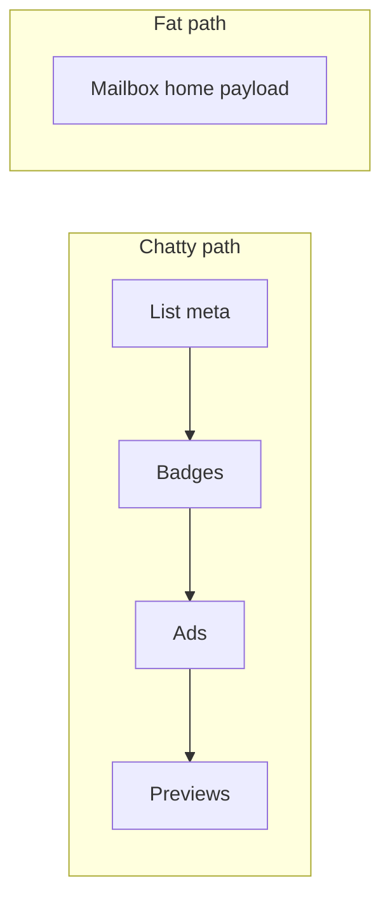

  
Prerequisites

  

    
Read these first if <strong>cellular radio cost</strong>, <strong>RTT</strong>, or <strong>BFF aggregation</strong> are new.

    <ul>
      <li><a href="https://developer.android.com/topic/performance/power/network">Reducing network battery drain</a> — radio wakes and batching; why six GETs per row hurt on one bar</li>
      <li><a href="https://developer.android.com/studio/profile/network-profiler">Network Profiler</a> — seeing RTT and payload size on device</li>
      <li><a href="https://learn.microsoft.com/en-us/azure/architecture/patterns/backends-for-frontends">Backends for Frontends</a> — fat responses shaped for one client</li>
      <li><a href="https://developer.mozilla.org/en-US/docs/Glossary/HTTP_2">HTTP/2</a> — multiplexing; why chatty APIs look fine on Wi‑Fi</li>
    </ul>
  

## The list scrolled fine on Wi‑Fi

On office Wi‑Fi, a message list that fires six GETs per row feels snappy. On cellular — mid-train, one bar, radio cycling — the same design hitch-steps: placeholders flash, scroll janks while JSON arrives late, and background sync drains battery waking the radio for tiny payloads. The bug is not “Android is slow.” It is **physics**: latency and radio state dominate more than database purity arguments about resource-oriented REST.

## Round trips usually hurt more than a few extra bytes

Cellular RTT is often tens to hundreds of milliseconds. Each sequential request pays that tax again. A home or message-list screen that needs messages + badges + ads + experiments as separate calls can stack seconds before first useful paint — even when each response is small.

| Style | Shape | Wins when | Loses when |
|-------|-------|-----------|------------|
| **Chatty** | Many small resource GETs | Resources reused widely; HTTP/2 multiplexing; fields change independently | High RTT; sequential dependencies; radio flapping |
| **Fat** | One aggregated payload per screen/section | Time-to-interactive on cellular; fewer failure modes | Over-fetch; cache invalidation coarser; payload bloat |

HTTP/2 helps with parallel small requests on one connection, but it does not erase RTT. Ten parallel calls still wait on the slowest dependency if the UI needs all of them to commit a frame. Prefer **one coherent response** for the critical path, then lazy-load heavy parts (full bodies, large images).

> **Rule of thumb** - optimize for round trips on the critical path first; trim bytes second; micro-normalize last.

## Scroll jank and sync cost are the real metrics

On Android list surfaces (RecyclerView historically, Compose `LazyColumn` now), late-arriving fields cause:

- Rebinds / recompositions as rows “fill in”
- Layout shifts when preview lines or ad slots appear late
- Extra decoder and main-thread work arriving in bursts

Background sync has a related cost: many tiny endpoints mean many radio wakes. Batching into fewer, slightly fatter sync documents often saves more battery than shaving JSON keys while keeping request count high. Mail is a good stress test: folders, badges, and push-triggered refresh can multiply into a chatty storm unless the sync protocol collapses work into deltas with clear watermarks.

*Figure 1. Chatty critical path vs one aggregated home payload.*

## Not database dogma

Server engineers sometimes push chatty APIs because normalized resources are easier to cache and evolve. That is a real concern — and it belongs behind a [BFF](https://samnewman.io/patterns/architectural/bff/) or aggregate endpoint, not in the mobile critical path. The phone should not reimplement a join across a flaky network. When several clients need the same fat shape, that is [an argument for one aggregation layer]({{ site.baseurl }}/bff-three-clients-same-aggregation), not for pushing the work back onto the radio.

Practical split:

1. **Critical path (list open, first screenful)** — fat or BFF-shaped; stable field set; cursor pagination sized for the viewport
2. **Secondary** — thread body, full attachment metadata, rarely used panels — separate calls, prefetch when idle
3. **Sync** — delta documents with clear watermarks; avoid N endpoints × M folders on every tick

The portable wins on large mail-style Android surfaces usually come from fewer blocking round trips and calmer list updates — not from arguing REST purity in a design review.

## What to measure before picking a religion

- Time to first useful list content on a throttled cellular profile
- Request count and bytes for cold open vs incremental sync
- Frame time / jank while the first page binds
- Radio wake patterns during background sync (coarse is fine)

If fat payloads are bloated, sparse fieldsets and compression help. If chatty APIs are chatty, aggregate. Watch for the false compromise: “parallelize six calls on OkHttp” — better than sequential, still six failure modes and six chances for partial UI. The answer is usually hybrid, and you only know which hybrid after you have measured list open and sync cost on a bad network.

## References

- [Designing APIs for mobile performance (CACM)](https://cacm.acm.org/blogcacm/designing-apis-for-mobile-performance-best-practices/)
- [JSON mobile API optimization (Jsonic)](https://jsonic.io/guides/json-mobile-apis)
- [Mobile API strategy (Developers Voice)](https://developersvoice.com/blog/mobile/mobile-api-strategy-in-2025/)
- [Sam Newman — Backends for Frontends](https://samnewman.io/patterns/architectural/bff/)
