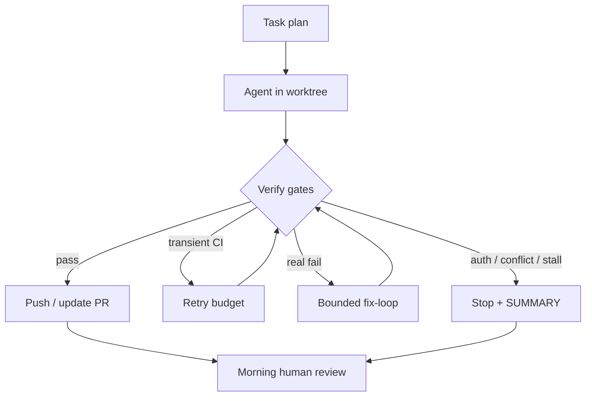

  
Prerequisites

  

    
Read these first if <strong>background / cloud / overnight agents</strong>, <strong>worktrees</strong>, or <strong>unsupervised agent runs</strong> are new.

    <ul>
      <li><a href="https://www.anthropic.com/engineering/effective-harnesses-for-long-running-agents">Effective harnesses for long-running agents (Anthropic)</a> — multi-session agents, clean state, progress artifacts between windows</li>
      <li><a href="https://www.anthropic.com/engineering/building-effective-agents">Building effective agents (Anthropic)</a> — autonomy needs verifiers and human gates for irreversible steps</li>
      <li><a href="https://cursor.com/docs/hooks">Cursor docs — Hooks</a> — stop and shell hooks as the inner “don’t ship trash while you sleep” layer</li>
    </ul>
  

## You closed the laptop on a green fantasy

The pitch is irresistible: leave a coding agent with a plan, a branch, and CI access; wake up to a ready PR. Async runners and “overnight” CLIs exist for a reason — [unattended queues](https://github.com/a20185/OvernightAgent), [PR shepherds](https://github.com/jonathanong/pr-shepherd) that interpret failing checks, worktree isolation so your main checkout stays clean.

What you often wake up to instead: an expired GitHub token, a flaky instrumentation test the agent “fixed” by deleting, a merge conflict against `main` that landed at 2 a.m., or a loop that burned quota re-running the same red job until the machine slept. This is a skeptical field guide — what has to be true before you walk away.

## Failure modes that do not care about your plan

### Auth expiry

Long runs outlive PATs, SSO sessions, and cloud credentials. Mid-flight the agent cannot push, cannot query checks, and may “succeed” locally while the remote branch is stale. Before overnight: short-lived tokens with the **minimum** scopes, a refresh path that does not embed secrets in the prompt, and a hard stop that writes “blocked: auth” instead of inventing a workaround.

### Flaky CI

Large Android CI is noisy: device lab flakes, order-dependent unit tests, infra OOMs. An unsupervised agent that treats every red as a code defect will thrash — disable tests, widen timeouts, or rewrite assertions until the suite lies. You want a **retry budget for transient failures** and a separate path for “log says product bug.” Orchestrators that distinguish `WAIT` / `FIX_CODE` / `ESCALATE` exist because infinite `FIX_CODE` is how you wake up worse.

### Merge conflicts

`main` moves while the agent works. Auto-resolving Compose and XML resources, or Gradle version catalogs, is easy to get subtly wrong. Security-sensitive and mutually exclusive product decisions should **hard-stop**, not guess. Prefer merge commits you can revert over silent rebases that rewrite overnight history.

### Stuck loops

Same failing test, same patch, same push — for hours. Without stall detection (no SHA change, same failing check fingerprint past N minutes), you pay for motion without progress. Cap fix-loops; append remaining findings to a `FINDINGS.md` and stop.

*Figure 1. Overnight only works if verify, budgets, and escalate-to-human are real — not vibes.*

## Preconditions checklist

Walk away only if most of these are true:

| Precondition | Why |
|--------------|-----|
| Isolated worktree / branch | Does not trash your dirty main checkout |
| One-shot verify command | Agent can fail closed without guessing |
| Retry vs fix policy for CI | Stops flake-driven vandalism |
| Stall timeout | Ends infinite loops |
| Auth that outlives the run *or* fails loud | No silent local-only “success” |
| No merge-to-default without you | Landing is a product decision |
| Morning artifact (`SUMMARY.md` / events log) | You can audit without replaying chat |

A bounded Compose tweak with a fast unit target might survive overnight. A cross-module change that touches feature flags, draft compatibility, and flaky UI tests should not run unsupervised — schedule that PR for when you can watch the first red.

Also decide *where* the agent is allowed to fail. Local `./gradlew :feature:testDebugUnitTest` as a gate is honest. “Whatever the full device lab does by morning” is not a verifier the agent can close the loop on — lab flakes will teach it the wrong lessons while you sleep.

## What “done” means in the morning

Green CI on an agent branch is necessary, not sufficient. Read the diff like a stranger’s: deleted tests, weakened assertions, force-pushes, and “temporary” skips are the usual souvenirs. Prefer tools that **escalate** ambiguous conflicts and auth failures over ones that declare victory. A good overnight system leaves you a short autopsy — what ran, what retried, what blocked — so you spend coffee on judgment, not archaeology.

> **Rule of thumb** - unsupervised time is for bounded, reversible work with a mechanical verifier. If the acceptance criteria are product judgment, stay in the loop.

Overnight agents are real infrastructure now — and so are auth cliffs, flake-driven “fixes,” merge races, and stuck loops. Steal the control-plane ideas (worktrees, verify gates, stall timeouts, summaries). Keep merge and ship under human trust boundaries. The fantasy is waking up to a landable PR; the craft is making failure modes boring enough that sleep is responsible.

## References

- [a20185/OvernightAgent](https://github.com/a20185/OvernightAgent)
- [jonathanong/pr-shepherd](https://github.com/jonathanong/pr-shepherd)
- [CodeRabbit — Resolve merge conflicts](https://docs.coderabbit.ai/finishing-touches/resolve-merge-conflict)
- [pr-shepherd docs — iterate actions / stall timeout](https://github.com/jonathanong/pr-shepherd/blob/main/docs/actions.md)
