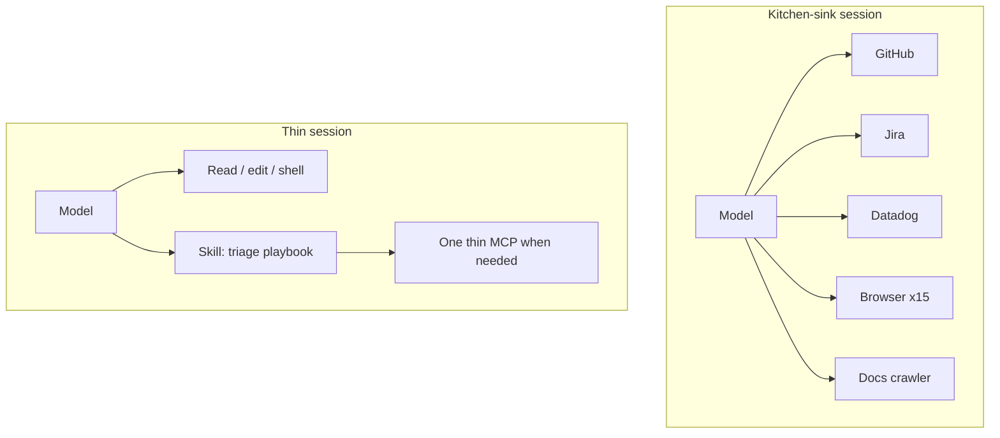

  
Prerequisites

  

    
Read these first if <strong>tools</strong>, <strong>MCP</strong>, or <strong>skills</strong> are new.

    <ul>
      <li><a href="https://modelcontextprotocol.io/">Model Context Protocol</a> — open standard for connecting agents to external tools and data</li>
      <li><a href="https://www.anthropic.com/engineering/building-effective-agents">Building effective agents (Anthropic)</a> — tools as the agent’s hands; start simple before stacking integrations</li>
      <li><a href="https://www.anthropic.com/engineering/writing-tools-for-agents">Writing effective tools for AI agents (Anthropic)</a> — clear tool purposes, less overlap, high-signal returns</li>
      <li><a href="https://docs.anthropic.com/en/docs/agents-and-tools/agent-skills/overview">Anthropic — Agent Skills</a> — reusable procedures loaded on demand (vs always-on MCP sprawl)</li>
    </ul>
  

## Twenty plugins, worse judgment

The pattern is familiar from my own agent setups: wire every MCP server you can find — GitHub, Jira, Datadog, Notion, three browsers, a docs crawler — then wonder why the coding agent flails. It calls the wrong tool, summarizes the wrong dashboard, and spends half the context window reading schemas it will never need. You did not make it smarter. You widened the decision space until correct tool choice became the hard problem.

The other half of the mistake is subtler. Connecting GitHub gives the agent **hands**. It still does not know your triage labels, your module map, or which package owns the screen you meant. Access is not expertise. Kitchen-sink plugins optimize for demos; useful agents need a **thin interface** plus **playbooks** that load when the task actually needs them.

## Why more tools make worse calls

Models pick among described tools under uncertainty. Each extra server adds names, parameters, and overlapping verbs (`search`, `query`, `list_issues`). Ambiguity rises; wrong calls rise; each wrong call pollutes context with junk observations. Teams that measure agent success keep landing on the same curve: consolidate aggressively — sometimes from a dozen-plus tools down to a handful — and success jumps because the model stops guessing which dial to turn.

For day-to-day coding, the high-value set is boring:

1. Read / search the repo
2. Edit
3. Shell (bounded)
4. Maybe one live system you truly need this week

Everything else is optional until a task earns it. A Playwright MCP with fifteen browser tools is a product; it is rarely what you want always-on while fixing a Kotlin nullability bug.

*Figure 1. Fat tool menus invite wrong picks. Thin core + on-demand skill keeps judgment focused.*

> **Rule of thumb** - if two tools can answer the same question, delete one from the default session. Ambiguity is a bug in the harness.

## Access ≠ expertise

MCP (and similar bridges) solve **governed reach**: auth, live data, typed operations against a real system. Skills / playbooks solve **how you work**: sequence, conventions, refusal rules, examples.

| Need | Prefer | Example |
|------|--------|---------|
| Live system + auth | Thin MCP | List open PRs with real OAuth |
| Procedure / judgment | Skill | "How we triage ANRs," release checklist |
| Both | MCP + skill | Skill drives when/why; MCP executes |
| One-shot transform | Script or skill | Do not stand up a server for a pure function |

A Datadog connection without a skill will happily invent an interpretation of a dashboard. A skill without any access can only lecture. Most real work wants a **small server for reach** and a **loadable playbook for judgment** — progressive disclosure so the playbook costs almost nothing until the task matches.

A useful skepticism has spread with MCP adoption: many servers should not exist — they are thin API wrappers better replaced by a skill that shells out, or by docs the agent already can read. The useful test: does this capability need persistent auth and state, or did we just enjoy collecting plugins?

## What to keep always-on vs on demand

**Always-on (session defaults):** repo read/edit/shell, project rules (module boundaries, "don't touch generated sources"), and the mechanical verifiers you refuse to skip — see [agent done / CI red]({{ site.baseurl }}/agent-done-but-ci-red).

**On demand (skills):** Android release cuts, Crashlytics triage procedure, "how we name feature flags," a short module map for the tree you actually work in. Load when the user asks or when a path matcher fires — not at every chat turn.

**Rare / explicit connect:** production Datadog, admin GitHub, anything that can open a PR or mutate infra. Least privilege is not only security theater; it is how you keep the tool menu small enough to reason about.

On a large Android monorepo, the expertise gap shows up as agents that *can* `gh` but still edit the wrong Gradle module. Connecting GitHub did not teach module ownership. A short skill that points at the module map did.

## Discovery is not permission

MCP (and cousins) make tools **show up at runtime**. That is useful — and it is also how an agent inherits fifteen new verbs because someone clicked “connect” in a desktop client. Discovery answers “what *could* I call?” The harness still answers “what *may* I call?”

Treat an MCP catalog like a package index: interesting, untrusted as policy. Your allowlist / deny list / approval gates apply **after** discovery. If a server advertises `deploy_prod` and your policy never enabled it, the model should not see it — or should see a stub that hard-fails closed.

## Inference economics is a harness concern

Tool thrash is not only a quality bug; it is a bill. A kitchen-sink catalog burns tokens on schema soup before the first useful edit. The same discipline applies across models: a cheap triage pass that decides “no code change” can skip a full Claude coding loop. Log **$/task** (or tokens in/out) next to steps-to-success. If “connect everything” doubles cost for the same outcome, the catalog is the regression — not the model version.

Prompt caching and smaller triage models are tactics; the size of the catalog is the strategy.

## Practical consolidation

1. Audit the default MCP list monthly; remove anything unused for two weeks
2. Merge overlapping tools (`search_code` vs `grep` vs IDE search) into one preferred path
3. Encode procedure as skills, not as another always-connected server
4. Prefer one curated integration over five partial ones
5. Measure thrash: wrong tool calls and steps-to-success, not plugin count

The portable lesson matches CI discipline: smaller surface, clearer contracts, expertise written down where the agent can load it — not implied by a longer plugin sidebar.

Twenty plugins degrade judgment; live access without playbooks confuses hands for expertise. Ship a thin tool core, add MCP only when reach truly needs it, and put procedure in skills that load on demand. Fewer tools is not austerity — it is how the model finds the right one.

## References

- [The Agent Said Done — and CI Is Red (this site)]({{ site.baseurl }}/agent-done-but-ci-red)
- [Code execution with MCP (Anthropic)](https://www.anthropic.com/engineering/code-execution-with-mcp) — why loading every MCP definition into context hurts
