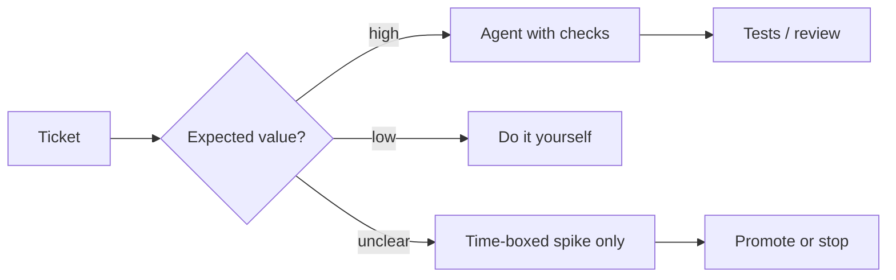

## Negative expected value is allowed

Not every ticket deserves an agent. That sentence sounds obvious until you watch a team agent-wash a one-line string fix, a confidential design review, or a research spike with no acceptance criteria — then spend longer reviewing the diff than typing the change would have taken.

Coding agents are leverage under the right distribution of tasks. Under the wrong one they are a tax: prompting, waiting, auditing, and undoing confident mistakes. The METR randomized study on experienced open-source developers (early 2025 tooling) found participants took about **19% longer** with AI on familiar repos — while still *believing* they were faster. Perception is not a ship metric. Expected value is.

## Assistant vs agency

It helps to separate two products that share a chat box:

| Mode | What it is | Failure cost |
|------|------------|--------------|
| **Assistant** | Completions, local refactors, explain-this-stack-trace | Usually contained; you stay in the loop |
| **Agency** | Multi-file goals, PR bots, "just fix CI overnight" | Diffs and comments you must still own |

An **assistant** speeds mechanical work when you can verify line-by-line. **Agency** needs a clear goal, a navigable repo, and a verifier — or it externalizes judgment while leaving you accountable. I wrote about [assistant-style Compose UI]({{ site.baseurl }}/android-compose-ai-assistant) as a **UI/IME pattern**: streaming bubbles, keyboard insets, stable list keys — not as a claim that Mail shipped a product assistant. This one is about when *you* should refuse agency on a ticket. Different layer; same word. Do not confuse a helpful panel with an unsupervised worker.

*Figure 1. Default is not "always agent." Route by expected value, then verify.*

## Negative-EV ticket shapes

**Unclear product intent.** "Make it feel premium" has no falsifiable done. An agent will invent UI and you will argue with a mirror. Write acceptance first ([planning with teeth]({{ site.baseurl }}/planning-theater-vs-real-plan)) or keep the work human.

**One-line / known-locus fixes.** Typo in a string, wrong constant, obvious NPE with a stack frame pointing at one method. The prompting overhead exceeds the edit. Use the agent as autocomplete if you want — do not open a multi-tool investigation.

**Confidential or political review.** Security-sensitive diffs, personnel issues, unreleased metrics, legal holds. Pasting context into a cloud agent can be a policy violation; even when allowed, you need a human who can swear to what shipped. Agency here is not speed — it is risk transfer theater.

**Novel research with no oracle.** Greenfield spikes where you do not yet know what "correct" means. Agents optimize for plausible completeness. You need exploration notes, not a PR that pretends the design exists.

**Tasks where you are the expert and the suite is thin.** On mature code you know cold, review cost dominates. METR's setting — experienced developers on their own large repos — is exactly where "AI will 10× me" is most likely to lie. Thin golden evals help configs ([ship bar ≠ demo]({{ site.baseurl }}/agent-eval-not-a-demo)); they do not erase the review tax on every ticket.

> **Rule of thumb** - if explaining the task to the agent takes longer than doing it, you already have your answer.

## Don't agent-wash everything

Agent-washing is the organizational failure mode: every Jira ticket gets an agent run because leadership bought seats, or because "AI-first" is a performance narrative. Symptoms:

- PRs with huge unrelated refactors the human did not ask for
- Review queues full of bot comments nobody owns ([public wrongness]({{ site.baseurl }}/bot-commented-on-pr-nobody-owns))
- Engineers who cannot find the one-shot test command because the map was never written ([navigable monorepos]({{ site.baseurl }}/monorepo-navigable-to-agents))

Seat utilization is not productivity. Track outcomes you already care about: cycle time to green CI, revert rate, review latency. If those worsen while agent usage climbs, you are paying for theater.

## When agency is positive EV

Use agents hard when the work is **bounded, checkable, and boring at scale**: mechanical API migrations across many call sites, test scaffolding with a compiler as verifier, summarizing a failing CI log into a hypothesis you then validate, drafting a first-pass patch inside a module whose commands are documented. Pair with tests and path bans. Keep humans on intent, architecture, and anything that must be true in production — not on typing every rename.

## Wrap-up

Refuse agency on unclear, tiny, confidential, or oracle-free tickets. Keep assistants for mechanical help you can audit in seconds. Measure yourself against wall-clock and reverts, not against how busy the sidebar looks. The mature move is not "AI everywhere" — it is knowing when the expected value is negative and closing the chat.

## References

- [METR: early-2025 AI and experienced open-source developer productivity](https://metr.org/blog/2025-07-10-early-2025-ai-experienced-os-dev-study/) — ~19% slowdown vs perceived speedup on familiar repos
- [Ars Technica summary of the METR study](https://arstechnica.com/ai/2025/07/study-finds-ai-tools-made-open-source-software-developers-19-percent-slower/) — review/prompt/wait overhead eating coding-time savings
- [5 things to avoid when working with AI coding tools](https://dev.to/aws/5-things-to-avoid-when-working-with-ai-tools-5cld) — scope, review burden, and context bloat
