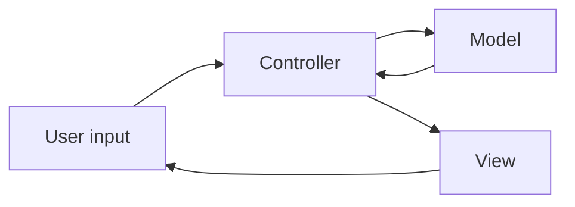
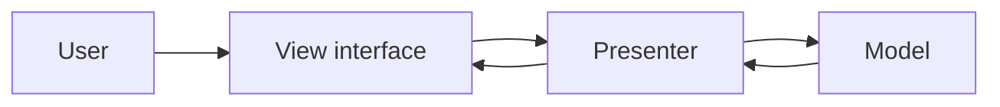
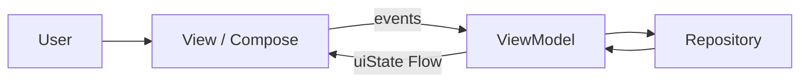
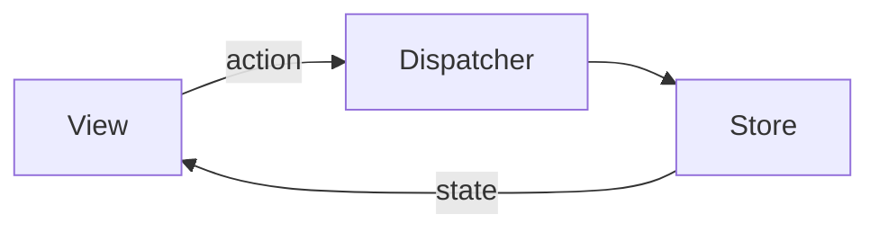
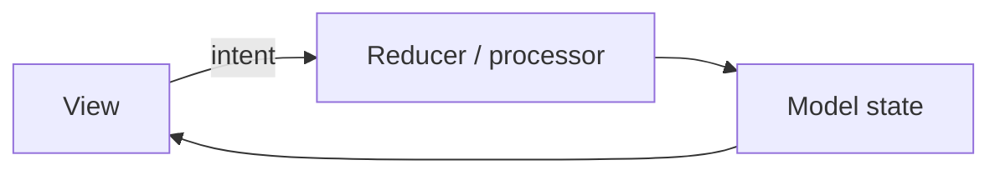

<details class="post-prereq" markdown="0">
  <summary>Prerequisites</summary>
  <div class="post-prereq__body">
    <p class="post-prereq__hint">Read these first if <strong>Activities</strong>, <strong>MVC/MVVM</strong>, or <strong>unidirectional UI state</strong> are new.</p>
    <ul>
      <li><a href="https://developer.android.com/guide/components/activities/intro-activities">Introduction to activities</a> — the original Android UI host, and why God-Activities happen</li>
      <li><a href="https://developer.android.com/topic/architecture">Guide to app architecture</a> — UI layer vs data layer; why patterns exist</li>
      <li><a href="https://developer.android.com/topic/libraries/architecture/viewmodel">ViewModel overview</a> — surviving rotation without stuffing the Activity</li>
      <li><a href="https://developer.android.com/develop/ui/compose/architecture">Architecture in Compose</a> — declarative UI on top of the same state split</li>
    </ul>
  </div>
</details>

## Why front-end architecture stops being optional

Every greenfield app starts readable. Then features accumulate — ads, onboarding, sync, experiments — and Activities grow **God-object** tendrils: click handlers, API calls, adapter logic, and animation flags in one class. At some point the codebase becomes a **mutant**: it runs, but nobody can predict what breaks when they add a nudge slot or change rotation behavior.

Architecture patterns do not exist to win diagram arguments. They trade upfront structure for **scalability** (new features without rewiring everything), **testability** (logic off the UI thread and off Android classes), and **debuggability** (one direction of data flow). The Android front-end (FE) stack evolved because each generation hit the same wall — tight coupling between views and business logic — and proposed a different split.

This post is about **UI-facing patterns** on Android, not the platform layer map ([Android Architecture Breakdown]({{ site.baseurl }}/android-architecture-breakdown) covers system tiers). The through-line: separate **what to show** from **how it is stored** and **who reacts to input**, then let declarative UI (Compose) change how the "view" half is expressed.

## MVC — Activity as everything

Early Android borrowed **Model–View–Controller**. In theory:

- **Model** — data and domain rules
- **View** — widgets on screen
- **Controller** — maps input to model updates



*Figure 1. Classic MVC — controller sits between input, model, and view.*

In practice, `Activity` was often all three. XML layouts were "the view," but the Activity both handled clicks and mutated `TextView`s directly:

```kotlin
class InboxActivity : AppCompatActivity() {
    private lateinit var titleView: TextView

    override fun onCreate(savedInstanceState: Bundle?) {
        super.onCreate(savedInstanceState)
        setContentView(R.layout.activity_inbox)
        titleView = findViewById(R.id.title)

        findViewById<Button>(R.id.refresh).setOnClickListener {
            // Controller + Model + View glue in one place
            val count = api.fetchUnreadCount()   // network on main thread — bad, but typical early demos
            titleView.text = "Unread: $count"
        }
    }
}
```

That works for tiny demos; it fails on rotation, testing, and multi-pane layouts because **view and controller live in the same Android entry point**.

| Pros | Cons |
|------|------|
| Simple mental model | Activity/Fragment bloat |
| Fast for prototypes | Hard to unit test UI logic |
| Flexible file layout | No enforced boundaries |

## MVP — pull logic into a Presenter

**Model–View–Presenter** pushed interaction logic into a **Presenter** the View calls through an interface. The View stays dumb; the Presenter talks to the model and tells the View what to render.



*Figure 2. MVP — Presenter owns logic; View is an interface you can mock.*

```kotlin
interface InboxView {
    fun showUnread(count: Int)
    fun showError(message: String)
}

class InboxPresenter(
    private val api: MailApi,
) {
    private var view: InboxView? = null

    fun attach(view: InboxView) { this.view = view }
    fun detach() { view = null }

    fun onRefresh() {
        runCatching { api.fetchUnreadCount() }
            .onSuccess { view?.showUnread(it) }
            .onFailure { view?.showError(it.message ?: "Failed") }
    }
}

class InboxActivity : AppCompatActivity(), InboxView {
    private val presenter = InboxPresenter(MailApi())

    override fun onStart() {
        super.onStart()
        presenter.attach(this)
    }

    override fun onStop() {
        presenter.detach()   // avoid leaking the Activity
        super.onStop()
    }

    override fun showUnread(count: Int) {
        findViewById<TextView>(R.id.title).text = "Unread: $count"
    }

    override fun showError(message: String) { /* toast / snackbar */ }
}
```

Testability improved — mock `InboxView`, test the presenter — at the cost of **boilerplate** (interfaces, manual view updates, lifecycle wiring).

## MVVM — state holders and reactive UI

**Model–View–ViewModel** became the default Android recommendation once **Data Binding** and later **LiveData** / **Flow** matured. The **ViewModel** survives configuration changes and exposes UI state; the View observes and renders.



*Figure 3. MVVM — View observes state; ViewModel never holds a View reference.*

```kotlin
data class InboxUiState(
    val unread: Int = 0,
    val isLoading: Boolean = false,
    val error: String? = null,
)

class InboxViewModel(
    private val repo: MailRepository,
) : ViewModel() {
    private val _uiState = MutableStateFlow(InboxUiState())
    val uiState: StateFlow<InboxUiState> = _uiState.asStateFlow()

    fun refresh() {
        viewModelScope.launch {
            _uiState.update { it.copy(isLoading = true, error = null) }
            runCatching { repo.fetchUnreadCount() }
                .onSuccess { count ->
                    _uiState.update { it.copy(unread = count, isLoading = false) }
                }
                .onFailure { e ->
                    _uiState.update {
                        it.copy(isLoading = false, error = e.message)
                    }
                }
        }
    }
}
```

Google's architecture components formalized this: ViewModel + Repository + Room/Retrofit. Benefits: lifecycle-safe state, fake repositories in tests, reactive streams. Costs: indirection in tiny apps, and teams sometimes treat ViewModel as a second Activity (network + navigation + formatting in one class).

## Flux — unidirectional events into a store

**Flux** (Facebook, web-first) stresses **one direction**: UI emits **actions**, a **dispatcher** fans them into a **store**, the store updates, the view re-reads state. Android teams borrowed the idea via Redux-style libraries and custom stores. A deeper Kotlin take lives in [Redux with Kotlin]({{ site.baseurl }}/redux-with-kotlin).



*Figure 4. Flux — actions in, state out; no View calling the Model directly.*

```kotlin
sealed interface InboxAction {
    data object Refresh : InboxAction
    data class UnreadLoaded(val count: Int) : InboxAction
    data class Failed(val message: String) : InboxAction
}

data class InboxState(val unread: Int = 0, val error: String? = null)

class InboxStore {
    private val _state = MutableStateFlow(InboxState())
    val state: StateFlow<InboxState> = _state.asStateFlow()

    fun dispatch(action: InboxAction) {
        _state.update { current ->
            when (action) {
                InboxAction.Refresh -> current.copy(error = null)
                is InboxAction.UnreadLoaded ->
                    current.copy(unread = action.count, error = null)
                is InboxAction.Failed ->
                    current.copy(error = action.message)
            }
        }
    }
}
```

Benefit: every UI change is an action you can log and replay. Cost: ceremony and a learning curve if the screen is just a toggle.

## MVI — Intent → Model → View

**MVI** (Model–View–Intent) keeps unidirectional flow but names the user events **intents**. A reducer (or processor) folds intents into a single **immutable model**; the View renders that model only. Often paired with Kotlin coroutines or RxJava.



*Figure 5. MVI — intents in, one model out; View is a pure function of state.*

```kotlin
sealed interface InboxIntent {
    data object Refresh : InboxIntent
}

data class InboxModel(
    val unread: Int = 0,
    val isLoading: Boolean = false,
    val error: String? = null,
)

fun reduce(model: InboxModel, intent: InboxIntent, unread: Int?): InboxModel =
    when (intent) {
        InboxIntent.Refresh -> model.copy(
            isLoading = unread == null,
            unread = unread ?: model.unread,
            error = null,
        )
    }

// View (Compose) only maps Model → UI
@Composable
fun InboxScreen(model: InboxModel, onIntent: (InboxIntent) -> Unit) {
    if (model.isLoading) CircularProgressIndicator()
    Text("Unread: ${model.unread}")
    Button(onClick = { onIntent(InboxIntent.Refresh) }) { Text("Refresh") }
}
```

| Idea | Benefit | Cost |
|------|---------|------|
| Single state object | Reproducible UI | More ceremony per screen |
| Intent → reducer | Predictable updates | Learning curve |
| Immutable models | Easier debugging | Allocation if overdone |

MVI shines on complex flows (wizard checkout, collaborative editors). On a simple settings screen it can be heavy.

## Clean Architecture — layers, not a UI pattern

**Clean Architecture** (Uncle Bob) is not Android-specific. It organizes code into **entities**, **use cases**, and **interface adapters** so inner layers never depend on frameworks. On Android you often see **MVVM at the UI edge** with Clean's use-case layer underneath — navigation and Compose stay outer; business rules stay JVM-pure.

Strength: swap databases, APIs, or UI toolkit without rewriting core logic. Weakness: folder depth and interface count hurt small teams if applied dogmatically on day one.

## Declarative UI — Compose changes the View contract

Jetpack Compose (2021 stable, **mature across production apps by 2026**) is not another acronym in the MVC family. It is a **UI toolkit**: composable functions describe UI from state. That shifts FE architecture pressure from "who calls `setText`" to **where state lives** and **what triggers recomposition**.

The imperative vs declarative split — and what migration actually breaks — is its own post: [Imperative vs Declarative Android UI]({{ site.baseurl }}/imperative-vs-declarative-android-ui). At a high level:

- **Imperative (Views)** — you hold widget references and mutate them; MVP/MVVM presenters or view models push updates manually.
- **Declarative (Compose)** — you pass state into composables; the runtime diffing updates the tree.

MVVM + unidirectional flow remains the common pairing in 2026, but the "View" is a `@Composable` function, not a layout XML file:

```kotlin
@Composable
fun MessageListScreen(viewModel: MessageListViewModel = hiltViewModel()) {
    val uiState by viewModel.uiState.collectAsStateWithLifecycle()

    MessageList(
        messages = uiState.messages,
        isLoading = uiState.isLoading,
        onMessageClick = viewModel::openMessage,
    )
}
```

State flows one way; events flow up. The pattern name matters less than keeping **one source of truth** for what the list shows.

## Comparison at a glance

| Pattern | Era (approx.) | Core split | Testing sweet spot | Common pain |
|---------|---------------|------------|-------------------|-------------|
| MVC | Early Android | Model / View / Controller | Instrumented only | Activity obesity |
| MVP | 2008–2014 | View interface + Presenter | Presenter unit tests | Boilerplate, leaks |
| MVVM | 2014–present | ViewModel + observable state | ViewModel + fake repo | Fat ViewModels |
| Flux | 2015–present | Action → store → view | Store/reducer tests | Ceremony |
| MVI | 2015–present | Intent → single model | Reducer/state tests | Heavy on small screens |
| Clean | 2010s–present | Use cases + layers | Pure domain tests | Over-layering |
| Compose + MVVM | 2021–present | State in VM; UI as functions | Same + Compose UI tests | Recomposition, stability |

Teams mix freely — **Clean use cases + MVVM + Compose** is a common production stack. The mistake is picking a buzzword without matching team size and feature velocity.

## What changed in the Compose era

By 2026, Compose is the default for new Google samples and for large migrations (including high-traffic mail surfaces). Architecture discussions shifted:

- **Less adapter glue**, more **state collection** (`collectAsStateWithLifecycle`)
- **Slot APIs** and list item stability replace ViewHolder manual diffing
- **Interop** (AndroidView, WebView, legacy fragments) remains the real migration cost — not learning `@Composable` syntax

## Wrap-up

Android FE architecture evolved from Activities that did everything, through testable presenters and lifecycle-aware view models, toward immutable state and declarative UI. The diagrams and snippets above are the same inbox "refresh unread" story told five ways — if you can redraw that flow for your screen, you understand the pattern. Pick the lightest structure that keeps new features from turning the codebase into a mutant, and let Compose change *how* you render, not *whether* you separate state from side effects.

## Related reading

- **Internal:** [Imperative vs Declarative Android UI]({{ site.baseurl }}/imperative-vs-declarative-android-ui) · [Android Architecture Breakdown]({{ site.baseurl }}/android-architecture-breakdown) · [Redux with Kotlin]({{ site.baseurl }}/redux-with-kotlin)

## References

- [UI layer](https://developer.android.com/topic/architecture/ui-layer) — unidirectional state in the screen, after the platform architecture guide
- [Handling lifecycles](https://developer.android.com/topic/libraries/architecture/lifecycle) — why God-Activities leaked observers
- [Hannes Dorfmann — Mosby](https://hannesdorfmann.com/android/mosby/) — MVP on Android as a historical waypoint
- [MVI on Android (Hannes Dorfmann)](https://hannesdorfmann.com/android/mosby3-mvi-1/) — intent → model → view as a single state machine
