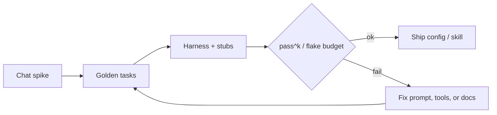

  
Prerequisites

  

    
Read these first if <strong>evals</strong>, <strong>golden tasks</strong>, <strong>trajectories</strong>, or an <strong>eval harness</strong> are new.

    <ul>
      <li><a href="https://medium.com/@Micheal-Lanham/how-to-build-an-evaluation-harness-for-your-ai-agent-before-it-books-the-wrong-flight-84de83a47207">How to build an evaluation harness for your AI agent</a> — golden traces, reproducibility, and why demos ≠ ship bar</li>
      <li><a href="https://visionforgestudio.com/blog/ai-agent-evals-cicd-production-stack">AI agent evals in CI/CD</a> — golden sets, pass^k, wiring checks into pipelines</li>
      <li><a href="https://www.anthropic.com/engineering/building-effective-agents">Building effective agents (Anthropic)</a> — measure and iterate; add complexity only when evals demand it</li>
    </ul>
  

## The demo is not the product

You paste a skill or a team agent config into chat. The agent renames a symbol, updates a test, and says done. You merge the config. Two weeks later the same prompt edits the wrong module because someone moved packages, or it "passes" by deleting the assertion it could not satisfy. Nothing in your process caught the regression — you only ever had a happy path in one conversation.

That is the gap between a **demo** and a **ship bar**. Unit tests taught us this decades ago: a function that returned the right answer once on your laptop is not done. Agent configs, skills, and harness prompts are software too. They deserve something lighter than a research benchmark and heavier than vibes.

## What "worked once" actually measured

A single chat success usually proves:

- The model could follow *that* prompt in *that* context window
- The repo state that day matched the implicit assumptions in your head
- You were watching and steered when it drifted

It does **not** prove the skill survives repo moves, model upgrades, empty context, or a junior on the team running it unsupervised. Treat the chat log as a **spike**, not as green CI.

*Figure 1. Promotion path: chat is discovery; golden tasks + a harness are the gate.*

## Lightweight golden tasks

You do not need a paper-sized suite. Start with **5–15 tasks** that represent how you actually use the agent:

| Task type | Example on an Android tree | Assertion |
|-----------|----------------------------|-----------|
| Mechanical edit | Rename a Compose preview param across 2 files | Diff touches only those files; build still configures |
| Boundary respect | "Fix the crash in `:feature-mail`" | No edits under `build/` or generated sources |
| Verifier loop | Make a failing unit test green | Test command exits 0; no deleted assertions |
| Doc lookup | "How do we run module unit tests?" | Agent cites the one-shot Gradle command from AGENTS.md |

Write each task as: **setup** (repo fixture or stub), **prompt**, **allowed tools**, **pass condition**. Prefer outcome checks (`test exits 0`, `file X contains Y`) over grading prose. Trajectory grading — did it call the right tools in a sane order — is useful when final state alone hides unsafe shortcuts, but start with outcomes so the suite stays cheap.

> **Rule of thumb** - if you cannot state the pass condition without watching the chat, you do not have an eval; you have a demo script.

## Flake when the repo moves

Agent evals flake for reasons unit tests usually do not:

- **Layout drift** — package moves, module renames, new generated folders that look editable
- **Nondeterminism** — temperature, tool latency, partial context
- **Stale golden traces** — the "correct" tool sequence from last quarter points at deleted paths

Budget for that. Re-run critical tasks **k times** and care about **pass^k** (succeeds every time), not pass@k (succeeds if you retry enough). When a task flakes after a real refactor, update the fixture — do not lower the bar to "usually works." Pin model versions in CI the same way you pin JDK in [Android CI]({{ site.baseurl }}/cicd-jenkins-to-screwdriver): silent upgrades turn green suites yellow without a code change.

Stub external tools where you can. A golden task that needs live network search is measuring the internet, not your skill. Record tool results for replay when the point is "given this `./gradlew` output, does the agent stop or thrash?"

## What to put in the harness (and what not to)

A personal or team harness can be a shell script that:

1. Checks out a fixture branch or worktree
2. Runs the agent headlessly with a fixed prompt file
3. Asserts exit code, key file contents, and "forbidden path" greps
4. Writes a short HTML or markdown report as a CI artifact

Keep the always-on suite under ~15 minutes. Park expensive multi-hour trajectories on nightly. The point is **regression detection for prompts and rules**, not replacing product tests. Product tests still own app correctness; agent evals own "our automation still follows the playbook."

Avoid turning the suite into a leaderboard chase. If a stronger model still fails your golden "do not touch generated sources" task, the bug is your rules or layout docs — not the need for a bigger card.

## Audit fields are part of the ship bar

A pass/fail table without **who acted** is half an eval. For any side-effect step, the JSONL (or Langfuse trace) should answer: which actor, which tool, whether a human approved, and which spec/case id was in force. “Anonymous write succeeded” is a failed gate even if the file contents look right.

Pair this with a [spec written before the agent codes]({{ site.baseurl }}/spec-before-the-agent-writes): at least one golden case should assert the acceptance check itself — not that the model sounded done.

## Wrap-up

Promote agent configs the way you promote flaky-test policy: spike in chat, encode 5–15 golden tasks, gate on outcomes with a flake budget, then ship. "It worked once while I watched" is exploratory testing. The ship bar is boring, repeatable, and slightly annoying to maintain — which is how you know it is real.

## References

- [ReliabilityBench](https://arxiv.org/abs/2601.06112) — consistency, perturbations, and fault injection as production-shaped reliability
- [CORE: full-path evaluation of LLM agents](https://arxiv.org/abs/2509.20998) — why final-state checks miss unsafe mid-trajectory behavior
