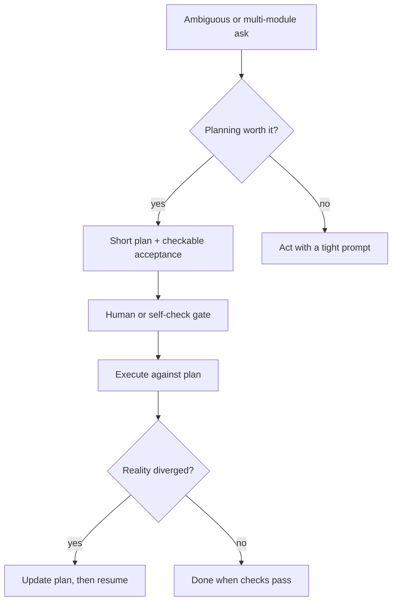

<details class="post-prereq" markdown="0">
  <summary>Prerequisites</summary>
  <div class="post-prereq__body">
    <p class="post-prereq__hint">Read these first if <strong>stale agent plans</strong>, <strong>plan mode</strong>, or <strong>acceptance criteria</strong> are new.</p>
    <ul>
      <li><a href="https://pub.towardsai.net/the-stale-plan-problem-in-coding-agents-cde2c741f8ab">The stale plan problem in coding agents</a> — why an obsolete plan is worse than no plan</li>
      <li><a href="https://cursor.com/learn/agents.md">Cursor Learn — Agents</a> — instructions + tools + model; where a planning pass sits</li>
      <li><a href="https://www.anthropic.com/engineering/building-effective-agents">Building effective agents (Anthropic)</a> — workflows with explicit steps vs open-ended agency</li>
    </ul>
  </div>
</details>

## When the plan is the product

Some agent sessions open with a two-page plan that restates the ticket, invents three modules you do not need, and then gets ignored the moment the first file is opened. Other sessions skip planning, thrash for an hour across the wrong Gradle project, and force a rewrite that a ten-minute plan would have prevented. Both failure modes are common. The useful question is not "should agents plan?" It is **when a planning pass pays for itself** — and how to tell theater from a plan you can check.

## Theater looks busy

Planning theater has familiar tells:

- Long prose with no **acceptance checks** ("improve reliability," "clean up architecture")
- A file list copied from `find` without ownership or risk
- Steps that cannot fail closed ("consider edge cases," "ensure quality")
- A plan the agent never re-reads after turn three

If nothing in the plan could make a later tool call **wrong**, you wrote a press release. Humans do this in design docs too; agents just produce it faster and with more confidence.



*Figure 1. Real planning is a loop with a gate and a reconcile step — not a preamble monologue.*

## When a planning pass earns its tokens

Pay for a plan when at least one is true:

1. **Ambiguous product intent** — "make compose feel faster" needs a hypothesis and a measurement before edits
2. **Multi-PR or multi-module blast radius** — Mail-scale Android trees punish one-shot refactors that cross feature modules without a split
3. **Irreversible or expensive steps** — migrations, API renames, deleting dead code paths with unclear callers
4. **You will hand off mid-flight** — another human or a fresh agent session needs a durable artifact, not chat archaeology

Skip the ceremony for one-line typos, a known failing test with a clear stack trace, or a change you could describe in a single checkable sentence. In those cases planning is latency. [When agents make you slower]({{ site.baseurl }}/when-agents-make-you-slower) is often just misallocated planning tax.

| Signal | Theater | Real plan |
|--------|---------|-----------|
| Length | Pages of restated ticket | One screen: goal, non-goals, checks, steps |
| "Done" | Adjectives ("better," "clean") | Commands and path bounds you can fail |
| After turn 5 | Abandoned in chat history | Still the thing the agent re-reads |
| On surprise | Keep coding; hope | Stop, amend plan, resume |

A five-minute plan that forces a module split before the first edit is cheaper than a heroic PR that reviewers send back for being three features in a trench coat.

## Checkable acceptance, not vibes

A useful plan is short and mean. Aim for something closer to a commit checklist than a strategy memo:

```markdown
## Goal
Move attachment preview loading off the main list recomposition path.

## Non-goals
No redesign of the preview UI. No network protocol changes.

## Acceptance
- [ ] `./gradlew :feature-attach:testDebugUnitTest` passes
- [ ] List scroll jank repro steps no longer trigger preview fetch in systrace
- [ ] Diff touches only `:feature-attach` and shared image loader API

## Steps
1. Isolate fetch behind existing repository interface
2. Add unit test for cancellation on leave composition
3. Wire call site; run module tests
```

Each checkbox is something an agent (or you) can **falsify**. Prefer commands and path bounds over adjectives. If acceptance cannot be pasted into a later verifier prompt, it will evaporate under context pressure.

> **Rule of thumb** - if the plan's "done" criteria are only readable by a human who already knew the answer, the agent will declare victory early.

Gate before execution when the blast radius is high: approve the acceptance list, not the essay. A human (or a strict self-check prompt) should be able to reject "Step 2: refactor shared networking" if that was never in scope. Once execution starts, paste the acceptance block into the verifier turn so "done" means the checkboxes, not a summary paragraph.

## Drift mid-execution

Plans go stale for honest reasons: a test fails and invalidates the design; the real bug is in a dependency; the module boundary was wrong. The failure mode is continuing to patch code while the plan document still describes the abandoned approach. Future you — or a subagent — then "follows the plan" into a rewrite.

Adjacent failure: the agent solves a **nearby** problem — adds a fallback instead of fixing the root cause, or narrows behavior to the one repro you pasted — then marks acceptance mentally complete because the chat looks green. Intent drift sounds finished; checkable acceptance is what catches it.

When evidence kills an assumption:

1. **Stop implementing**
2. **Reconcile the plan** (goal, non-goals, acceptance, steps)
3. **Resume** only against the updated artifact

Treat the plan as the durable source of truth across compaction and session resets. Chat corrections that never land in the plan file are rumors. This is the same discipline as keeping CI honest: the documented contract and the running system must match, or the next actor will trust the wrong one — see [CI/CD as a mental model]({{ site.baseurl }}/cicd-jenkins-to-screwdriver).

## Wrap-up

Use a planning pass to bound blast radius and write checks you can fail. Skip it when the task is already a single falsifiable sentence. Theater is length without teeth; a real plan is short, owned, and updated when reality disagrees. The rewrite you save is usually the one where the agent confidently finished the wrong design.

## References

- [Roady](https://github.com/felixgeelhaar/roady) — file-based plan-of-record and drift detection across session resets
- [Intent drift detection for AI coding agents](https://feelgoot.com/intent-drift-detection/) — adjacent completions that miss acceptance while sounding finished
