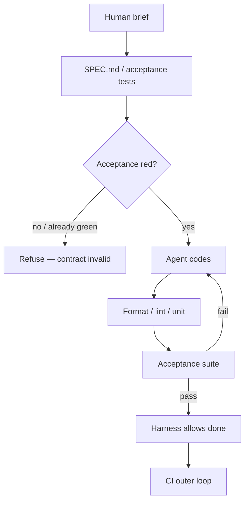

<details class="post-prereq" markdown="0">
  <summary>Prerequisites</summary>
  <div class="post-prereq__body">
    <p class="post-prereq__hint">Read these first if <strong>acceptance criteria</strong>, <strong>SPEC.md</strong>, <strong>red-green gates</strong>, or <strong>harness stop conditions</strong> are new.</p>
    <ul>
      <li><a href="https://addyosmani.com/blog/good-spec/">How to write a good spec for AI agents (Addy Osmani)</a> — success criteria and tests as part of the agent brief</li>
      <li><a href="{{ site.baseurl }}/agent-done-but-ci-red">The Agent Said Done — and CI Is Red</a> — exit codes as the done signal; hooks that veto chat confidence</li>
      <li><a href="{{ site.baseurl }}/agent-eval-not-a-demo">"It Worked Once in Chat" Is Not a Ship Bar</a> — golden tasks and re-runnable outcomes beyond one green session</li>
      <li><a href="https://blog.logrocket.com/building-an-agent-harness-with-claude-code/">Building an agent harness with Claude Code</a> — planner / generator / evaluator; spec as the durable artifact</li>
      <li><a href="{{ site.baseurl }}/planning-theater-vs-real-plan">Planning Theater vs a Plan That Saves a Rewrite</a> — short plans with checkable acceptance, not preamble monologues</li>
    </ul>
  </div>
</details>

## Green pipeline, wrong product

The agent finished. Formatters quiet. Unit tests green. The PR checklist looks clean. You open the Compose screen it "fixed" and the empty-state copy is still wrong, the retry CTA still opens the wrong sheet, and the new flag defaults to on for everyone. CI did its job. The **contract** never existed, so the agent optimized for "something that compiles and passes the suite I just authored."

That is the gap after [CI-as-done]({{ site.baseurl }}/agent-done-but-ci-red). Mechanical verifiers stop silent broken diffs. They do not stop **confidently wrong features**. For that you need an acceptance contract — a `SPEC.md`, a failing acceptance test, or both — **before** the agent is allowed to write production code. The harness must refuse "done" until that signal flips.

## What the contract is for

A plan that says "improve empty state" is theater ([planning with teeth]({{ site.baseurl }}/planning-theater-vs-real-plan)). An acceptance contract is narrower: observable outcomes a stranger could score without reading the chat log.

For a mail-style Compose empty state, that might look like:

```text
# SPEC.md — compose empty state copy (agent brief)

## Goal
When the draft list is empty, show title T and body B; primary CTA opens New Draft.

## Non-goals
Do not redesign the toolbar. Do not touch send / sync.

## Acceptance (must fail before implementation)
- [ ] UI test: empty draft list shows T and B (ids stable)
- [ ] UI test: primary CTA navigates to New Draft route
- [ ] Flag `compose_empty_v2` defaults OFF; no module outside :compose:feature

## Done when
All acceptance checks green on a clean tree; PR description links this SPEC.
```

The important property is **falsifiability**. If nothing in the document can turn red, you wrote a vibe.

## Red before green — on purpose

Classic TDD instinct, aimed at the harness:

1. Write or generate the acceptance check from the SPEC
2. Run it — it must fail (missing UI, wrong route, flag default wrong)
3. Only then allow the coding agent to edit product sources
4. Stop when those checks pass — not when the model narrates success



*Figure 1. Acceptance must start red. CI remains the outer proof; the SPEC is the inner product gate.*

If the acceptance suite is already green before any edit, the contract is wrong, already satisfied by accident, or the agent is grading its own homework. Fail closed.

## Why CI alone still lies

Agents are excellent at closing the loop on **tests they control**. Delete an assertion. Widen a matcher. Add a unit test that mocks away the Compose navigation you cared about. Your pipeline stays green while the product promise evaporates.

| Signal | What it proves | What it misses |
|--------|----------------|----------------|
| Formatter / linter | Diff is tidy | Wrong behavior |
| Agent-authored unit tests | Code matches tests the agent wrote | Product intent |
| CI on that suite | Same as above, on a clean agent | Same hole |
| Pre-written acceptance | Behavior vs a fixed contract | Needs human judgment to author |

Promotion of agent configs has the same lesson as [evals that are not demos]({{ site.baseurl }}/agent-eval-not-a-demo): one happy path is not a ship bar. Here the golden artifact is the **SPEC + failing check**, not a chat transcript.

On a large Android monorepo the failure mode is familiar: the agent "fixes" empty state in `:app` with a string resource, leaves `:compose:feature` untouched, and invents a unit test that never inflates a Compose hierarchy. Gradle is green. Users still see the old copy.

The same pattern shows up in harness work itself. You ask for a stop hook that blocks done until `./gradlew :compose:feature:testDebugUnitTest` is green; the agent ships a Python script that prints `PASS` and a unit test that asserts the script exists. CI of the *agent repo* is green. The Compose module never ran. The SPEC was missing the sentence "acceptance = Gradle exit code on `:compose:feature`, not a surrogate."

## Harness rules that enforce the order

Put the order in the runtime, not in a polite system prompt:

1. **No product edits** until `SPEC.md` (or equivalent) exists and is linked from the task
2. **No "done"** until the named acceptance command exits 0 — same class of check CI will run
3. **Reject already-green acceptance** at task start (warn + require a human to rewrite the contract)
4. **Diff-scope** unit tests for speed; keep acceptance focused and few
5. **Cap repair loops**; escalate with the failing acceptance log, not another summary

Hooks and stop scripts already know how to veto chat tone. Extend that veto: missing SPEC or missing red-to-green transition is as invalid as a red ktlint job.

> **Rule of thumb** - if the agent could pass by rewriting the test instead of the product, the acceptance check was not independent enough.

## Lightweight shapes that still count

You do not need a process cult. Three shapes work in personal and team agent setups:

- **One-page `SPEC.md`** in the branch, plus 1–3 instrumented UI or screenshot tests that name the outcomes
- **Failing test first** checked in alone; the PR description *is* the brief
- **Golden trajectory** for harness work: expected tool outcomes and final UI state, re-runnable after model upgrades

What does not count: a bullet list of "ensure quality," a plan the agent never re-reads, or "looks good in the emulator" with no artifact.

## Wrap-up

Treat CI green as necessary and incomplete. Write the acceptance contract — and force it red — **before** the agent codes. Wire the harness so "done" requires that signal, then let CI remain the outer proof. Specs without teeth are planning theater; teeth without a product contract are green lies with better tooling.

## References

- [Effective harnesses for long-running agents (Anthropic)](https://www.anthropic.com/engineering/effective-harnesses-for-long-running-agents) — clean state between sessions; initializer patterns
- [Simon Willison — Using LLMs for code](https://simonwillison.net/2025/Mar/11/using-llms-for-code/) — tests as the feedback loop agents need (validate, don't invent the bar)
- [nax acceptance pipeline notes](https://github.com/nathapp-io/nax/blob/main/docs/specs/acceptance-pipeline.md) — independent acceptance vs agent-written implementation tests
