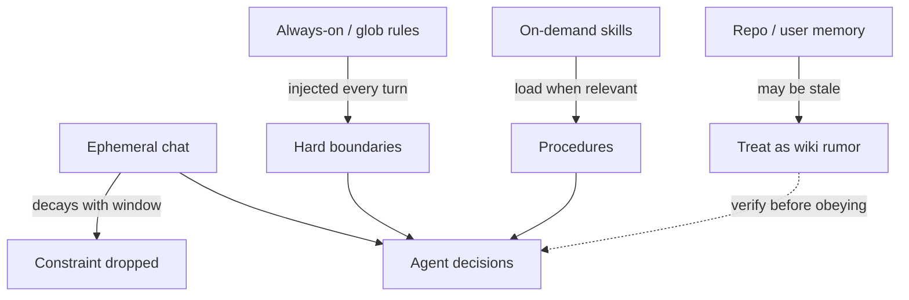

## The rule lived three turns ago

You told the agent, clearly: do not touch generated sources under `build/`, and keep the change inside `:mail:compose`. Twenty minutes later it “fixes” a compile error by editing a generated binder file and reaches into `:mail:sync` because “that is where the real bug is.” The chat still shows your constraint. The model is behaving as if it never existed.

That is not stubbornness. Long sessions fill a finite context window. Older instructions drift toward the edges; tool dumps and half-finished plans crowd the middle. What looks like forgetting is usually **noisy context winning over a one-time sentence**.

The second failure mode feels worse. Yesterday’s session wrote a memory note: “Compose list uses XML adapters.” That was true before the migration. Today every new chat “remembers” it, invents a fix for adapters that no longer exist, and argues with you when you correct it. Stale memory does not merely miss — it **gaslights the diagnosis**.

## Related reading

- **Docs:** [Cursor skills](https://cursor.com/help/customization/skills) — on-demand workflows vs short always-on rules
- **Articles surveyed:** [Why Cursor forgets mid-task](https://www.learncursor.dev/tips/cursor-forgets-context) — context hygiene; [Rules vs skills](https://getaibook.com/blog/agent-skills-vs-cursor-rules/) — deterministic vs relevance-loaded context

## Three places a constraint can live

Treat durability as a placement problem, not a prompting contest.

| Home | Lifetime | Good for | Bad for |
|------|----------|----------|---------|
| This chat | Until the thread dies or the window fills | One-shot scope (“only this PR”) | Anything you will need next week |
| Always-on rules | Every session (or every matching glob) | Hard prohibitions, module boundaries | Long playbooks, rare workflows |
| Skills / playbooks | Loaded when the task matches | Multi-step procedures (ship checklist, review pass) | “Never edit `build/`” — that must not be optional |



*Figure 1. Constraints that must never fail belong in rules; procedures belong in skills; chat and memory are untrusted until verified.*

> **Rule of thumb** - if breaking the constraint costs a bad diff or a security review, put it in always-on (or glob-scoped) rules. If it is a how-to, make it a skill. If it is only true for this ticket, say it in chat *and* restate it when the thread gets long.

## Android monorepo vignette

Mail-scale trees make the failure obvious. Generated sources look like editable Kotlin. A “helpful” agent will patch them. Sibling modules share package names that invite drive-by refactors. The durable form of the constraint is boring and mechanical:

```text
# .cursor/rules/mail-boundaries.mdc (alwaysApply or globs on :mail:**)
- Do not edit files under **/build/** or **/generated/**.
- Prefer changes inside the module named in the task; do not “fix” siblings unless asked.
- Prefer repository / ViewModel sources over touching Compose preview-only fixtures.
```

Put the *procedure* for a Compose screen migration in a skill: checklist, verify commands, post-edit review steps. Do not stuff that whole playbook into always-on rules — you burn context on every `ls`.

## Memory is an untrusted wiki page

Write memory when a fact is stable and expensive to rediscover: the one-shot test command for a feature module, which package owns an attachment preview surface, “CI flake X needs a re-run not a code change.”

Delete or rewrite memory when the ground moves: architecture migrations, renamed packages, retired adapters. Treat every remembered sentence like a sketchy internal wiki — **useful hypothesis, not ground truth**. Before the agent acts on a memory claim, ask it to point at a file or command that still proves it.

```text
# Bad memory (from pre-migration era)
"Message list UI is XML RecyclerView + adapters."

# Better: dated, falsifiable
"As of 2024 UI migration: message list is Compose; do not reintroduce XML adapters.
Verify: feature module sources + feature flag docs."
```

## What to do in a long session that is already drifting

1. Restate the hard constraint near the latest user message — models overweight recent tokens.
2. If the thread feels heavy, start a fresh chat and point at the rule file / skill, not at “continue.”
3. Correct wrong memory *in the memory store*, not only in chat, or the next session will resurrect the lie.

## Wrap-up

Agents do not “owe” you continuity. They owe you whatever is still in context plus whatever you injected as durable policy. Put non-negotiable boundaries in rules, put rare workflows in skills, keep chat for the ticket, and treat memory as untrusted until a file or command confirms it. Past me spent evenings arguing with a confident wrong memory; present me deletes the note first.

## References

- [Cursor — Skills](https://cursor.com/help/customization/skills)
- [Learn Cursor — Why Cursor forgets context mid-task](https://www.learncursor.dev/tips/cursor-forgets-context)
- [Agent Skills vs Cursor Rules](https://getaibook.com/blog/agent-skills-vs-cursor-rules/)
- [Morph — Cursor rules best practices](https://www.morphllm.com/cursor-rules-best-practices)
