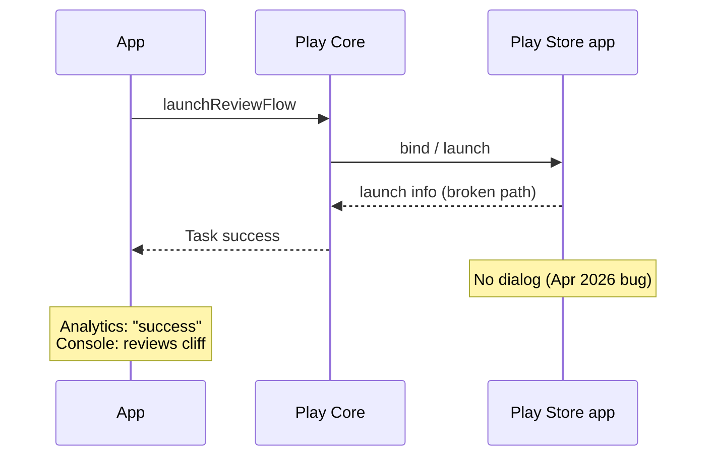

<details class="post-prereq" markdown="0">
  <summary>Prerequisites</summary>
  <div class="post-prereq__body">
    <p class="post-prereq__hint">Read these first if <strong>Play In-App Review or Play Core Task APIs</strong> are new.</p>
    <ul>
      <li><a href="https://developer.android.com/guide/playcore/in-app-review">In-app reviews (Play)</a> — what the API guarantees (and does not)</li>
      <li><a href="https://developer.android.com/reference/com/google/android/play/core/review/ReviewManager">ReviewManager API</a> — request/launch review flow</li>
      <li><a href="https://developer.android.com/guide/playcore">Play Core libraries</a> — Task-based async Play APIs</li>
      <li><a href="https://developer.android.com/guide/playcore/in-app-review/test">Test in-app reviews</a> — how to verify without production quotas</li>
    </ul>
  </div>
</details>

## Ratings fell. Installs did not.

Around **21 April 2026**, Play Console inbound reviews for many apps fell off a cliff — reports of **60–80%** drops were common — while installs and DAU looked normal. The first instinct is always the same: we broke the prompt, we hit quota, we shipped a bad funnel. For teams that rely on in-app review for ASO, that instinct burns days.

What made this incident nasty was the API surface. `ReviewManager.launchReviewFlow` completed **successfully**. No exception. No failed `Task`. Logs showed bind → launch info → unbind in tens of milliseconds — and **no UI**. Google’s own docs already warn that completion does **not** mean a dialog was shown. In April that warning stopped being pedantry and became the whole outage.

This post is the forensic path: how to decide **app misuse vs Play-side regression**, what the silent-success contract already admitted, and what not to panic-ship while Google rolls a store update.

## Related reading

- **Docs:** [In-app reviews (Kotlin/Java)](https://developer.android.com/guide/playcore/in-app-review/kotlin-java) — completion ≠ dialog shown
- **Incident:** [Google Issue Tracker #506844940](https://issuetracker.google.com/issues/506844940)
- **Write-up:** [AppFollow — Google confirms Play Store bug](https://appfollow.io/blog/google-confirms-play-store-bug-causing-review-drops-fix-coming-may-5th)
- **Internal:** [ANR Stack Traces Lie by Omission]({{ site.baseurl }}/android-crashlytics-anr) — another place “green signal” hides the real failure mode

## What “success” actually promises

Play’s in-app review flow is deliberately opaque. Quotas, eligibility, and whether the user already reviewed are server-side. The client API is allowed to return success when nothing visible happened. That design protects Google’s spam controls; it also means **your only honest product signal is downstream** — Console review volume, not the `Task` result.

```kotlin
reviewManager.launchReviewFlow(activity, reviewInfo)
    .addOnCompleteListener { task ->
        // Completes for "flow finished" — not "stars dialog appeared".
        if (task.isSuccessful) {
            analytics.track("in_app_review_flow_completed")
        }
    }
```

If your dashboards treat `in_app_review_flow_completed` as “prompt shown,” you will gaslight yourself the next time Play breaks.

## The April–May 2026 failure mode

Developers filing and commenting on [#506844940](https://issuetracker.google.com/issues/506844940) described a pattern that started ~**2026-04-21**:

1. Request `ReviewInfo` as usual.
2. `launchReviewFlow` reports success quickly.
3. No review UI.
4. Play inbound ratings drop while traffic stays flat.

Google later confirmed a **bug in the Play Store app** (system-wide), not per-app integration mistakes. A fix was estimated to roll out **starting ~2026-05-05**; AppFollow and others tracked recovery into mid-May. Google’s guidance to developers: **do not change app code** for the platform fix.



*Figure 1. Silent success: your process sees green; users never see stars.*

## Ruling out “our wiring” — the forensic path

Before you rewrite the integration, prove where the break lives.

**1. Correlate product and platform signals.** Plot daily inbound reviews against DAU, install volume, and your “flow completed” event. A cliff with stable traffic and stable “success” rates points at **dialog suppression**, not traffic.

**2. Separate client races from silent no-UI.** A different failure class is real app bugs — e.g. launching after the `Activity` is gone, or racing configuration changes into NPEs in wrappers. Those usually leave exceptions or obvious lifecycle smells. The April bug left **success and silence**.

**3. Compare against Play-side expectations.** On a large app — for example, a mail client — treat Play Core as an untrusted dependency: when ratings telemetry diverges from session success, the question is not “did the app call the API” but “did Play keep its side of the contract.” For this incident I **repackaged / decompiled the Play review libraries**, walked the **in-app review request call path**, and checked **call signatures** against public / AOSP-shaped expectations. The signatures and short-circuit timing matched a **Play-internal** failure to present UI — not a missing `launchReviewFlow` from the app. That is the difference between shipping a panicked workaround and waiting for a store update.

**4. Use a *test-only* store rollback carefully.** Some developers restored the dialog on QA devices by uninstalling Play Store updates (factory Play). That is a **lab** signal that the store binary mattered. It is not a user-facing fix.

## What not to do while Play is broken

| Panic move | Why it hurts |
|------------|--------------|
| Deep-link every user to the Play listing | Quota/spam risk, worse UX, may not restore star volume the way you hope |
| Rewrite Play Core version mid-incident | Noise; Google said the fix is Play Store–side |
| Treat `Task` success as ASO health | You already learned it lies |
| Silence the cliff in leadership updates | ASO owners need “platform outage” language, not “we’re investigating our prompt” for two weeks |

Better: add a **silent-failure detector** — ratio of `flow_completed` to Console new reviews (or a sampled “dialog impression” you *can* measure, if you ever get one). Alert when the ratio breaks, not when absolute reviews wobble for a day.

## Wrap-up

The April 2026 in-app review incident was a reminder that **rating pipelines are platform dependencies**. Your APK can be unchanged and still lose most inbound reviews because Play’s dialog path returned success without UI. Trust Console volume over SDK completion, forensic the call path before rewriting integration, and wait for store-side fixes when Google owns the bug.

## References

- [Android Developers — In-app reviews](https://developer.android.com/guide/playcore/in-app-review/kotlin-java)
- [Google Issue Tracker #506844940](https://issuetracker.google.com/issues/506844940)
- [AppFollow — Google confirms Play Store bug, fix from May 5th](https://appfollow.io/blog/google-confirms-play-store-bug-causing-review-drops-fix-coming-may-5th)
