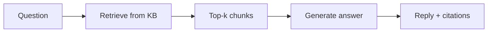

  
Prerequisites

  

    
Read these first if <strong>RAG</strong>, <strong>chunking</strong>, <strong>embeddings</strong>, or <strong>knowledge bases</strong> are new.

    <ul>
      <li><a href="https://aws.amazon.com/what-is/retrieval-augmented-generation/">What is RAG? (AWS)</a> — retrieve from an authoritative corpus, then generate</li>
      <li><a href="https://www.pinecone.io/learn/chunking-strategies/">Chunking strategies (Pinecone)</a> — how you slice the corpus; wrong boundaries → wrong top-<em>k</em></li>
      <li><a href="https://docs.aws.amazon.com/prescriptive-guidance/latest/retrieval-augmented-generation-options/what-is-rag.html">Understanding RAG (AWS Prescriptive Guidance)</a> — embeddings, vector store, retrieve → augment → generate</li>
      <li><a href="https://arxiv.org/abs/2005.11401">Lewis et al. — RAG for Knowledge-Intensive NLP Tasks</a> (NeurIPS 2020) — original paper that named the pattern</li>
      <li><a href="https://www.anthropic.com/engineering/effective-context-engineering-for-ai-agents">Effective context engineering for AI agents (Anthropic)</a> — retrieved (or repo) context competes for the same attention budget</li>
    </ul>
  

## The wiki answered. It was last year's policy.

A teammate asks the internal assistant how long retention is for deleted drafts. The bot cites three passages, names a doc title, and answers with a round number. Legal's real page was updated last quarter. The chunks that ranked highest were an old FAQ and a neighboring section about *sent* mail. Nobody lied in the prompt. **Retrieval ranked the wrong slice of a knowledge base**, and generation did what generation does: sound finished.

That is the everyday failure mode for **RAG** — retrieval-augmented generation. The terms are inseparable in practice: a **knowledge base** is the corpus you maintain (wikis, runbooks, PDFs, ticket dumps); **RAG** is the pattern that *searches* that corpus at query time, stuffs passages into context, and lets the model write. Lewis et al. popularized the recipe in 2020; production teams rediscover that the generator is only as honest as the top-*k* you feed it.

## Knowledge base first, then the pipeline

Call the asset what it is before you buy an embedding product.

| Piece | Job |
|-------|-----|
| **Knowledge base** | Owned documents with freshness, permissions, and a clear "source of truth" |
| **Index / chunks** | How you slice and embed those docs for search |
| **Retriever (+ optional rerank)** | Which chunks enter the prompt |
| **Generator** | The LLM that answers *conditioned on* those chunks |

*Figure 1. RAG is search-then-write over a knowledge base — not a smarter model that "remembers" your wiki.*

If the KB is a graveyard of contradictory Confluence pages, RAG will amplify the loudest stale page. Ownership matters as much as embeddings: who retires superseded runbooks, who can publish, and whether the index lags the wiki by hours or by quarters. Chunking that splits a definition from its exception produces the same confident wrongness taxonomies keep rediscovering: boundary errors, off-topic hits, distractor dominance while the answer-bearing span sits one chunk away.

For example, in a mail app help center, "deleted drafts" and "deleted messages" often live in adjacent articles. A fixed-size split can put the retention number in chunk A and the product caveat ("drafts vs sent") in chunk B. The retriever returns A because the query shared more tokens with the FAQ title. The model cites A and invents confidence. Users experience a policy answer; you experienced a ranking bug.

> **Rule of thumb** - debug the ranked passages before you blame the model. If the gold paragraph never entered the prompt, no prompt tweak fixes the product.

## Two products people confuse

**Docs / support Q&A** needs a maintained knowledge base and a retrieval stack you can evaluate: Did the right passage appear? Can the user open the cite? Stale sync and bad ACLs are product bugs, not "LLM vibes."

**Coding agents** already live inside a different knowledge base: the repository. For "which Gradle task gates PRs?" or "where is the Compose list adapter?", the honest path is usually `rg`, a module map, and thin [AGENTS / skills]({{ site.baseurl }}/monorepo-navigable-to-agents) — the same discipline as [context that must stay durable]({{ site.baseurl }}/agent-forgot-the-constraint). Standing up a vector index of every `.kt` file because "we need RAG" often buys approximate neighbors when exact path search was the requirement. Similarity search shines on prose handbooks; it is a poor substitute for a checked-in verify command.

| Need | Prefer |
|------|--------|
| Policy / FAQ / handbook answers with citations | KB + RAG (and freshness SLO) |
| "Where is this symbol / module / verify command?" | Repo tools + navigable monorepo |
| Mixed: "how does our send pipeline work?" in prose runbooks | RAG over *owned* architecture docs — not raw `build/` trees |
| Agent must not invent APIs | Skills and rules in the harness, not a similarity search over Slack |

Embeddings are great at "find something *like* this paragraph." They are mediocre at "open the file the build actually uses." Treat that as an architecture choice, not a fashion cycle.

## What to measure when chat looks green

Demos fail the same way coding agents fail when chat says done and CI is red ([harness verifiers]({{ site.baseurl }}/agent-done-but-ci-red)): the UI is fluent while the gate is missing.

For a KB + RAG path, cheap checks beat vibes:

1. **Retrieval hit** — for a golden question set, is the answer-bearing chunk in top-*k*?
2. **Freshness** — does the index lag the wiki by hours or by quarters?
3. **Citation honesty** — does the cited doc actually support the sentence, or is it decorative?

Generation-only scores hide "right document, wrong page" failures that show up in long manuals and mail-style help centers: the retriever found the family of pages and still missed the paragraph that changed last release.

## Wrap-up

A knowledge base is the corpus you own; RAG is retrieve-then-generate over it. They belong in one mental model because the popular bug is joint: **wrong chunk in, confident answer out.** Build RAG when answers must track a living document set with provenance. For coding agents, invest in a legible repo and harness context first — and only add retrieval when the question is genuinely "search the handbook," not "find the module."

## References

- [Why the Chunking Problem Isn't Solved](https://tianpan.co/blog/2026-04-10-rag-chunking-problem-not-solved) — boundary splits and naive fixed-size chunks in production
- [A Systematic Taxonomy of Failure Modes in RAG](https://aclanthology.org/2026.trustnlp-main.27/) — retrieval vs fusion vs generation failures
- [Classifying Errors in RAG Systems](https://aclanthology.org/2026.eacl-long.147/) — missed retrieval, low relevance, partial evidence
