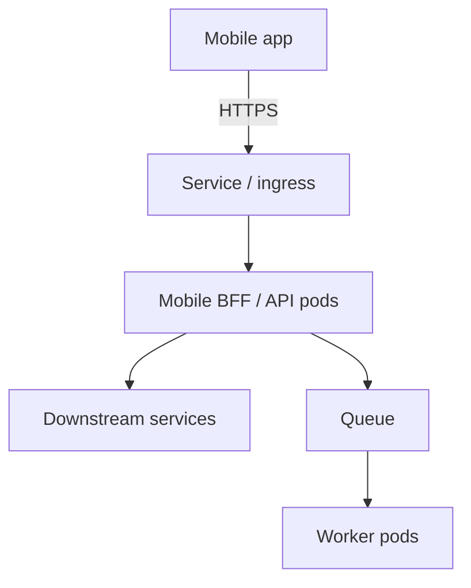

  
Prerequisites

  

    
Read these first if <strong>containers</strong>, <strong>Docker images</strong>, or <strong>orchestration</strong> are new.

    <ul>
      <li><a href="https://docs.docker.com/get-started/docker-overview/">Docker overview</a> — images and containers</li>
      <li><a href="https://kubernetes.io/docs/concepts/overview/">Kubernetes overview</a> — managing containerized workloads</li>
      <li><a href="https://kubernetes.io/docs/concepts/workloads/controllers/deployment/">Deployments</a> — replicas and rolling updates</li>
      <li><a href="https://docs.docker.com/compose/">Docker Compose</a> — several services on one machine</li>
    </ul>
  

## The phone never runs Docker. It calls something that does.

A mail or chat Android client talks HTTPS to a hostname baked into the build (or fetched from config). That hostname is not “Kubernetes” and not “a Docker daemon.” It is a **backend process** — usually several of them — packaged as images and kept running across machines.

**Docker** is how that process becomes a repeatable image: same bits on a laptop, in CI, and in staging. **Kubernetes** is how a fleet of those images stays up: how many copies, how they roll, what name the app calls, what happens when a node dies. Build with one; run the production shape with the other.

For a mobile service, the useful question is not whale vs helm. It is **which backend jobs the app depends on**, and which of those jobs live in the cluster.

## The mobile-facing backend is several jobs

The app’s critical path is mostly one kind of process. The cluster is not.

| Kind | What it does for the mobile app | How it usually runs |
|------|--------------------------------|---------------------|
| **API / BFF** | HTTPS the app actually calls. **BFF** (*Backend for Frontend*) is an API shaped for one client — e.g. a mobile BFF that aggregates list/send/auth so the phone does not fan out to five services | Replicas behind a stable name; roll out gradually |
| **Downstream services** | Mailbox, identity, attachments — the BFF fans out here | Same cluster or another; the phone should not know |
| **Worker** | Send, index, push fan-out, thumbnails — work that must not sit on the tap | Scale on queue lag, not on HTTP QPS |
| **Job / Cron** | Backfill, cleanup, replay failed sends | Run to completion; not a forever replica |
| **Agent** | Node collector (metrics, logs, traces) — e.g. a Datadog agent talking to Datadog’s intake | One per node (or a sidecar); **outbound**, not a hostname the app calls |

Docker’s job is the same for all of them: **this image is the process**. Kubernetes’s job differs by shape: a Deployment + Service for anything the phone hits; workers without a public hostname; Jobs that exit; agents as a DaemonSet so every machine is observed.

*Figure 1. The app calls one name. Kubernetes keeps BFF replicas behind it; workers and downstream services do the rest of the product. Node agents (not shown) scrape those boxes — they are not on the request path.*

For example, in a mail app, opening the inbox should be BFF → mailbox metadata → a payload the list can paint. Tapping send should return fast; SMTP and push fan-out belong on a worker. That split is why [the request path should never wait]({{ site.baseurl }}/request-path-should-never-wait) is an ops shape as much as an API slogan. A [fat mobile payload]({{ site.baseurl }}/fat-vs-chatty-apis-cellular) is cheaper on cellular when the BFF does the join **in the cluster**, not on the radio.

## How Docker and Kubernetes show up in that path

**Same image, three places.** CI `docker build`s the BFF, tags it, pushes a registry. A developer runs the same image with Compose (BFF + Redis + stub auth) and points a debug APK at `10.0.2.2`. Staging and prod pull the tag onto N pods. When “works in Compose” and “fails on device against staging” disagree, the image is often fine — ingress, secrets, and real dependencies are not in the laptop YAML.

**The name the app already has.** Kubernetes puts a Service (and usually ingress/TLS) in front of BFF pods so the APK does not chase pod IPs. Rolling a Deployment replaces pods gradually. For a minute, some phones hit the new tag and some hit the old one. Aggressive client retries turn that into a hang; the cluster looks “mostly green.”

**Environments are different fleets.** Namespaces or clusters are how staging vs prod exist. A dogfood build pointed at the wrong Service looks like an Android sync bug. The backend change was a base URL.

**Workers are the rest of the product.** They share the cluster and often the same repo as the BFF, with a different command. They must not sit on the hostname the phone uses. Scale them on queue depth. If send is slow, look at worker lag before rewriting the compose screen.

**Agents watch the fleet.** A node agent — Datadog, Fluent Bit, a Prometheus exporter — is another container, usually one per machine, shipping telemetry to an intake. Scaling the BFF to 20 replicas does not mean 20 collectors. If the agent cannot reach intake, dashboards go dark while the app still gets 200s. Useful, easy to over-index on; it is not the mobile API.

> **Rule of thumb** - Docker answers “what binary is this backend process?” Kubernetes answers “how many, where, and under what name does the app call it?” For a mobile service, start with the BFF hostname, then workers, then collectors.

The APK is a client of that hostname. Docker and Kubernetes are how the servers behind it get built and kept alive — not a choice the phone makes, and not a rivalry between two logos.

## References

- [Docker overview](https://docs.docker.com/get-started/docker-overview/)
- [Kubernetes concepts overview](https://kubernetes.io/docs/concepts/overview/)
- [Deployments](https://kubernetes.io/docs/concepts/workloads/controllers/deployment/)
- [DaemonSet](https://kubernetes.io/docs/concepts/workloads/controllers/daemonset/)
- [Docker Compose](https://docs.docker.com/compose/)
- [Backends for Frontends](https://samnewman.io/patterns/architectural/bff/)
- [Request path should never wait (this site)]({{ site.baseurl }}/request-path-should-never-wait)
- [Fat vs chatty APIs on cellular (this site)]({{ site.baseurl }}/fat-vs-chatty-apis-cellular)
- [BFF — three clients, same aggregation (this site)]({{ site.baseurl }}/bff-three-clients-same-aggregation)
