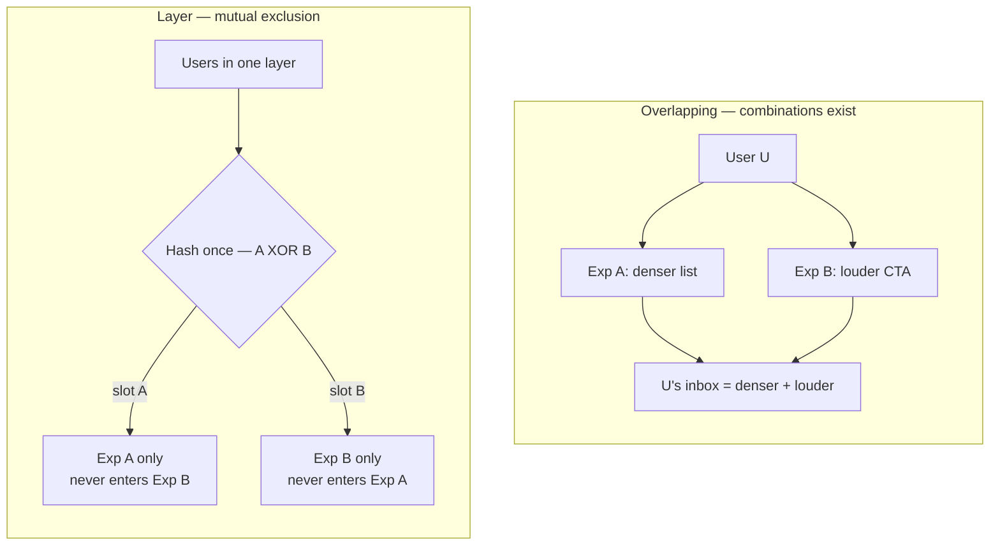

  
Prerequisites

  

    
Read these first if <strong>A/B tests</strong>, <strong>exposure</strong>, or <strong>feature flags vs experiments</strong> are new.

    <ul>
      <li><a href="{{ site.baseurl }}/feature-flags-experiments-mobile">Feature flags on mobile (this site)</a> — kill switch vs rollout vs experiment</li>
      <li><a href="https://docs.statsig.com/experiments/layers-overview">Statsig — Layers</a> — mutual exclusion domains</li>
      <li><a href="https://www.statsig.com/blog/embracing-overlapping-a-b-tests-and-the-danger-of-isolating-experiments">Embracing overlapping A/B tests</a> — why isolation can hurt power</li>
      <li><a href="https://docs.statsig.com/experiments/holdouts-introduction">Holdouts</a> — measuring cumulative impact with a held-back floor</li>
    </ul>
  

## This A/B ate that A/B

Two “winning” experiments ship the same week: a denser message list and a louder compose CTA. Metrics look great in isolation. Together, the inbox feels noisy and send drops. Nobody lied in the dashboard — **traffic topology** lied. Both treatments hit the same users with no mutual exclusion.

This is not a rewrite of [kill switch / rollout / experiment jobs]({{ site.baseurl }}/feature-flags-experiments-mobile). It is the failure mode when those jobs share a screen without a contract.

## The wrong fight: “overlap is modern, layers are legacy”

Platforms that argue for **overlapping** assignment (e.g. Statsig’s public writing) are right about velocity and statistical power: isolating *everything* destroys both. The same docs still ship **layers** (mutual exclusion domains) and **interaction detection** — because some treatments are not independent parameters.

*Figure 1. Overlap: the same user can sit in A and B at once (combination cells). Layer: traffic is partitioned so a user is in at most one experiment in that domain.*

The interesting decision is not “which religion?” It is: **can these two treatments rewrite the same pixel or the same write path at once?**

| Symptom | Likely topology mistake |
|---------|-------------------------|
| Two “wins,” one ugly product | Overlap on colliding surfaces (list chrome + CTA + ranking) |
| Every test underpowered; teams fighting for users | Everything forced into layers |
| Cumulative product drift nobody can measure | No **holdout** floor — everyone is always in something |
| Ghost variants on old APKs | Overlapping remote config on clients that only understand half the matrix |

## Where layers still earn rent on mobile

**Colliding surfaces.** List density, ranking, and compose CTAs are not independent knobs. Exclusive layers (or hard gates) keep ownership honest when two teams ship into the same screen.

**Binary skew.** Old APKs linger. Overlapping configs on clients that only know half the variants produce “impossible” combinations in telemetry. Layers plus version targeting cut that class of ghost.

**Holdout floors.** A small global holdout (often a few percent in org folklore) never enters a set of experiments so you can measure **cumulative** drift vs “everyone in everything.” That answers a different question than any single A/B — and it is easy to forget when overlap is the default pitch.

Overlapping remains the right default when interactions are rare, metrics are robust, and you can detect collisions. Layers are the circuit breaker when the product is one shared UI.

> **Rule of thumb** - overlap by default; force a layer when two treatments can rewrite the same pixel or the same send path.

## Topology does not fix missing exposure

Neither overlapping nor layers save the science if you never fire “user saw treatment T.” Sticky assignment, offline defaults, and no config fetch on the critical path still rule — then choose topology. Without exposure, you will ship another pair of “wins” that only look good because the dashboards never saw the combination users actually got.

For example, in a mail-shaped client, the dense-list + loud-CTA week is not a stats pedantry problem. It is a product incident caused by assignment topology. Fix the exclusion (or gate the ship) before you A/B a third chrome change on top.

## References

- [Interaction detection](https://docs.statsig.com/experiments/exploring-results/interaction-detection)
- [Tang et al. — Overlapping Experiment Infrastructure (KDD 2010)](https://research.google.com/archive/papers/Overlapping_Experiment_Infrastructure_More_Be.pdf) — layers as mutually exclusive domains so more tests share traffic
- [Kohavi, Tang, Xu — Trustworthy Online Controlled Experiments](https://experimentguide.com/) — interactions, SRM, and why isolation is not free
