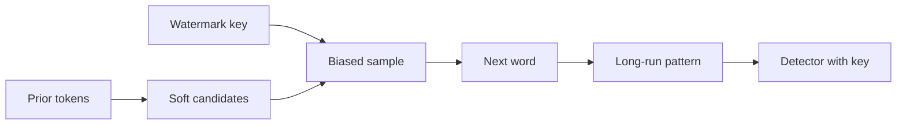

  
Prerequisites

  

    
Read these first if <strong>SynthID-style text watermarks</strong>, <strong>EU AI Act transparency marking</strong>, or <strong>C2PA file credentials</strong> are new.

    <ul>
      <li><a href="https://www.anthropic.com/news/claude-text-watermark">How Claude's text watermarking works (Anthropic)</a> — word-choice watermark, not hidden characters; what a detection score can and cannot mean</li>
      <li><a href="https://support.claude.com/en/articles/16266773-how-claude-marks-ai-generated-content">How Claude marks AI-generated content</a> — text watermark vs C2PA on files; applies across API and products</li>
      <li><a href="https://www.nature.com/articles/s41586-024-08025-4">SynthID-Text (Nature, 2024)</a> — the watermarking method family Anthropic builds on</li>
      <li><a href="https://digital-strategy.ec.europa.eu/en/policies/regulatory-framework-ai">EU AI Act overview</a> — why providers are marking generated content for transparency</li>
    </ul>
  

## The wrong mental model of “delete”

Within days of Anthropic explaining Claude’s invisible text watermark, the web filled with “watermark removers.” Many of them do something familiar and useless: strip zero-width Unicode, normalize fancy dashes, scrub metadata. That toolkit made sense when people suspected *hidden characters*. Claude’s mark is not that.

Anthropic’s public write-up is blunt: **nothing is added to the text**. No invisible characters, no extra tokens, no price bump. The signal is a statistical pattern in **which near-synonyms the model picks** when several words would have been fine — a SynthID-Text-style scheme. You cannot `sed` away a bias in sampling.

So the interesting debate is not “is there a delete button?” It is three sharper problems people keep arguing past each other:

1. **What would “removal” even mean** if the mark is the wording?
2. **What does a positive detection prove** — authorship, or mere involvement?
3. **Who can verify** any of this while the detection API is still “coming soon”?

## How the mark gets into the prose

Language models repeatedly choose the next token among candidates. Sometimes the choice is forced (`Principia` → `Mathematica`). Often it is soft: *overcast* vs *grey*. Watermarking reuses those soft choices. Instead of an arbitrary RNG, sampling is nudged with a secret key and recent context so that, over a long enough passage, the sequence of soft picks is unlikely under a human or a different key.

*Figure 1. The watermark is not a sticker on the paragraph. It is a bias in low-stakes word picks that becomes measurable only with the key and enough text.*

That design has immediate consequences:

- **Short snippets are weak.** Few soft decisions → little signal. A three-line Slack reply may not be detectable even if Claude wrote it.
- **Hard text is sparsely marked.** Code that must compile, math that must be right, and “only fix grammar” edits leave fewer degrees of freedom. Anthropic says comments can carry mark; the executable tokens often cannot.
- **Heavy Claude writing leaves more mark.** A full translation or a from-scratch draft is dense with model choices. A light proofread of your essay may not move the needle.

## Can it be deleted?

| Attack people propose | What it actually does |
| --- | --- |
| Strip zero-width / bidi / “AI dash” Unicode | Removes characters that were never the Claude watermark |
| Strip C2PA / EXIF from a PNG | Drops **file** provenance (easy). Does not touch **text** watermark |
| Light edit, synonym sprinkle | May leave enough of the original soft-pick sequence to still score |
| Full paraphrase / retranslate with another model | Can destroy the Claude-key pattern — because you replaced the words |
| “Remover” SaaS before a public detector exists | Unverifiable marketing until you can re-run Anthropic’s (or an audited) detector |

Anthropic’s own FAQ lands where the engineering does: light editing probably does not wipe the mark; a complete rewrite where every word is replaced will — and at that point you are arguing about whether the artifact is still “Claude’s text.”

So yes, watermarks can be *evaded*, in the same boring way plagiarism detectors are: **rewrite hard enough**. That is not a remover. It is authorship transfer by exhaustion. The cottage industry claiming one-click deletion is, for now, mostly selling Unicode hygiene and hope.

## What a positive hit actually means

This is the part that matters more than remover drama.

A Claude watermark detector (when the API ships) answers something like: **how likely is it that Claude was involved in producing this passage?** It does **not**:

- Prove a human did not write the first draft
- Distinguish “Claude authored this” from “Claude heavily edited / translated this”
- Identify *which* user or org called the API (Anthropic says the mark carries no user identity)
- Detect GPT- or Gemini-only text (different keys / methods)

That gap creates real workplace and classroom failure modes. You paste your design doc into Claude for a clarity pass; the returned prose may carry detectable involvement even though the ideas were yours. You ask Claude Code for a PR description; the markdown may be marked while the diff is mostly yours. A hiring screen or academic integrity tool that treats “watermark present” as “student cheated” is using a probability as a verdict.

The dual error is also true: **absence of a Claude watermark is not proof of human authorship**. Another model, enough rewrite, or a short sample can all go negative.

## Text watermark vs file credentials

Claude’s transparency stack is two different mechanisms that people keep conflating:

| | Text watermark | C2PA on supported files |
| --- | --- | --- |
| Where it lives | Word-choice statistics in the string | Signed metadata on the file |
| Survives copy-paste? | Yes (it *is* the text) | No requirement — often dies on export / screenshot / re-encode |
| Easy to “delete”? | Only by rewriting | Often yes — strip metadata |
| Says | Claude likely involved in the *wording* | Claude created or processed this *file* |

If your threat model is “screenshot of a diagram Claude drew,” C2PA is fragile by design. If your threat model is “blog post pasted into a CMS,” the text watermark is the sticky one — and the one removers keep misunderstanding.

## Why this showed up now

Anthropic frames the change as compliance with the EU AI Act’s transparency expectations (Code of Practice on marking AI-generated content), applied **globally at launch** because they say they lack a durable regional scope. Other major providers signed similar commitments; keys and methods will differ. Expect a messy decade of “which detector, which vendor, which confidence threshold.”

Until Anthropic’s detection API is public and third parties can reproduce scores, every “we removed Claude’s watermark” claim is faith-based. That is the quiet scandal underneath the remover boom: **you cannot audit the audit tool yet**.

## What I will do with this as an engineer

I use Claude in the same places many Android engineers do: draft PR text, reshape release notes, occasionally ask for a first pass on a design doc. Watermarking does not change ownership under Anthropic’s terms, and it should not change how I treat **review**: I still own the words I merge and the claims I make in a PR.

Practically:

1. **Do not trust Unicode removers** for Claude text marks. They solve a different problem.
2. **Do not treat a future detector score as authorship court.** Ask what policy you actually want: disclose assistance, ban certain uses, or judge the work product.
3. **Expect short, factual, or code-heavy outputs to mark weakly** — and long generative prose to mark more strongly.
4. **Separate C2PA hygiene from text hygiene** when you ship screenshots or SVGs.

The headline fight — “can watermarking be deleted?” — has a precise answer: **not by deletion, only by replacement.** Everything else is either metadata theater or an unverifiable SaaS claim. The harder product question is the one Anthropic already admits in the FAQ: a watermark says Claude was *in the loop*, not that a human was *out* of it.

## References

- [AI 'watermark removers' flood the web (BleepingComputer)](https://www.bleepingcomputer.com/news/security/ai-watermark-removers-flood-the-web-almost-none-can-prove-they-work/) — why Unicode/C2PA strippers do not prove text-watermark removal
- [Claude will apply invisible watermarks (The Verge)](https://www.theverge.com/ai-artificial-intelligence/977823/anthropic-claude-ai-watermarks-c2pa-text-images) — product scope and EU timing context
- [Watermarking AI-generated text with SynthID (DeepMind blog)](https://deepmind.google/blog/watermarking-ai-generated-text-and-video-with-synthid/) — accessible overview of the method family (paper is in Prerequisites)
- [C2PA specification](https://c2pa.org/) — signed content credentials for files (distinct from text sampling watermarks)
