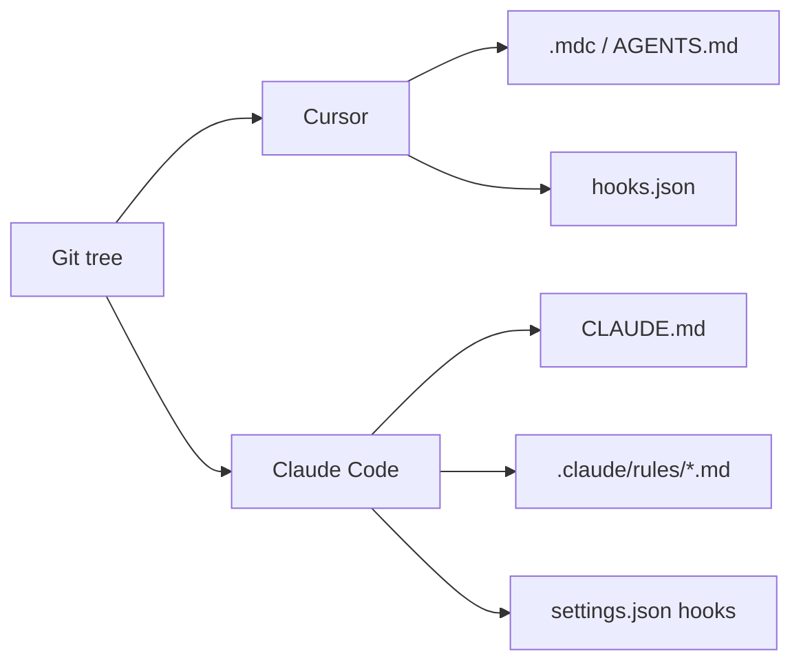

  
Prerequisites

  

    
Read these first if <strong>.mdc project rules</strong>, <strong>CLAUDE.md vs AGENTS.md</strong>, <strong>hooks</strong>, or <strong>skills</strong> are new.

    <ul>
      <li><a href="https://cursor.com/docs/rules">Cursor docs — Rules</a> — <code>.cursor/rules/*.mdc</code> with frontmatter; a plain <code>.md</code> in that folder is ignored</li>
      <li><a href="https://code.claude.com/docs/en/memory">Claude Code — Memory</a> — reads <code>CLAUDE.md</code>, not <code>AGENTS.md</code>; <code>@AGENTS.md</code> import and <code>/import</code> as a one-time copy</li>
      <li><a href="https://cursor.com/docs/reference/third-party-hooks">Cursor — Third-party hooks</a> — Claude <code>.claude/settings.json</code> hooks load in Cursor only after an opt-in</li>
      <li><a href="https://code.claude.com/docs/en/skills">Claude Code — Skills</a> — <code>.claude/skills/*/SKILL.md</code>, not Cursor's skill tree</li>
      <li><a href="https://code.claude.com/docs/en/mcp">Claude Code — MCP</a> — listing a server is not enabling it; deny lives in settings</li>
    </ul>
  

## Why the same checkout disagrees

A company blesses Cursor *and* Claude Code, or it blesses one and people still use the other — different teams, different laptops. That is normal. The failure is treating “the repo has rules” as if every agent reads the same files.

Each product is its own loader. **Which sentences enter the window depends on which binary someone launched.** Two people on the same ticket can follow two policies without knowing it.

The case that made this concrete for me was a security / skill-creation rule: do not add a second skill (or a second always-on rule) for a job the repo already owns. Cursor honored it. Claude Code cheerfully wrote `.claude/skills/review/SKILL.md` next to the existing `.cursor/skills/review/` playbook — same job, second copy, now two sources of truth. The model did not rebel. The “no duplicates” sentence lived only in a `.mdc` with `alwaysApply: true`. Claude Code never saw that file.

*Figure 1. One checkout, two loaders. Overlap is accidental unless you designed it.*

## `.mdc` is not `.md`

Cursor project rules must be `.mdc` (frontmatter for `globs` / `alwaysApply`). A plain `no-duplicate-skills.md` in `.cursor/rules/` is ignored. Claude’s `.claude/rules/` is the opposite: **`.md`, recursive.** Copy without renaming and nothing loads.

A Cursor glob on `**/{skills,rules}/**` has no 1:1 in a root `CLAUDE.md`. Flatten it and you burn context on every `ls`; skip it and the CLI never sees the no-duplicate rule. Claude’s path-scoped `.claude/rules/` is a cousin, not a clone.

`AGENTS.md` looks portable. Cursor reads it. Claude Code reads `CLAUDE.md`, **not** `AGENTS.md`. The bridges are `@AGENTS.md` in `CLAUDE.md`, or `/import`, which **appends a copy**. A copy forks the next time someone edits only one side.

## The rest of the harness splits too

| Surface | Cursor | Claude Code | How it bites |
| --- | --- | --- | --- |
| Rules | `.mdc` (+ `AGENTS.md`) | `CLAUDE.md`, `.claude/rules/*.md` | “Do not create a duplicate skill” lives only in Cursor |
| Skills | `.cursor/skills/` | `.claude/skills/*/SKILL.md` | Claude writes a second `review` skill because it never saw the no-duplicate rule |
| Hooks | `.cursor/hooks.json` | `hooks` in `.claude/settings.json` | A write-block on new `SKILL.md` files never runs in the other product (Cursor loads Claude hooks only if you opt in; `Bash` vs `Shell`) |
| MCP | `.cursor/mcp.json` | `.mcp.json` + enable/deny lists | Connected in the IDE, pending in the CLI |
| Org overlay | Team / User rules, `~/.cursor/` | `~/.claude/`, managed settings | Dashboard policy never hits the CLI |

Ignore files, memories, subagents, and `permissions.deny` split the same way.

Markdown is advice. A PreToolUse deny is a gate the model cannot forge. If that gate lives only in `.cursor/hooks.json`, Claude Code will agree not to add a second skill and then write `.claude/skills/review/SKILL.md` anyway. Cursor Team Rules feel like company policy and never leave the IDE.

A missing file is easy: “Claude doesn’t pick up `.mdc`.” **Both files present and disagreeing is worse.** Cursor says one review skill, owned here. Claude’s `.md` still says “add a skill when the workflow is useful.” Each session looks consistent. The repo now has two playbooks. `/import` and a hand-copied `.mdc` are the same bug as the duplicate skill: a second copy you will not keep in sync.

> **Rule of thumb** - if it must hold in both products, prove it in both: ask each agent to add a `review` skill that already exists. If only Cursor refuses, you have folklore in git.

## Keep one prose file, thin adapters

Do not symlink everything. Do not generate forty adapters.

Put portable facts in `AGENTS.md` (one skill per job, where skills live, who owns them). Point Claude at it with `@AGENTS.md`. Keep Cursor globs in `.mdc`, Claude path rules under `.claude/rules/`, and hard stops in **hooks both processes actually run** — after the third-party-hook opt-in, with matcher names checked.

Do not put “do not create a duplicate skill” only in a `.mdc`, org security only in a Cursor dashboard, or treat `/init` / `/import` as a sync. Those are onboarding. Drift starts on the next edit.

Where a constraint lives *inside* one product is [a placement problem]({{ site.baseurl }}/agent-forgot-the-constraint). Making the tree readable is [a map problem]({{ site.baseurl }}/monorepo-navigable-to-agents). If the CLI “forgets” a rule Cursor still injects, look at the loaders before the model.

## References

- [AGENTS.md](https://agents.md/) — the cross-tool instruction file Cursor reads natively; Claude Code still needs an import
- [Explore the `.claude` directory](https://code.claude.com/docs/en/claude-directory) — which Claude files are project vs `~/.claude`
- [Cursor — Skills](https://cursor.com/help/customization/skills) — Cursor’s on-demand playbooks vs Claude’s `SKILL.md` tree
- [Where every AI coding tool looks for instructions](https://www.digitalapplied.com/blog/where-ai-coding-tools-keep-their-instructions) — loader map across Cursor, Claude Code, and neighbors
- [Switching from Cursor to Claude Code? Your rules stop working](https://dev.to/olivia_craft/switching-from-cursor-to-claude-code-your-rules-stop-working-migration-guide-5g2f) — the `.mdc` → `CLAUDE.md` migration people underestimate
